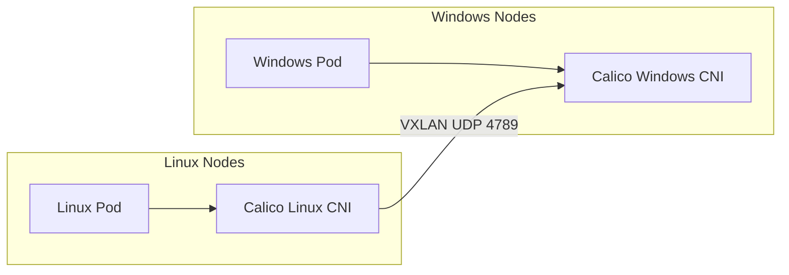

# How to Migrate to Mixed Linux and Windows Networking with Calico Safely

Author: [nawazdhandala](https://github.com/nawazdhandala)

Tags: Calico, Kubernetes, Window, Linux, Networking

Description: Safely add Windows nodes to an existing Linux-only Calico Kubernetes cluster.

---

## Introduction

Running Calico in mixed Linux/Windows Kubernetes clusters enables organizations to containerize Windows-specific workloads alongside Linux containers while using a unified networking and policy model. Calico for Windows supports VXLAN networking and non-overlay BGP peering (IP-in-IP is not supported on Windows), with Windows-specific limitations for some policy and dataplane features.

Mixed OS networking requires careful attention to differences in how Windows handles network interfaces, IPAM, and policy enforcement. Windows Calico uses a different CNI binary and network driver compared to Linux, but both integrate with the same Kubernetes API and Calico datastore.

## Prerequisites

- Kubernetes cluster with Linux control plane nodes
- Windows worker nodes on a Windows Server version supported by your Kubernetes release
- Calico v3.16+ with Windows support, or Calico v3.27+ for the operator-based HostProcess installation
- VXLAN mode configured for this VXLAN-based approach

## Configure VXLAN for Windows Compatibility

```bash
kubectl patch ippool default-ipv4-ippool -p '{"spec":{"ipipMode":"Never","vxlanMode":"Always"}}'
kubectl patch ipamconfigurations default --type merge --patch='{"spec": {"strictAffinity": true}}'
# For operator-managed Calico installations, disable BGP when using VXLAN.
kubectl patch installation default --type=merge -p '{"spec": {"calicoNetwork": {"bgp": "Disabled"}}}'
```

## Install Calico on Windows Nodes

For current Calico releases, use the operator-based Windows HostProcess installation. If you have a version-specific reason to use the deprecated manual PowerShell install, download the official installer script and use it to prepare the Windows files.

```powershell
# On Windows node

Invoke-WebRequest -Uri https://github.com/projectcalico/calico/releases/download/v3.27.0/install-calico-windows.ps1 -OutFile C:\install-calico-windows.ps1
C:\install-calico-windows.ps1 -DownloadOnly yes -KubeVersion <your Kubernetes version>

# Configure C:\CalicoWindows\config.ps1, then install and start Calico
C:\CalicoWindows\install-calico.ps1
```

## Test Cross-OS Connectivity

```bash
# Deploy Linux pod
kubectl run linux-pod --image=busybox -- sleep 3600

# Deploy Windows pod
kubectl apply -f windows-pod.yaml

LINUX_IP=$(kubectl get pod linux-pod -o jsonpath='{.status.podIP}')
WIN_IP=$(kubectl get pod windows-pod -o jsonpath='{.status.podIP}')

# Test Linux to Windows
kubectl exec linux-pod -- ping -c 3 ${WIN_IP}

# Test Windows to Linux (from Windows pod)
kubectl exec windows-pod -- ping -n 3 ${LINUX_IP}
```

## Mixed OS Architecture



## Conclusion

Mixed Linux/Windows networking with Calico can use VXLAN mode or non-overlay BGP, but IP-in-IP is not supported on Windows. It requires careful MTU and IPAM configuration, plus thorough testing of cross-OS pod connectivity. Network policies give you a unified security model for mixed workload clusters, subject to the Windows dataplane limitations documented by Calico.
