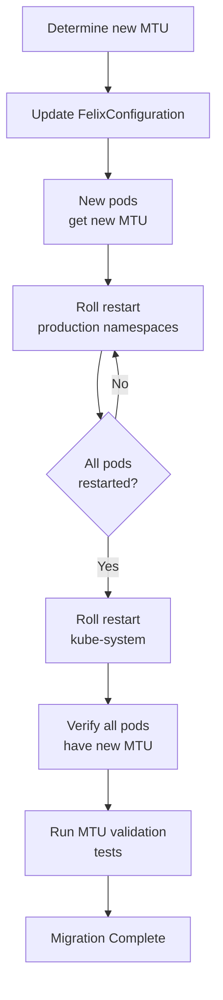

# How to Migrate to MTU Sizing for Calico Safely

Author: [nawazdhandala](https://github.com/nawazdhandala)

Tags: Calico, Kubernetes, MTU, Networking, Migration

Description: Safely change Calico MTU configuration in a live cluster by using a rolling approach that minimizes workload disruption while transitioning to a new MTU value.

---

## Introduction

Changing MTU configuration in a running Calico cluster requires care because pods retain their original MTU until they are restarted. During a MTU migration, you can have a mixed state where some pods have the old MTU and others have the new MTU. If the old MTU is larger than the new MTU, pods with the old MTU may send packets that cannot be processed by the network, causing connectivity failures.

The safest migration approach involves first setting the new (lower) MTU, then rolling out the change by restarting pods progressively across the cluster. For MTU increases, the order matters less, but consistency is still important.

## Prerequisites

- Understanding of current vs target MTU
- Maintenance window or ability to perform rolling restarts
- kubectl access with ability to drain nodes

## Phase 1: Determine Current and Target MTU

```bash
# Check current configuration
calicoctl get felixconfiguration default -o yaml | grep -i mtu

# Check current pod MTU
kubectl get pods -A -o wide | head -5
POD=$(kubectl get pod -A -o name | head -1 | cut -d/ -f2)
NS=$(kubectl get pod -A -o name | head -1 | cut -d: -f1 | cut -d/ -f1)
kubectl exec -n ${NS} ${POD} -- ip link show eth0
```

## Phase 2: Update FelixConfiguration (New pods get new MTU)

```bash
# For reducing MTU (e.g., adding WireGuard encryption)
calicoctl patch felixconfiguration default --type merge \
  --patch '{"spec":{"mtu":1440,"wireguardMTU":1440}}'
```

New pods created after this change receive the new MTU. Existing pods retain the old MTU.

## Phase 3: Rolling Restart by Namespace

Restart pods progressively to apply new MTU:

```bash
# Restart all deployments in each namespace
for ns in $(kubectl get ns -o name | cut -d/ -f2 | grep -v kube-system); do
  echo "Restarting deployments in namespace: $ns"
  kubectl rollout restart deployment -n ${ns}
  # Wait for each namespace to finish
  kubectl rollout status deployment -n ${ns} --timeout=300s
  echo "Namespace ${ns} complete"
done
```

## Phase 4: Restart System Pods

```bash
# Restart kube-system pods carefully
kubectl rollout restart deployment -n kube-system
```

## Phase 5: Verify All Pods Have New MTU

```bash
# Check for any pods still using old MTU
OLD_MTU=1500
NEW_MTU=1440
kubectl get pods -A -o wide | while read ns pod rest; do
  mtu=$(kubectl exec -n ${ns} ${pod} -- ip link show eth0 2>/dev/null | \
    grep -oP 'mtu \K\d+' | head -1)
  if [ "${mtu}" == "${OLD_MTU}" ]; then
    echo "OLD MTU: ${ns}/${pod} still at ${mtu}"
  fi
done
```

## Migration Flowchart



## Conclusion

MTU migration in Calico is safe when done progressively: update the FelixConfiguration first, then roll restart pods namespace by namespace to apply the new MTU. Monitor application health during each phase and be prepared to roll back the FelixConfiguration if issues arise. Always validate the final state to confirm all pods are running at the new MTU before declaring the migration complete.
