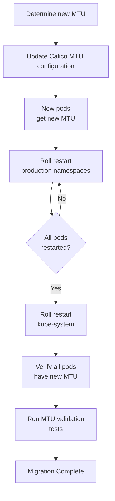

# How to Migrate to MTU Sizing for Calico Safely

Author: [nawazdhandala](https://github.com/nawazdhandala)

Tags: Calico, Kubernetes, MTU, Networking, Migration

Description: Safely change Calico MTU configuration in a live cluster by using a rolling approach that minimizes workload disruption while transitioning to a new MTU value.

---

## Introduction

Changing MTU configuration in a running Calico cluster requires care because pods retain their original MTU until they are restarted. During a MTU migration, you can have a mixed state where some pods have the old MTU and others have the new MTU. If the old MTU is larger than the new MTU, pods with the old MTU may send packets that cannot be processed by the network, causing connectivity failures.

The safest migration approach involves first setting the new (lower) MTU, then rolling out the change by restarting pods progressively across the cluster. For MTU increases, the order matters less, but consistency is still important.

## Prerequisites

- Understanding of current vs target MTU
- Maintenance window or ability to perform rolling restarts
- kubectl access with ability to restart workloads

## Phase 1: Determine Current and Target MTU

```bash
# Check current configuration for the install method you use

# Operator installations
kubectl get installation.operator.tigera.io default -o yaml | grep -i mtu

# Manifest based installations
kubectl get configmap/calico-config -n kube-system -o yaml | grep -i veth_mtu

# Optional tunnel MTU overrides
kubectl get felixconfiguration default -o yaml | grep -i mtu

# Check current pod MTU
kubectl get pods -A -o wide | head -5
NS=$(kubectl get pod -A -o jsonpath='{.items[0].metadata.namespace}')
POD=$(kubectl get pod -A -o jsonpath='{.items[0].metadata.name}')
kubectl exec -n ${NS} ${POD} -- ip link show eth0
```

## Phase 2: Update Calico MTU Configuration (New pods get new MTU)

```bash
# Operator installations
kubectl patch installation.operator.tigera.io default --type merge \
  -p '{"spec":{"calicoNetwork":{"mtu":1440}}}'

# Manifest based installations
kubectl patch configmap/calico-config -n kube-system --type merge \
  -p '{"data":{"veth_mtu": "1440"}}'
kubectl rollout restart daemonset calico-node -n kube-system

# If you are also setting an IPv4 WireGuard tunnel MTU explicitly
kubectl patch felixconfiguration default --type merge \
  -p '{"spec":{"wireguardMTU":1440}}'
```

New pods created after this change receive the new MTU. Existing pods retain the old MTU.

## Phase 3: Rolling Restart by Namespace

Restart pods progressively to apply new MTU:

```bash
# Restart all deployments in each namespace
for ns in $(kubectl get ns -o name | cut -d/ -f2 | grep -v kube-system); do
  echo "Restarting deployments in namespace: $ns"
  kubectl get deployment -n ${ns} -o name | while read deploy; do
    kubectl rollout restart ${deploy} -n ${ns}
    kubectl rollout status ${deploy} -n ${ns} --timeout=300s
  done
  echo "Namespace ${ns} complete"
done
```

## Phase 4: Restart System Pods

```bash
# Restart kube-system deployments carefully
kubectl get deployment -n kube-system -o name | while read deploy; do
  kubectl rollout restart ${deploy} -n kube-system
  kubectl rollout status ${deploy} -n kube-system --timeout=300s
done
```

## Phase 5: Verify All Pods Have New MTU

```bash
# Check for any pods not using the new MTU
NEW_MTU=1440
kubectl get pods -A --no-headers | while read ns pod rest; do
  mtu=$(kubectl exec -n ${ns} ${pod} -- ip link show eth0 2>/dev/null | \
    grep -oP 'mtu \K\d+' | head -1)
  if [ -n "${mtu}" ] && [ "${mtu}" != "${NEW_MTU}" ]; then
    echo "MTU MISMATCH: ${ns}/${pod} is at ${mtu}, expected ${NEW_MTU}"
  fi
done
```

## Migration Flowchart


```mermaid
flowchart TD
    A[Determine new MTU] --> B[Update Calico MTU configuration]
    B --> C[New pods\nget new MTU]
    C --> D[Roll restart\nproduction namespaces]
    D --> E{All pods\nrestarted?}
    E -- No --> D
    E -- Yes --> F[Roll restart\nkube-system]
    F --> G[Verify all pods\nhave new MTU]
    G --> H[Run MTU validation\ntests]
    H --> I[Migration Complete]
```

## Conclusion

MTU migration in Calico is safe when done progressively: update the Calico MTU configuration first, then roll restart pods namespace by namespace to apply the new MTU. Monitor application health during each phase and be prepared to roll back the MTU configuration if issues arise. Always validate the final state to confirm all pods are running at the new MTU before declaring the migration complete.
