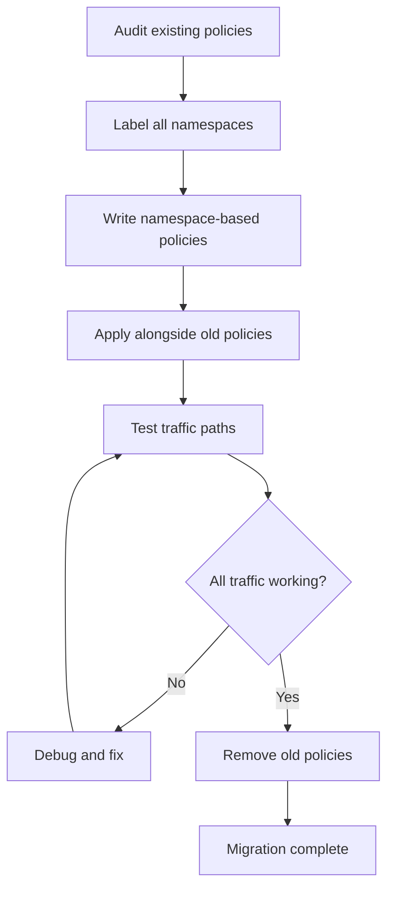

# How to Migrate Existing Rules to Calico Namespace-Based Policies

Author: [nawazdhandala](https://github.com/nawazdhandala)

Tags: Calico, Kubernetes, Network Policy, Namespace, Migration

Description: Migrate from IP-based or pod-selector network policies to Calico namespace-based policies for cleaner, more maintainable namespace isolation.

---

## Introduction

Many clusters start with network policies that use CIDR ranges or pod selectors to control traffic, but as the cluster grows, these approaches become hard to maintain. Namespace-based policies are more readable, more maintainable, and scale naturally as new namespaces are added.

Migrating to Calico namespace-based policies under `projectcalico.org/v3` requires establishing a namespace labeling strategy, writing new policies that reference those labels, and running both old and new policies in parallel until you've verified coverage.

## Prerequisites

- Kubernetes cluster with Calico v3.26+
- Existing network policies to migrate
- All namespaces accessible for labeling

## Step 1: Audit Existing Policies

```bash
# Find policies using pod selectors that could use namespace selectors instead
kubectl get networkpolicies --all-namespaces -o json | jq '.items[] | {
  name: .metadata.name,
  namespace: .metadata.namespace,
  from_types: [.spec.ingress[]?.from[]? | keys[]]
}'
```

## Step 2: Apply Namespace Labels

```bash
# Label all namespaces with semantic metadata
NAMESPACE_MAP=("production:production:platform" "staging:staging:platform" "monitoring:monitoring:observability")
for entry in "${NAMESPACE_MAP[@]}"; do
  ns=$(echo $entry | cut -d: -f1)
  env=$(echo $entry | cut -d: -f2)
  team=$(echo $entry | cut -d: -f3)
  kubectl label namespace $ns environment=$env team=$team --overwrite
done
```

## Step 3: Write Namespace-Based Replacement Policies

```yaml
# Before: CIDR-based
apiVersion: networking.k8s.io/v1
kind: NetworkPolicy
metadata:
  name: allow-monitoring-by-cidr
spec:
  ingress:
    - from:
        - ipBlock:
            cidr: 10.100.0.0/16  # monitoring subnet

# After: namespace-based
apiVersion: projectcalico.org/v3
kind: GlobalNetworkPolicy
metadata:
  name: allow-monitoring-by-namespace
spec:
  order: 200
  selector: all()
  ingress:
    - action: Allow
      source:
        namespaceSelector: team == 'observability'
      destination:
        ports: [9090, 9091]
  types:
    - Ingress
```

## Step 4: Test Parallel Operation

```bash
# Apply new namespace-based policy
calicoctl apply -f allow-monitoring-by-namespace.yaml

# Verify monitoring still works
kubectl exec -n monitoring prometheus -- curl -s http://production-app:9090/metrics
echo "Test result: $?"

# If successful, remove old CIDR-based policy
kubectl delete networkpolicy allow-monitoring-by-cidr -n production
```

## Migration Flow



## Conclusion

Migrating to namespace-based Calico policies is an investment that makes your cluster easier to reason about and operate. The key steps are labeling your namespaces consistently, writing policies that reference those labels, running parallel policies during the transition, and removing old policies only after thorough verification. The resulting policy set will be smaller, cleaner, and easier to audit than what you started with.
