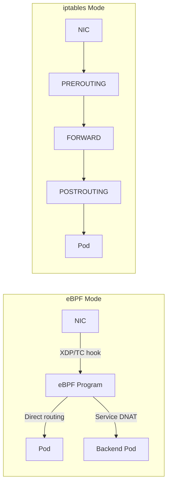

# How to Migrate to Native Routing with Calico eBPF Safely

Author: [nawazdhandala](https://github.com/nawazdhandala)

Tags: Calico, Kubernetes, eBPF, Networking, Performance

Description: Safely migrate a Calico cluster from iptables to eBPF native routing mode with live workloads.

---

## Introduction

Calico's eBPF dataplane provides an alternative to the iptables-based dataplane that can result in lower latency, higher throughput, and lower CPU use per Gbit. eBPF programs are loaded into the kernel and attached to networking hooks such as TC/TCX, and in some paths XDP, performing service handling and policy enforcement without the overhead of large iptables rule sets.

Native routing in eBPF mode avoids pod-to-pod overlay encapsulation when the underlying network can route pod traffic directly, for example with BGP peering or a compatible cloud CNI. If an overlay is required, Calico recommends VXLAN rather than IP-in-IP for eBPF mode. This makes it particularly valuable for latency-sensitive workloads and high-throughput microservices.

## Prerequisites

- A supported Linux distribution with kernel 5.10+, or Red Hat v8.4 with kernel 4.18.0-305 or above
- Calico with the Kubernetes datastore driver and eBPF dataplane support
- kube-proxy disabled or configured to avoid conflicts with Calico eBPF
- kubectl and calicoctl access

## Enable eBPF Dataplane

```bash
# Operator installs can let Tigera Operator configure the API server endpoint,
# enable eBPF, and disable kube-proxy with a rolling update.
kubectl patch installation.operator.tigera.io default --type merge -p \
  '{"spec":{"calicoNetwork":{"linuxDataplane":"BPF","bpfNetworkBootstrap":"Enabled","kubeProxyManagement":"Enabled"}}}'

# For manifest-based installs, first configure Calico to reach the API server
# directly instead of through the kubernetes.default ClusterIP.
kubectl create configmap kubernetes-services-endpoint -n kube-system \
  --from-literal=KUBERNETES_SERVICE_HOST='<API server host>' \
  --from-literal=KUBERNETES_SERVICE_PORT='<API server port>'

# Then disable kube-proxy before enabling eBPF.
kubectl patch ds -n kube-system kube-proxy -p \
  '{"spec":{"template":{"spec":{"nodeSelector":{"non-calico":"true"}}}}}'

# Enable eBPF mode
calicoctl patch felixconfiguration default --patch \
  '{"spec":{"bpfEnabled":true,"bpfDisableUnprivileged":true}}'
```

## Verify eBPF Mode

```bash
CALICO_NODE=$(kubectl get pod -n calico-system -l k8s-app=calico-node -o jsonpath='{.items[0].metadata.name}')

# Check that eBPF mode started successfully
kubectl logs -n calico-system "$CALICO_NODE" | grep 'BPF enabled'

# Verify services are programmed in Calico's BPF NAT table
kubectl exec -n calico-system "$CALICO_NODE" -- calico-node -bpf nat dump

# Test connectivity
kubectl run test1 --image=busybox -- sleep 3600
kubectl exec test1 -- wget -O- http://kubernetes.default.svc
```

## Benchmark eBPF vs iptables

```bash
# Run throughput test
kubectl run iperf-server --image=networkstatic/iperf3 -- iperf3 -s
SRV=$(kubectl get pod iperf-server -o jsonpath='{.status.podIP}')
kubectl run iperf-client --image=networkstatic/iperf3 -- iperf3 -c ${SRV} -t 30

# Compare against previous iptables results
```

## eBPF Architecture



## Conclusion

Calico eBPF native routing delivers measurable performance improvements by bypassing traditional kernel networking overhead. Enable eBPF mode after verifying kernel compatibility, disable kube-proxy, and benchmark throughput and latency to validate the improvement. The migration is reversible - eBPF mode can be disabled and kube-proxy re-enabled if issues are encountered.
