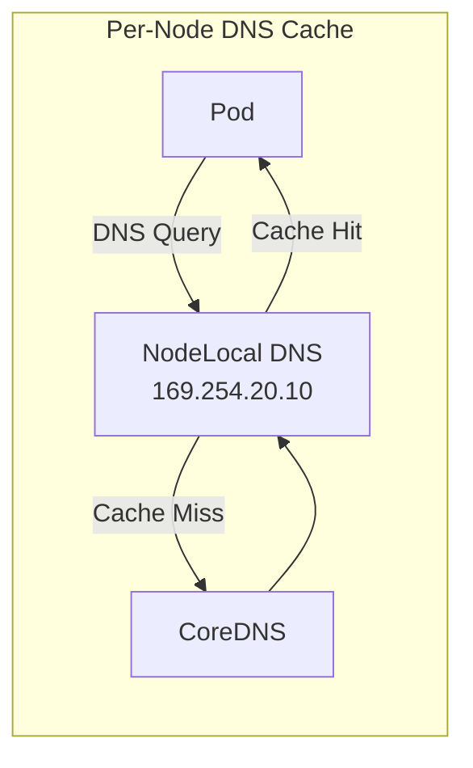

# How to Migrate to Node Local DNS Cache with Calico Safely

Author: [nawazdhandala](https://github.com/nawazdhandala)

Tags: Calico, Kubernetes, DNS, node-cache, Networking

Description: Safely add NodeLocal DNSCache to an existing Calico cluster with a phased rollout that avoids disrupting live DNS resolution for running workloads.

---

## Introduction

NodeLocal DNSCache is a critical performance enhancement for Calico clusters with high DNS query volumes. The per-node caching layer reduces latency for cached entries from milliseconds to microseconds, and reduces load on CoreDNS by serving cached responses locally.

Managing NodeLocal DNSCache requires understanding its interaction with Calico's network policy engine, iptables chain management, and the link-local IP addressing it uses. Proper configuration of both components ensures DNS performs optimally without compromising security or reliability.

## Prerequisites

- Kubernetes cluster with Calico
- NodeLocal DNSCache deployed
- kubectl and calicoctl access

## Configure NodeLocal DNSCache Upstream

Update the NodeLocal DNS ConfigMap to optimize upstream behavior:

```bash
kubectl edit configmap -n kube-system node-local-dns
```

Key configuration options:
- `cache` TTL values: balance freshness vs. cache hit rate
- `forward` target: ensure CoreDNS ClusterIP is correct
- `health` endpoint: enable for monitoring

## Verify DNS Cache Hit Rate

```bash
NODE_DNS=$(kubectl get pod -n kube-system -l k8s-app=node-local-dns -o name | head -1)
kubectl exec -n kube-system ${NODE_DNS} -- \
  wget -qO- http://localhost:9253/metrics | \
  awk '/cache_hits/{hits=$2} /cache_misses/{misses=$2} END{print "Hit rate:", hits/(hits+misses)*100 "%"}'
```

## Apply Network Policy for DNS Security

```yaml
apiVersion: projectcalico.org/v3
kind: GlobalNetworkPolicy
metadata:
  name: dns-cache-policy
spec:
  order: 10
  selector: all()
  egress:
  - action: Allow
    protocol: UDP
    destination:
      nets: [169.254.20.10/32]
      ports: [53]
  - action: Allow
    protocol: TCP
    destination:
      nets: [169.254.20.10/32]
      ports: [53]
```

## Monitor DNS Cache Performance

```yaml
apiVersion: monitoring.coreos.com/v1
kind: PrometheusRule
metadata:
  name: dns-cache-alerts
spec:
  groups:
  - name: nodelocal-dns
    rules:
    - alert: NodeLocalDNSDown
      expr: up{job="node-local-dns"} == 0
      for: 1m
      labels:
        severity: critical
      annotations:
        summary: "NodeLocal DNS cache down on {{ $labels.instance }}"
```

## DNS Cache Architecture



## Conclusion

Managing NodeLocal DNSCache with Calico requires proper network policies allowing traffic to the link-local DNS IP, monitoring of cache hit rates to validate effectiveness, and alerts on cache pod failures that would cause fallback to higher-latency CoreDNS. Regular validation of cache performance ensures the investment in the caching layer is delivering the expected latency improvements.
