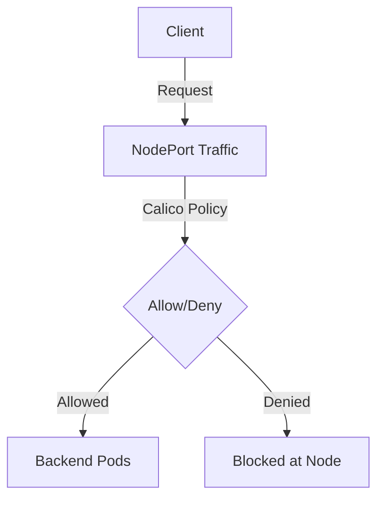

# How to Migrate to Calico NodePort Traffic Policies

Author: [nawazdhandala](https://github.com/nawazdhandala)

Tags: Calico, Kubernetes, Network Policy, NodePort, Security

Description: Migrate Calico NodePort traffic policies to secure Kubernetes NodePort service access.

---

## Introduction

NodePort traffic policies in Calico give you control over how traffic flows through Kubernetes service networking. The `projectcalico.org/v3` API provides the tools needed to secure NodePort traffic effectively while maintaining service availability.

Proper NodePort traffic policy configuration is essential for clusters that expose services to external traffic. Without it, any source that can reach your nodes can reach exposed NodePort services, creating significant attack surface.

This guide covers migrating NodePort traffic policies in Calico with practical, production-tested configurations.

## Prerequisites

- Kubernetes cluster with Calico v3.26+
- Calico host endpoints for the nodes receiving NodePort traffic
- `calicoctl` and `kubectl` installed
- Understanding of Kubernetes service networking

## Core Configuration

```yaml
apiVersion: projectcalico.org/v3
kind: GlobalNetworkPolicy
metadata:
  name: secure-nodeport-traffic
spec:
  order: 100
  preDNAT: true
  applyOnForward: true
  selector: has(kubernetes.io/hostname)
  ingress:
    - action: Allow
      source:
        nets:
          - 10.0.0.0/8
          - 172.16.0.0/12
      destination:
        ports: ['30000:32767']
    - action: Deny
      destination:
        ports: ['30000:32767']
  types:
    - Ingress
```


## Verification

```bash
# Apply the policy

calicoctl apply -f migrate-nodeport-traffic.yaml

# Verify traffic behavior
curl -s --max-time 5 http://<node-ip>:<node-port>
echo "Result: $?"
```

## Architecture



## Conclusion

NodePort traffic policies in Calico provide essential security controls for Kubernetes service traffic. Configure them carefully, test traffic flows from allowed and denied sources, and use staged policies to preview impact before enforcement. Regular monitoring of denial rates helps you detect misconfigurations and unauthorized access attempts before they impact service availability.
