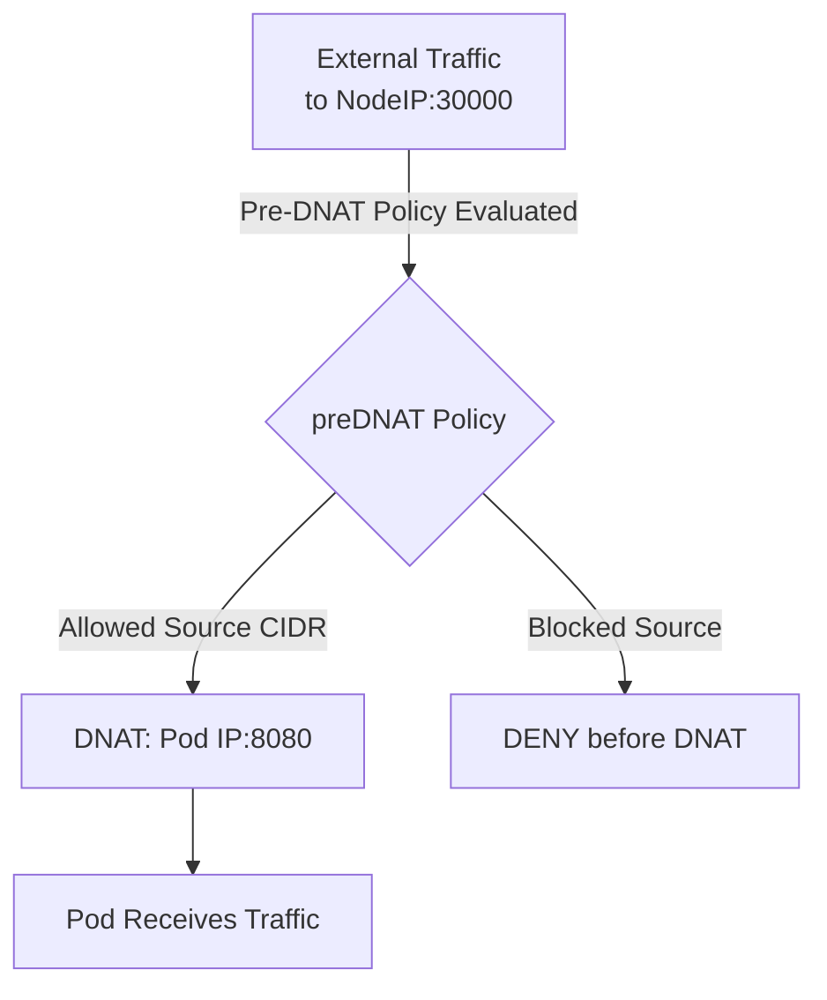

# How to Migrate to Calico Pre-DNAT Policies for Host Traffic

Author: [nawazdhandala](https://github.com/nawazdhandala)

Tags: Calico, Kubernetes, Network Policy, Pre-DNAT, Host Traffic, Security

Description: Migrate Calico pre-DNAT policies for host traffic control before destination address translation.

---

## Introduction

Pre-DNAT policies in Calico are applied before Destination NAT translation, meaning they operate on the original destination IP of incoming traffic rather than the translated pod IP. This is critical for protecting Kubernetes NodePort and LoadBalancer services because traffic arrives at the node IP before being forwarded to pods.

Calico's `projectcalico.org/v3` GlobalNetworkPolicy supports `preDNAT: true` to enable pre-DNAT policy evaluation. This allows you to block or allow traffic based on the external-facing node IP and port before Kubernetes routes it to pods.

This guide covers migrate pre-DNAT policies in Calico for controlling external access to NodePort and LoadBalancer services.

## Prerequisites

- Kubernetes cluster with Calico v3.26+
- `calicoctl` and `kubectl` installed
- Host endpoints configured for the target nodes

## Core Configuration

```yaml
apiVersion: projectcalico.org/v3
kind: GlobalNetworkPolicy
metadata:
  name: migrate-pre-dnat-policy
spec:
  order: 100
  preDNAT: true
  applyOnForward: true
  selector: node == 'production-node'
  ingress:
    - action: Allow
      source:
        nets:
          - 10.0.0.0/8
          - 192.168.0.0/16
      destination:
        ports: [30000, 30001]
    - action: Deny
      destination:
        ports: [30000, 30001]
  types:
    - Ingress
```

## Implementation

```bash
# Apply pre-DNAT policy
calicoctl apply -f pre-dnat-policy.yaml

# Verify policy is active
calicoctl get globalnetworkpolicies -o wide | grep pre-dnat

# Test from allowed CIDR
curl -s --max-time 5 http://node-ip:30000
echo "Allowed source test: $?"

# Test from blocked source (should fail)
echo "Blocked source should timeout"
```

## Architecture



## Conclusion

Pre-DNAT policies in Calico are the correct tool for protecting NodePort and LoadBalancer services from unauthorized external access. By applying policies before DNAT translation, you evaluate traffic against the original destination IP and can enforce source IP-based access controls that survive the address translation process. Always test pre-DNAT policies carefully and ensure your management traffic is explicitly allowed before applying any deny rules.

