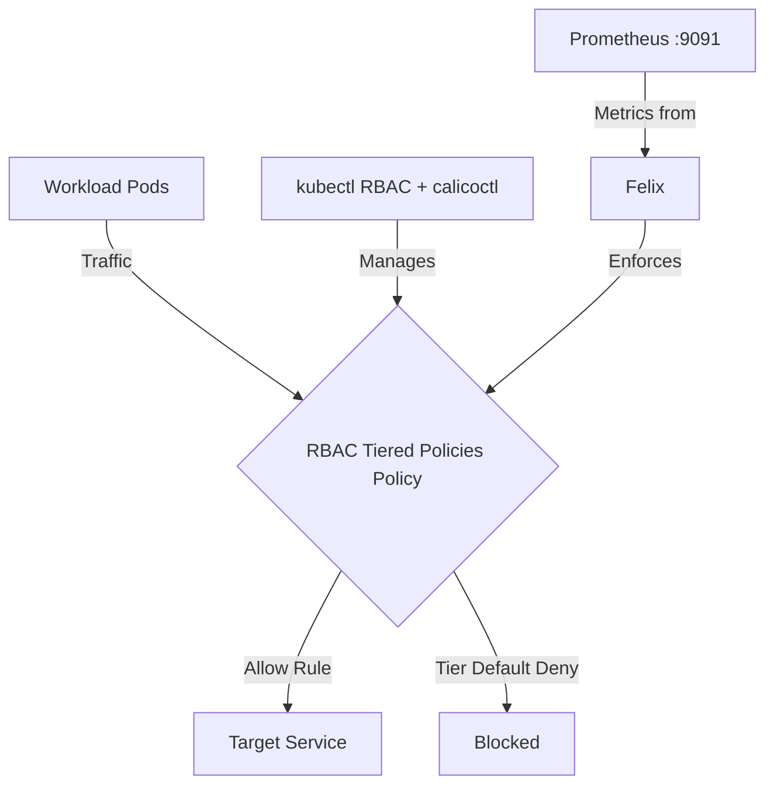

# How to Migrate to RBAC-Controlled Calico Tiered Policies

Author: [nawazdhandala](https://github.com/nawazdhandala)

Tags: Calico, Kubernetes, Network Policy, RBAC, Policy Tiers, Security

Description: Migrate existing network policies to RBAC for Tiered Policies in Calico without disruption.

---

## Introduction

RBAC for Tiered Policies is an advanced Calico feature that provides fine-grained network security controls using the `projectcalico.org/v3` API. This guide covers how to migrate RBAC Tiered Policies effectively in your Kubernetes cluster.

Calico's `projectcalico.org/v3` API provides rich support for RBAC Tiered Policies through its `GlobalNetworkPolicy`, `NetworkPolicy`, and related resources. Proper configuration of RBAC Tiered Policies is essential for maintaining a secure, well-controlled network fabric.

This guide provides production-tested patterns for migrating RBAC Tiered Policies, including YAML examples, CLI commands, and troubleshooting techniques.

## Prerequisites

- Kubernetes cluster with Calico and the Calico API server or native `projectcalico.org/v3` CRDs enabled
- `calicoctl` and `kubectl` installed  
- Basic understanding of Calico network policy concepts
- Cluster-admin access to create tiers and Kubernetes RBAC resources

## Core Configuration

The following YAML demonstrates the key pattern for RBAC Tiered Policies. Keep the Calico resources and Kubernetes RBAC resources in separate files when using `calicoctl`, because `calicoctl` only manages Calico resource types.

```yaml
apiVersion: projectcalico.org/v3
kind: Tier
metadata:
  name: net-sec
spec:
  order: 100
  defaultAction: Deny
---
apiVersion: projectcalico.org/v3
kind: NetworkPolicy
metadata:
  name: net-sec.migrate-rbac-tiered-policies
  namespace: production
spec:
  tier: net-sec
  order: 100
  selector: all()
  ingress:
    - action: Allow
      protocol: TCP
      source:
        selector: app == 'authorized-source'
      destination:
        ports: [8080, 443]
  egress:
    - action: Allow
      protocol: UDP
      destination:
        ports: [53]
    - action: Allow
      destination:
        selector: app == 'authorized-destination'
  types:
    - Ingress
    - Egress
---
apiVersion: rbac.authorization.k8s.io/v1
kind: ClusterRole
metadata:
  name: production-net-sec-tier-reader
rules:
  - apiGroups: ["projectcalico.org"]
    resources: ["tiers"]
    resourceNames: ["net-sec"]
    verbs: ["get"]
---
apiVersion: rbac.authorization.k8s.io/v1
kind: ClusterRole
metadata:
  name: production-net-sec-policy-manager
rules:
  - apiGroups: ["projectcalico.org"]
    resources: ["tier.networkpolicies"]
    resourceNames: ["net-sec.*"]
    verbs: ["get", "list", "watch", "create", "update", "patch", "delete"]
---
apiVersion: rbac.authorization.k8s.io/v1
kind: ClusterRoleBinding
metadata:
  name: production-team-can-read-net-sec-tier
subjects:
  - kind: Group
    name: production-team
    apiGroup: rbac.authorization.k8s.io
roleRef:
  kind: ClusterRole
  name: production-net-sec-tier-reader
  apiGroup: rbac.authorization.k8s.io
---
apiVersion: rbac.authorization.k8s.io/v1
kind: RoleBinding
metadata:
  name: production-team-can-manage-net-sec-policies
  namespace: production
subjects:
  - kind: Group
    name: production-team
    apiGroup: rbac.authorization.k8s.io
roleRef:
  kind: ClusterRole
  name: production-net-sec-policy-manager
  apiGroup: rbac.authorization.k8s.io
```

## Implementation Steps

```bash
# 1. Validate the Calico policy and tier resources before applying
calicoctl validate -f migrate-rbac-tiered-policies.yaml

# 2. Apply the Kubernetes RBAC resources
kubectl apply -f migrate-rbac-tiered-policy-rbac.yaml

# 3. Apply the Calico tier and policy
calicoctl apply -f migrate-rbac-tiered-policies.yaml

# 4. Verify the policy is active in the expected tier
kubectl get networkpolicies.p -n production --field-selector spec.tier=net-sec
calicoctl get networkpolicy net-sec.migrate-rbac-tiered-policies -n production -o yaml

# 5. Test connectivity
kubectl exec -n production test-pod -- curl -s --max-time 5 http://target:8080
echo "Exit code: $?"

# 6. Check Felix metrics if Prometheus metrics are enabled
curl -s http://localhost:9091/metrics | grep felix_active_local_policies
```

## Operational Commands

```bash
# List all relevant policies
calicoctl get networkpolicies --all-namespaces
calicoctl get globalnetworkpolicies
kubectl get networkpolicies.p --all-namespaces --field-selector spec.tier=net-sec

# View policy details
calicoctl get networkpolicy net-sec.migrate-rbac-tiered-policies -n production -o yaml

# Delete a policy if needed
calicoctl delete networkpolicy net-sec.migrate-rbac-tiered-policies -n production
```

## Architecture



## Common Issues

1. **Policy not applying**: Verify API version is `projectcalico.org/v3` and run `calicoctl validate -f <file>` first
2. **Selector not matching**: Translate the Calico selector to a Kubernetes label selector such as `kubectl get pods -l app=authorized-source` to verify label matches
3. **Order conflicts**: Run `calicoctl get networkpolicies --all-namespaces -o wide` and `calicoctl get globalnetworkpolicies -o wide`, then sort by the tier and order fields
4. **DNS failures**: Always ensure egress to port 53 is allowed when restricting egress

## Conclusion

Migrate RBAC Tiered Policies in Calico requires careful attention to policy ordering, selector syntax, and bidirectional traffic rules. Use the patterns in this guide as a starting point, adapt them to your specific requirements, and always validate changes in a staging environment before applying to production. Consistent logging and monitoring will help you detect and resolve issues quickly when they occur.
