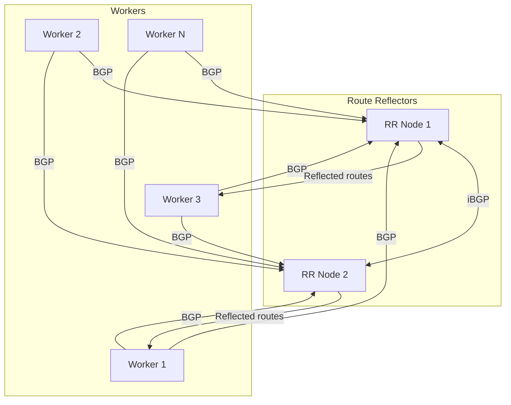

# How to Migrate to Route Reflectors in Calico Safely

Author: [nawazdhandala](https://github.com/nawazdhandala)

Tags: Calico, Kubernetes, BGP, Route Reflector, Networking

Description: Safely migrate a Calico cluster from full-mesh BGP to route reflector topology without causing routing outages.

---

## Introduction

As Kubernetes clusters grow beyond 50-100 nodes, the default Calico full-mesh BGP topology creates O(n²) session complexity - each node must maintain a BGP session with every other node. A 100-node cluster requires 4,950 BGP sessions, consuming significant CPU and memory on each node.

Route reflectors solve this by acting as BGP hubs: instead of each node peering with all others, worker nodes peer only with a small set of route reflectors, which then reflect routes to all other nodes. This reduces the per-node session count from O(n) to O(r) where r is the number of route reflectors (typically 2-3).

## Prerequisites

- Calico with BGP mode
- Dedicated unschedulable nodes for route reflector role, or existing nodes drained before enabling the role
- kubectl and calicoctl access

## Designate Route Reflector Nodes

```bash
# Label nodes that will act as route reflectors
kubectl label node rr-node-1 calico-route-reflector=true
kubectl label node rr-node-2 calico-route-reflector=true

# Prevent workloads from being scheduled on dedicated RR nodes during migration
kubectl cordon rr-node-1
kubectl cordon rr-node-2

# Set route reflector cluster ID
calicoctl patch node rr-node-1 \
  --patch '{"spec":{"bgp":{"routeReflectorClusterID":"244.0.0.1"}}}'
calicoctl patch node rr-node-2 \
  --patch '{"spec":{"bgp":{"routeReflectorClusterID":"244.0.0.1"}}}'
```

## Configure Peering and Disable Full-Mesh

Create BGPPeer resources for workers to peer with RRs before disabling the mesh:

```yaml
apiVersion: projectcalico.org/v3
kind: BGPPeer
metadata:
  name: bgppeer-global-rr
spec:
  nodeSelector: "!has(calico-route-reflector)"
  peerSelector: "has(calico-route-reflector)"
---
apiVersion: projectcalico.org/v3
kind: BGPPeer
metadata:
  name: bgppeer-rr-to-rr
spec:
  nodeSelector: "has(calico-route-reflector)"
  peerSelector: "has(calico-route-reflector)"
```

After the new peerings are established, disable node-to-node mesh:

```bash
calicoctl patch bgpconfiguration default \
  --patch '{"spec":{"nodeToNodeMeshEnabled":false}}'
```

## Verify Route Reflection

```bash
# On a worker node, check sessions are with RRs only
sudo calicoctl node status

# Or create a CalicoNodeStatus resource to monitor BGP sessions from Kubernetes
kubectl apply -f - <<EOF
apiVersion: projectcalico.org/v3
kind: CalicoNodeStatus
metadata:
  name: worker-node-status
spec:
  classes:
    - BGP
    - Routes
  node: worker-node-1
  updatePeriodSeconds: 10
EOF
kubectl get caliconodestatus worker-node-status -o yaml
```

## Route Reflector Architecture



## Conclusion

Route reflectors in Calico scale BGP from O(n²) full-mesh to an O(n×r) hub-and-spoke model that handles hundreds of nodes efficiently. Deploy at least two route reflectors for high availability, ensure they peer with each other, and configure all worker nodes to peer with all route reflectors. After migration, verify route counts on workers confirm they receive all pod CIDRs via reflection.
