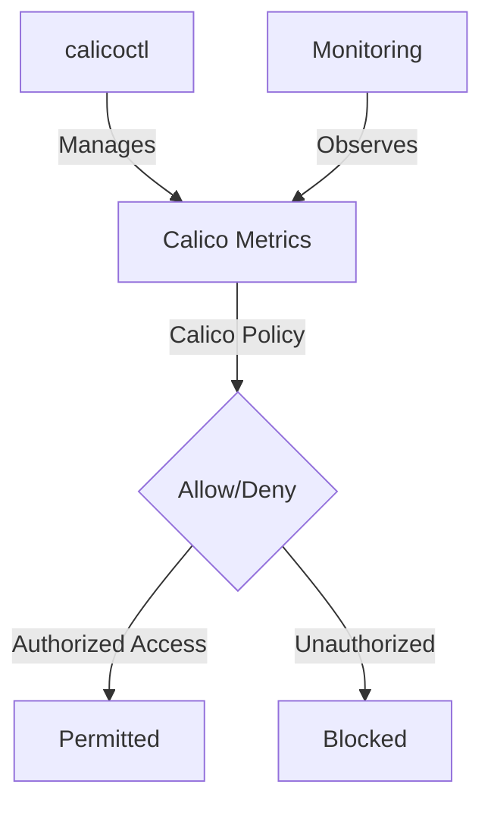

# How to Migrate to Secured Calico Metrics Endpoints

Author: [nawazdhandala](https://github.com/nawazdhandala)

Tags: Calico, Kubernetes, Metrics, Security, Prometheus

Description: Migrate security for Calico metrics endpoints to restrict access to authorized monitoring systems only.

---

## Introduction

Securing Calico Metrics Endpoints is an important security consideration for production Calico deployments. The `projectcalico.org/v3` API provides the tools needed to migrate Calico Metrics effectively, combining Calico's network policy with proper access controls and monitoring.

This guide covers migrate Calico Metrics in Calico with practical configurations and operational best practices.

## Prerequisites

- Kubernetes cluster with Calico v3.26+
- `calicoctl` and `kubectl` installed
- Understanding of Calico's monitoring and security architecture

## Core Configuration

```yaml
# Restrict access to Calico Felix metrics (port 9091)
apiVersion: projectcalico.org/v3
kind: GlobalNetworkPolicy
metadata:
  name: secure-calico-metrics
spec:
  order: 100
  selector: k8s-app == 'calico-node'
  ingress:
    - action: Allow
      source:
        namespaceSelector: team == 'observability'
      destination:
        ports: [9091]
    - action: Allow
      source:
        selector: app == 'prometheus'
      destination:
        ports: [9091]
    - action: Deny
      destination:
        ports: [9091, 9092, 9093]
  types:
    - Ingress
```

## Implementation Steps

```bash
# Apply metrics security policy
calicoctl apply -f secure-calico-metrics.yaml

# Verify only authorized access works
kubectl exec -n monitoring prometheus-pod -- curl -s http://calico-node-ip:9091/metrics | head -5
echo "Prometheus access (should work): $?"

# Verify unauthorized access is blocked
kubectl exec -n default test-pod -- curl -s --max-time 5 http://calico-node-ip:9091/metrics
echo "Unauthorized access (should timeout): $?"
```

## Verify Metrics Security

```bash
# List all IPs that have accessed the metrics endpoint recently
grep "port=9091" /var/log/calico/flow-logs/*.log | tail -20

# Check active policy for calico-node pods
calicoctl get networkpolicies -n kube-system | grep metrics
```

## Architecture



## Conclusion

Migrate Calico Metrics in Calico requires a combination of proper policy configuration, regular monitoring, and proactive testing. Use the patterns in this guide as a foundation and adapt them to your specific security requirements. Always validate changes in staging before production and maintain comprehensive logging for security visibility.
