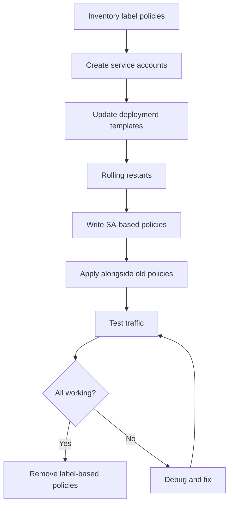

# How to Migrate Existing Rules to Calico Service Account-Based Policies

Author: [nawazdhandala](https://github.com/nawazdhandala)

Tags: Calico, Kubernetes, Network Policy, Service Account, Migration

Description: Migrate from label-based or namespace-scoped Calico policies to service account-based policies for stronger workload identity controls.

---

## Introduction

Migrating from label-based policies to service account-based policies is a security upgrade that makes your network access controls harder to bypass. Unlike labels, service accounts cannot be modified by a compromised pod, making them a more reliable identity mechanism for sensitive traffic controls.

The migration has two prerequisites: all workloads must be running with dedicated service accounts, and the new SA-based policies must be tested before the old label-based ones are removed.

## Prerequisites

- Kubernetes cluster with Calico v3.26+
- `calicoctl` and `kubectl` installed
- RBAC access to create service accounts across all namespaces

## Step 1: Inventory Existing Label-Based Policies

```bash
# List all policies using label selectors that could use SA selectors
calicoctl get networkpolicies --all-namespaces -o yaml | grep -B 5 "selector:" | grep -E "name|selector"
```

## Step 2: Create Service Accounts for All Workloads

```bash
# Automated SA creation based on deployments
kubectl get deployments --all-namespaces -o json | jq -r '.items[] | "\(.metadata.namespace) \(.metadata.name)"' | while read ns name; do
  SA_NAME="${name}-sa"
  if ! kubectl get serviceaccount "$SA_NAME" -n "$ns" &>/dev/null; then
    kubectl create serviceaccount "$SA_NAME" -n "$ns"
    echo "Created SA: $SA_NAME in $ns"
  fi
done
```

## Step 3: Update Deployments to Use Dedicated SAs

```bash
kubectl get deployments --all-namespaces -o json | jq -r '.items[] | "\(.metadata.namespace) \(.metadata.name)"' | while read ns name; do
  SA_NAME="${name}-sa"
  kubectl patch deployment "$name" -n "$ns" --type=merge -p "{
    "spec": {
      "template": {
        "spec": {
          "serviceAccountName": "$SA_NAME"
        }
      }
    }
  }"
  echo "Updated deployment $name in $ns to use SA: $SA_NAME"
done
```

## Step 4: Write SA-Based Replacements

```yaml
# Old label-based policy
# selector: app == 'backend'
# ingress: source: selector: app == 'frontend'

# New SA-based policy
apiVersion: projectcalico.org/v3
kind: NetworkPolicy
metadata:
  name: allow-frontend-to-backend-sa
  namespace: production
spec:
  order: 100
  serviceAccountSelector: name == 'backend-sa'
  ingress:
    - action: Allow
      source:
        serviceAccountSelector: name == 'frontend-sa'
    - action: Deny
  types:
    - Ingress
```

## Migration Flow



## Conclusion

Migrating to service account-based Calico policies strengthens your security posture by tying network access to RBAC-controlled identity. The migration requires careful coordination — service accounts must exist and be assigned to workloads before you can enforce SA-based policies. Run both old and new policies in parallel during the transition, verify that SA-based policies are working correctly, then remove the label-based ones. The end result is a more tamper-resistant network access control system.
