# How to Migrate to Service IP Advertisement with Calico Safely

Author: [nawazdhandala](https://github.com/nawazdhandala)

Tags: Calico, Kubernetes, BGP, Service Advertisement, Migration

Description: Safely migrate Kubernetes services from NodePort or cloud load balancers to Calico BGP service IP advertisement with a phased rollout and rollback plan.

---

## Introduction

Migrating services to Calico BGP advertisement from existing NodePort or cloud load balancer access requires careful coordination between network teams and application teams. The migration involves assigning new IP addresses to services (LoadBalancer IPs from an advertised pool) and updating DNS records or client configurations to use the new addresses.

The risk during migration is that the new IP may not be reachable if BGP routes are not properly propagated, causing service outages. A phased migration approach keeps the old access method working while validating the new BGP path before cutting over.

## Prerequisites

- Calico BGP configured with service advertisement
- LoadBalancer IP pool created and advertised
- External DNS control for service cutover

## Phase 1: Assign LoadBalancer IP Without Changing DNS

Add a LoadBalancer IP to the service from the BGP-advertised pool without changing DNS:

```yaml
apiVersion: v1
kind: Service
metadata:
  name: my-service
  annotations:
    projectcalico.org/ipv4pools: '["external-lb-pool"]'
spec:
  type: LoadBalancer
  selector:
    app: my-app
  ports:
  - port: 80
    targetPort: 8080
```

```bash
kubectl apply -f service.yaml
kubectl get svc my-service
```

## Phase 2: Validate New IP Connectivity

From an external host, test the new LoadBalancer IP before changing DNS:

```bash
LB_IP=$(kubectl get svc my-service -o jsonpath='{.status.loadBalancer.ingress[0].ip}')
curl -v http://${LB_IP}:80/health
```

## Phase 3: Gradual DNS Migration

Update DNS with low TTL and split traffic:

```bash
# Add new LB IP as secondary DNS record
# Keep old NodePort/LB as primary
# Monitor error rates

# Check old vs new traffic percentages in access logs
kubectl logs -l app=my-app | grep "X-Forwarded-For" | \
  awk '{print $1}' | sort | uniq -c | sort -rn
```

## Phase 4: Full Cutover

Once validation is complete, update DNS to point fully to the new IP:

```bash
# Update DNS record
# Monitor service for 30 minutes
# Remove old NodePort or cloud LB
kubectl patch svc my-service --type json \
  -p '[{"op":"remove","path":"/spec/ports/1"}]'
```

## Migration Timeline

```mermaid
gantt
    title Service IP Migration
    dateFormat HH:mm
    section Preparation
    Assign LB IP from pool   :00:00, 30m
    section Validation
    Test new IP connectivity :00:30, 30m
    section Migration
    Low TTL DNS update       :01:00, 30m
    Split traffic 10/90      :01:30, 1h
    Split traffic 50/50      :02:30, 1h
    Full cutover             :03:30, 30m
    section Cleanup
    Remove old access method :04:00, 30m
```



## Conclusion

Migrating to service IP advertisement requires assigning LoadBalancer IPs from BGP-advertised pools, validating connectivity before changing DNS, and gradually shifting traffic with the ability to roll back at each step. Keep old access methods available until you have confirmed the new BGP path is reliable under production load.
