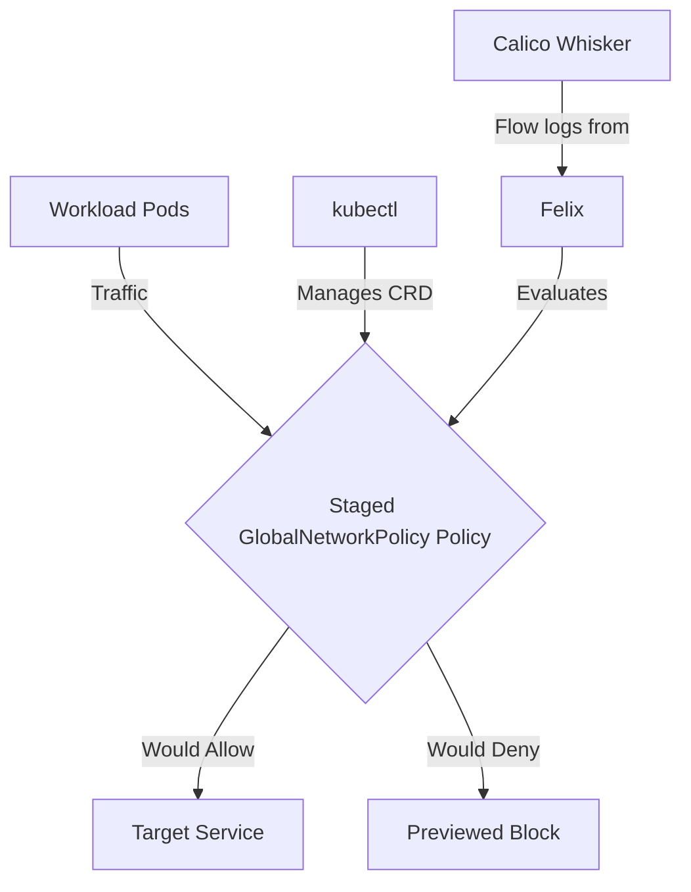

# How to Migrate to Staged GlobalNetworkPolicy in Calico

Author: [nawazdhandala](https://github.com/nawazdhandala)

Tags: Calico, Kubernetes, Network Policy, Staged Policies, Global Policy

Description: Migrate existing network policies to Staged GlobalNetworkPolicy in Calico without disruption.

---

## Introduction

Staged GlobalNetworkPolicy is an advanced Calico feature that lets you preview global network security controls using the `projectcalico.org/v3` API before enforcing them. This guide covers how to migrate to Staged GlobalNetworkPolicy effectively in your Kubernetes cluster.

Calico's `projectcalico.org/v3` API provides rich support for Staged GlobalNetworkPolicy through its `StagedGlobalNetworkPolicy`, `GlobalNetworkPolicy`, and related resources. Proper configuration of Staged GlobalNetworkPolicy is essential for maintaining a secure, well-controlled network fabric.

This guide provides production-tested patterns for migrate Staged GlobalNetworkPolicy, including YAML examples, CLI commands, and troubleshooting techniques.

## Prerequisites

- Kubernetes cluster with the `StagedGlobalNetworkPolicy` CRD installed
- `kubectl` installed
- Basic understanding of Calico network policy concepts
- Calico Whisker and Goldmane enabled if you want to preview staged policy impact in flow logs

## Core Configuration

The following YAML demonstrates the key pattern for Staged GlobalNetworkPolicy:

```yaml
apiVersion: projectcalico.org/v3
kind: StagedGlobalNetworkPolicy
metadata:
  name: migrate-staged-globalnetworkpolicy
spec:
  order: 100
  selector: projectcalico.org/namespace == 'production'
  ingress:
    - action: Allow
      source:
        selector: app == 'authorized-source'
      destination:
        ports: [8080, 443]
  egress:
    - action: Allow
      protocol: UDP
      destination:
        ports: [53]
    - action: Allow
      destination:
        selector: app == 'authorized-destination'
  types:
    - Ingress
    - Egress
```

## Implementation Steps

```bash
# 1. Validate and apply the staged policy

kubectl apply --dry-run=server -f migrate-staged-globalnetworkpolicy.yaml
kubectl apply -f migrate-staged-globalnetworkpolicy.yaml

# 2. Verify it's staged
kubectl get stagedglobalnetworkpolicies.projectcalico.org -o wide

# 3. Test connectivity; staged policies preview behavior and do not block traffic
kubectl exec -n production test-pod -- curl -s --max-time 5 http://target:8080
echo "Exit code: $?"

# 4. Preview policy impact with Calico Whisker flow logs
kubectl port-forward -n calico-system service/whisker 8081:8081
```

## Operational Commands

```bash
# List all relevant policies
kubectl get stagedglobalnetworkpolicies.projectcalico.org
kubectl get globalnetworkpolicies.projectcalico.org

# View policy details
kubectl get stagedglobalnetworkpolicy.projectcalico.org migrate-staged-globalnetworkpolicy -o yaml

# Delete a policy if needed
kubectl delete stagedglobalnetworkpolicy.projectcalico.org migrate-staged-globalnetworkpolicy
```

## Architecture



## Common Issues

1. **Policy not applying**: Verify API version is `projectcalico.org/v3` and run `kubectl apply --dry-run=server` first
2. **Selector not matching**: Use `kubectl get pods -l your-selector` to verify label matches
3. **Order conflicts**: Run `kubectl get stagedglobalnetworkpolicies.projectcalico.org -o yaml` and compare the order field
4. **DNS failures**: Always ensure egress to port 53 is allowed when restricting egress

## Conclusion

Migrating to Staged GlobalNetworkPolicy in Calico requires careful attention to policy ordering, selector syntax, and bidirectional traffic rules. Use the patterns in this guide as a starting point, adapt them to your specific requirements, and always validate changes in a staging environment before applying an equivalent enforcing policy to production. Consistent logging and monitoring will help you detect and resolve issues quickly when they occur.
