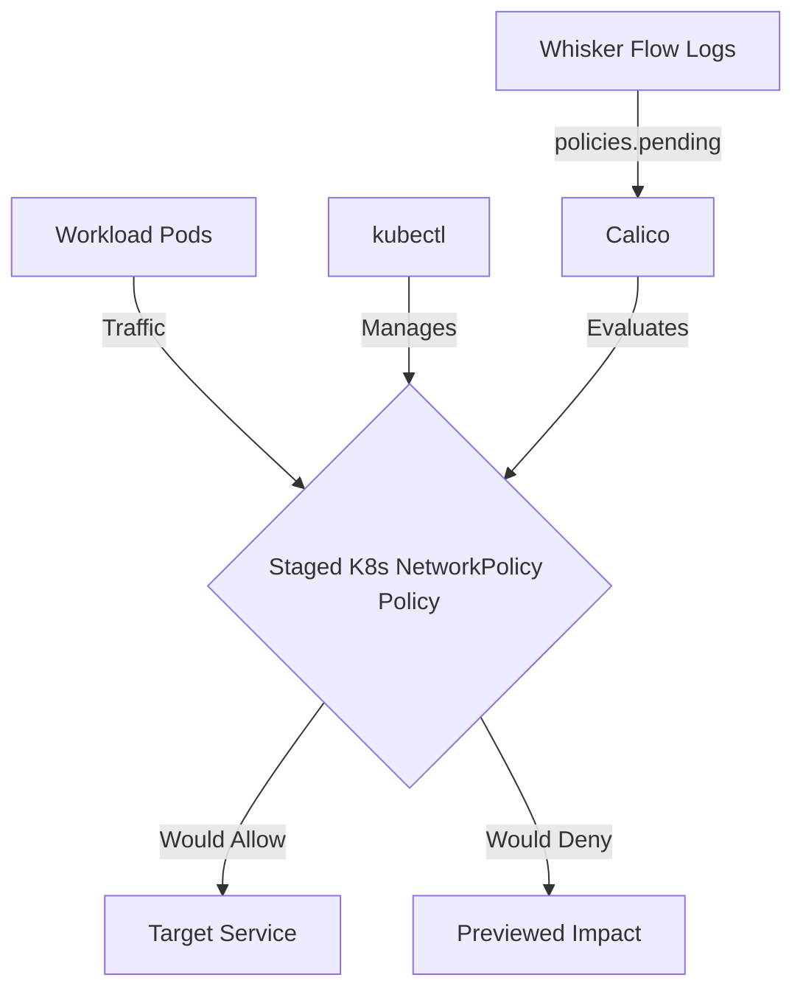

# How to Migrate to Staged Kubernetes NetworkPolicy in Calico

Author: [nawazdhandala](https://github.com/nawazdhandala)

Tags: Calico, Kubernetes, Network Policy, Staged Policies

Description: Migrate existing network policies to Staged Kubernetes NetworkPolicy in Calico without disruption.

---

## Introduction

Staged Kubernetes NetworkPolicy is an advanced Calico feature that lets you preview Kubernetes NetworkPolicy behavior using the `projectcalico.org/v3` API before enforcing it. This guide covers how to migrate Staged K8s NetworkPolicy effectively in your Kubernetes cluster.

Calico's `projectcalico.org/v3` API provides rich support for staged policy through its `StagedKubernetesNetworkPolicy`, `StagedNetworkPolicy`, `StagedGlobalNetworkPolicy`, and related resources. Proper configuration of Staged K8s NetworkPolicy is essential for maintaining a secure, well-controlled network fabric.

This guide provides production-tested patterns for migrate Staged K8s NetworkPolicy, including YAML examples, CLI commands, and troubleshooting techniques.

## Prerequisites

- Kubernetes cluster with Calico v3.30+
- `kubectl` installed and configured
- Basic understanding of Calico network policy concepts
- Calico v3.30+ for Staged K8s NetworkPolicy feature support

## Core Configuration

The following YAML demonstrates the key pattern for Staged K8s NetworkPolicy:

```yaml
apiVersion: projectcalico.org/v3
kind: StagedKubernetesNetworkPolicy
metadata:
  name: migrate-staged-k8s-networkpolicy
  namespace: production
spec:
  podSelector: {}
  policyTypes:
    - Ingress
    - Egress
  ingress:
    - from:
        - podSelector:
            matchLabels:
              app: authorized-source
      ports:
        - protocol: TCP
          port: 8080
        - protocol: TCP
          port: 443
  egress:
    - ports:
        - protocol: UDP
          port: 53
    - to:
        - podSelector:
            matchLabels:
              app: authorized-destination
```

## Implementation Steps

```bash
# 1. Apply the policy

kubectl apply -f migrate-staged-k8s-networkpolicy.yaml

# 2. Verify the staged policy exists
kubectl get stagedkubernetesnetworkpolicies -n production -o wide

# 3. Test current connectivity; staged policies preview behavior and do not enforce it
kubectl exec -n production test-pod -- curl -s --max-time 5 http://target:8080
echo "Exit code: $?"

# 4. Review staged policy impact in Calico flow logs
# Check the policies.pending field in the Calico Whisker web console.
```

## Operational Commands

```bash
# List all relevant policies
kubectl get stagedkubernetesnetworkpolicies --all-namespaces
kubectl get stagednetworkpolicies --all-namespaces
kubectl get stagedglobalnetworkpolicies

# View policy details
kubectl get stagedkubernetesnetworkpolicy migrate-staged-k8s-networkpolicy -n production -o yaml

# Delete a policy if needed
kubectl delete stagedkubernetesnetworkpolicy migrate-staged-k8s-networkpolicy -n production
```

## Architecture



## Common Issues

1. **Policy not applying**: Verify API version is `projectcalico.org/v3`, kind is `StagedKubernetesNetworkPolicy`, and run `kubectl apply --dry-run=server -f migrate-staged-k8s-networkpolicy.yaml` first
2. **Selector not matching**: Use `kubectl get pods -l your-selector` to verify label matches
3. **Policy not visible**: Run `kubectl get stagedkubernetesnetworkpolicies --all-namespaces` and confirm the Calico staged policy CRDs are installed
4. **DNS failures**: Always ensure egress to port 53 is allowed when restricting egress

## Conclusion

Migrating Staged K8s NetworkPolicy in Calico requires careful attention to Kubernetes NetworkPolicy selector syntax and bidirectional traffic rules. Use the patterns in this guide as a starting point, adapt them to your specific requirements, and always validate staged policy impact before creating the enforced Kubernetes NetworkPolicy in production. Consistent logging and monitoring will help you detect and resolve issues quickly when they occur.
