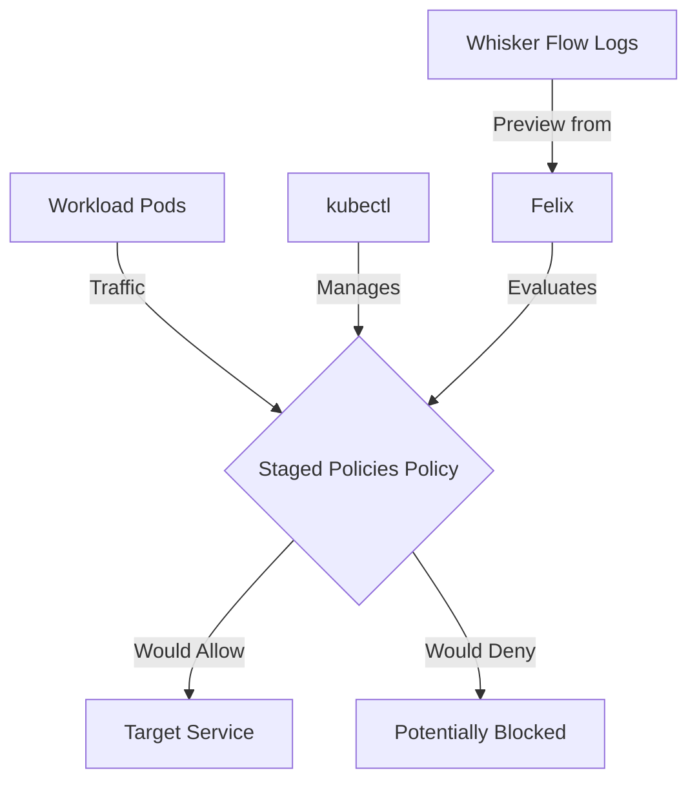

# How to Migrate to Staged Network Policies in Calico

Author: [nawazdhandala](https://github.com/nawazdhandala)

Tags: Calico, Kubernetes, Network Policy, Staged Policies, Security

Description: Migrate existing network policies to Staged Network Policies in Calico without disruption.

---

## Introduction

Staged Network Policies is an advanced Calico feature that lets you preview fine-grained network security controls using the `projectcalico.org/v3` API before enforcing them. This guide covers how to migrate Staged Policies effectively in your Kubernetes cluster.

Calico's `projectcalico.org/v3` API provides rich support for Staged Policies through its `StagedGlobalNetworkPolicy`, `StagedNetworkPolicy`, and related resources. Proper configuration of Staged Policies is essential for maintaining a secure, well-controlled network fabric.

This guide provides production-tested patterns for migrate Staged Policies, including YAML examples, CLI commands, and troubleshooting techniques.

## Prerequisites

- Kubernetes cluster with Calico v3.30+
- `kubectl` installed  
- Basic understanding of Calico network policy concepts
- Calico v3.30+ for Staged Policies feature support

## Core Configuration

The following YAML demonstrates the key pattern for Staged Policies:

```yaml
apiVersion: projectcalico.org/v3
kind: StagedNetworkPolicy
metadata:
  name: migrate-staged-policies
  namespace: production
spec:
  order: 100
  selector: all()
  ingress:
    - action: Allow
      protocol: TCP
      source:
        selector: app == 'authorized-source'
      destination:
        ports: [8080, 443]
  egress:
    - action: Allow
      protocol: UDP
      destination:
        ports: [53]
    - action: Allow
      destination:
        selector: app == 'authorized-destination'
  types:
    - Ingress
    - Egress
```

## Implementation Steps

```bash
# 1. Apply the policy

kubectl apply -f migrate-staged-policies.yaml

# 2. Verify it's staged
kubectl get stagednetworkpolicy.p -n production -o wide

# 3. Confirm existing connectivity while the staged policy remains non-enforcing
kubectl exec -n production test-pod -- curl -s --max-time 5 http://target:8080
echo "Exit code: $?"

# 4. Preview the staged policy impact in Calico Whisker flow logs
# Check the policies.pending field to see what would happen if the policy were enforced.
```

## Operational Commands

```bash
# List all relevant policies
kubectl get stagednetworkpolicy.p --all-namespaces
kubectl get stagedglobalnetworkpolicy.p

# View policy details
kubectl get stagednetworkpolicy.p migrate-staged-policies -n production -o yaml

# Delete a policy if needed
kubectl delete stagednetworkpolicy.p migrate-staged-policies -n production
```

## Architecture



## Common Issues

1. **Policy not applying**: Verify API version is `projectcalico.org/v3`, kind is `StagedNetworkPolicy`, and run `kubectl apply --dry-run=server -f migrate-staged-policies.yaml` first
2. **Selector not matching**: Translate the Calico selector to a Kubernetes label selector, such as `kubectl get pods -n production -l app=authorized-source`, to verify label matches
3. **Order conflicts**: Run `kubectl get stagednetworkpolicy.p --all-namespaces -o wide` and `kubectl get stagedglobalnetworkpolicy.p -o wide`, then sort by tier and order fields
4. **DNS failures after enforcement**: Always ensure egress to port 53 is allowed when applying an equivalent enforcing policy that restricts egress

## Conclusion

Migrate Staged Policies in Calico requires careful attention to policy ordering, selector syntax, and bidirectional traffic rules. Use the patterns in this guide as a starting point, adapt them to your specific requirements, preview the staged policy impact, and always validate changes in a staging environment before applying an equivalent enforcing policy to production. Consistent logging and monitoring will help you detect and resolve issues quickly when they occur.
