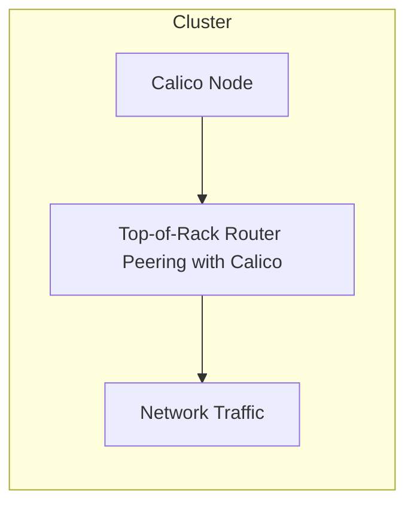

# How to Migrate to Top-of-Rack Router Peering with Calico Safely

Author: [nawazdhandala](https://github.com/nawazdhandala)

Tags: Calico, Kubernetes, BGP, ToR, Networking

Description: Safely migrate a Calico cluster to top-of-rack BGP peering from overlay networking without workload disruption.

---

## Introduction

Top-of-Rack Router Peering with Calico is an important aspect of Calico networking in Kubernetes. Properly managing this component ensures your cluster networking is performant, secure, and reliable.

This guide covers migrate of Top-of-Rack Router Peering with Calico in Calico with practical examples and best practices for production deployments.

## Prerequisites

- Calico v3.26+ installed
- kubectl and calicoctl configured
- Cluster-admin access

## Steps

```bash
# Verify current configuration
calicoctl get bgpconfiguration default -o yaml

# Check node status
kubectl get nodes -o wide

# Verify Calico components
kubectl get pods -n calico-system
```

## Architecture



## Conclusion

migrate of Top-of-Rack Router Peering with Calico in Calico requires careful attention to configuration, monitoring, and testing. Follow the steps above to ensure correct behavior in your production environment.
