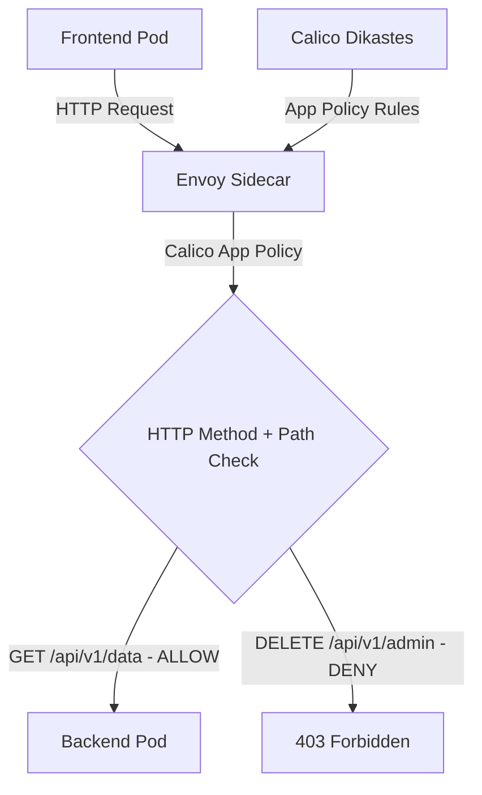

# How to Monitor Application-Layer Policy Impact with Calico and Istio

Author: [nawazdhandala](https://github.com/nawazdhandala)

Tags: Calico, Kubernetes, Network Policy, Istio, Application Layer, Security

Description: Monitor Calico application-layer network policies using Istio integration for HTTP method and path-based access control.

---

## Introduction

Application-Layer Policy with Calico and Istio combines Calico's network-layer enforcement with Istio's application-layer visibility. This powerful combination lets you write policies that reference HTTP attributes - methods and paths - in addition to network-level properties like IP addresses and ports.

Calico's `projectcalico.org/v3` NetworkPolicy with HTTP match criteria (available with Istio integration) allows you to write rules that are evaluated by Istio's Envoy sidecar proxies rather than only at the network layer. This enables fine-grained control like "allow GET requests to /api/health while other application-layer requests are denied."

This guide covers monitor App-Layer Policy using Calico and Istio together.

## Prerequisites

- Kubernetes cluster with Calico and Istio versions supported by the Calico-Istio integration
- Calico-Istio integration configured (Dikastes sidecar)
- `kubectl` installed and configured
- Workloads with Istio sidecar and Dikastes injection enabled

## Core Configuration

```yaml
apiVersion: projectcalico.org/v3
kind: NetworkPolicy
metadata:
  name: monitor-app-layer-policy
  namespace: production
spec:
  order: 100
  selector: app == 'backend-api'
  ingress:
    - action: Allow
      source:
        selector: app == 'frontend'
      http:
        methods:
          - GET
          - POST
        paths:
          - exact: /api/v1/data
          - prefix: /api/v1/public
  types:
    - Ingress
```

Calico application-layer HTTP match clauses are supported on ingress `Allow` rules. Requests that do not match an allowed HTTP method and path are denied by Dikastes unless another policy allows them.

## Istio + Calico Setup

```bash
# Verify Calico-Istio integration

kubectl get configmap -n istio-system istio-sidecar-injector -o yaml | grep "dikastes:" -A 5
kubectl get pods -n calico-system -l k8s-app=csi-node-driver

# Enable sidecar injection for namespace
kubectl label namespace production istio-injection=enabled

# Verify Dikastes is injected into an application pod
kubectl get pod -n production -l app=backend-api -o jsonpath='{.items[0].spec.containers[*].name}'
```

## Test Application-Layer Policy

```bash
# Test allowed method
kubectl exec -n production frontend-pod -- \
  curl -s -o /dev/null -w "GET /api/v1/data: %{http_code}\n" \
  -X GET http://backend-api:8080/api/v1/data

# Test denied method/path
kubectl exec -n production frontend-pod -- \
  curl -s -o /dev/null -w "DELETE /api/v1/admin: %{http_code}\n" \
  -X DELETE http://backend-api:8080/api/v1/admin
```

## Architecture



## Conclusion

Application-Layer Policy with Calico and Istio provides fine-grained network security in Kubernetes, combining network-layer enforcement with application-layer policy evaluation. By filtering on HTTP methods and paths, you can implement access controls that are impossible with pure network-layer policies. Ensure your Calico-Istio integration is properly configured and test both allowed and denied request patterns to verify your application-layer policies are working correctly.
