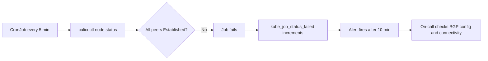

# How to Monitor BGP Peer Not Established in Calico

Author: [nawazdhandala](https://github.com/nawazdhandala)

Tags: Calico, Kubernetes, Networking, Troubleshooting

Description: Monitor BGP peer session state in Calico using BIRD metrics, calicoctl status checks, and Prometheus alerts for non-Established peer sessions.

---

## Introduction

Monitoring BGP peer state in Calico requires tracking session establishment and detecting flapping or sustained non-Established states. BIRD exposes BGP session metrics via Calico's Felix Prometheus endpoint, providing real-time visibility into peer state.

## Symptoms

- BGP peer failure not detected until cross-node connectivity breaks
- Peer flapping (repeated connect/disconnect) not triggering alerts

## Root Causes

- No BGP peer state monitoring configured
- BGP metrics not scraped by Prometheus

## Diagnosis Steps

```bash
calicoctl node status
NODE_POD=$(kubectl get pods -n kube-system -l k8s-app=calico-node -o name | head -1)
kubectl exec $NODE_POD -n kube-system -- wget -qO- http://localhost:9091/metrics \
  | grep "bgp\|bird" | head -20
```

## Solution

**Step 1: Enable Calico metrics**

```bash
kubectl patch felixconfiguration default \
  --type merge \
  --patch '{"spec":{"prometheusMetricsEnabled":true}}'
```

**Step 2: BGP peer state CronJob check**

```yaml
apiVersion: batch/v1
kind: CronJob
metadata:
  name: bgp-peer-check
  namespace: kube-system
spec:
  schedule: "*/5 * * * *"
  jobTemplate:
    spec:
      template:
        spec:
          serviceAccountName: calico-node
          containers:
          - name: checker
            image: calico/ctl:v3.27.0
            command:
            - /bin/sh
            - -c
            - |
              STATUS=$(calicoctl node status 2>/dev/null)
              echo "$STATUS"
              if echo "$STATUS" | grep -v "Established" | grep -qE "Idle|Active|Connect|OpenSent"; then
                echo "ALERT: BGP peer not Established"
                exit 1
              fi
              echo "BGP peers: all Established"
          restartPolicy: Never
```

**Step 3: Alert on BGP peer check failures**

```yaml
apiVersion: monitoring.coreos.com/v1
kind: PrometheusRule
metadata:
  name: bgp-peer-alerts
  namespace: monitoring
spec:
  groups:
  - name: bgp.peer
    rules:
    - alert: BGPPeerCheckFailing
      expr: |
        kube_job_status_failed{
          namespace="kube-system",
          job_name=~"bgp-peer-check.*"
        } > 0
      for: 10m
      labels:
        severity: critical
      annotations:
        summary: "BGP peer not Established - routing may be impaired"
```



## Prevention

- Deploy BGP peer check CronJob during cluster bootstrap
- Alert within 10 minutes of non-Established peer state
- Include BGP peer state in cluster health dashboard

## Conclusion

Monitoring BGP peer state requires a periodic check via calicoctl node status (since BGP peer state metrics may not be directly available in Prometheus in all Calico versions). A CronJob that fails when peers are not Established provides reliable detection through standard Kubernetes job monitoring.
