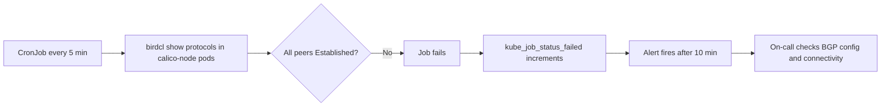

# How to Monitor BGP Peer Not Established in Calico

Author: [nawazdhandala](https://github.com/nawazdhandala)

Tags: Calico, Kubernetes, Networking, Troubleshooting

Description: Monitor BGP peer session state in Calico using BIRD metrics, calicoctl status checks, and Prometheus alerts for non-Established peer sessions.

---

## Introduction

Monitoring BGP peer state in Calico requires tracking session establishment and detecting flapping or sustained non-Established states. Felix exposes component metrics on its Prometheus endpoint, but BGP peer session state is normally checked with `calicoctl node status` on a Calico node or by querying BIRD inside the `calico-node` pod.

## Symptoms

- BGP peer failure not detected until cross-node connectivity breaks
- Peer flapping (repeated connect/disconnect) not triggering alerts

## Root Causes

- No BGP peer state monitoring configured
- Calico component metrics not scraped by Prometheus

## Diagnosis Steps

```bash
calicoctl node status
NODE_POD=$(kubectl get pods -n kube-system -l k8s-app=calico-node -o name | head -1)
kubectl exec $NODE_POD -n kube-system -- wget -qO- http://localhost:9091/metrics \
  | grep "bgp\|bird" | head -20
kubectl exec $NODE_POD -n kube-system -- birdcl -s /var/run/calico/bird.ctl show protocols
```

## Solution

**Step 1: Enable Calico metrics**

```bash
kubectl patch felixconfiguration default \
  --type merge \
  --patch '{"spec":{"prometheusMetricsEnabled":true}}'
```

**Step 2: BGP peer state CronJob check**

```yaml
apiVersion: v1
kind: ServiceAccount
metadata:
  name: bgp-peer-checker
  namespace: kube-system
---
apiVersion: rbac.authorization.k8s.io/v1
kind: Role
metadata:
  name: bgp-peer-checker
  namespace: kube-system
rules:
- apiGroups: [""]
  resources: ["pods"]
  verbs: ["get", "list"]
- apiGroups: [""]
  resources: ["pods/exec"]
  verbs: ["create"]
---
apiVersion: rbac.authorization.k8s.io/v1
kind: RoleBinding
metadata:
  name: bgp-peer-checker
  namespace: kube-system
roleRef:
  apiGroup: rbac.authorization.k8s.io
  kind: Role
  name: bgp-peer-checker
subjects:
- kind: ServiceAccount
  name: bgp-peer-checker
  namespace: kube-system
---
apiVersion: batch/v1
kind: CronJob
metadata:
  name: bgp-peer-check
  namespace: kube-system
spec:
  schedule: "*/5 * * * *"
  jobTemplate:
    spec:
      template:
        spec:
          serviceAccountName: bgp-peer-checker
          containers:
          - name: checker
            image: alpine/k8s:1.30.0
            command:
            - /bin/sh
            - -c
            - |
              FAILED=0
              for POD in $(kubectl get pods -n kube-system -l k8s-app=calico-node -o name); do
                echo "Checking $POD"
                STATUS=$(kubectl exec -n kube-system "$POD" -- birdcl -s /var/run/calico/bird.ctl show protocols 2>&1) || FAILED=1
                echo "$STATUS"
                if echo "$STATUS" | grep -qiE "Idle|Active|Connect|OpenSent|OpenConfirm|Close|Start"; then
                  echo "ALERT: BGP peer not Established in $POD"
                  FAILED=1
                fi
              done
              if [ "$FAILED" -ne 0 ]; then
                exit 1
              fi
              echo "BGP peers: all Established"
          restartPolicy: Never
```

**Step 3: Alert on BGP peer check failures**

```yaml
apiVersion: monitoring.coreos.com/v1
kind: PrometheusRule
metadata:
  name: bgp-peer-alerts
  namespace: monitoring
spec:
  groups:
  - name: bgp.peer
    rules:
    - alert: BGPPeerCheckFailing
      expr: |
        sum(increase(kube_job_status_failed{
          namespace="kube-system",
          job_name=~"bgp-peer-check.*"
        }[10m])) > 0
      for: 10m
      labels:
        severity: critical
      annotations:
        summary: "BGP peer not Established - routing may be impaired"
```


```mermaid
flowchart LR
    A[CronJob every 5 min] --> B[birdcl show protocols in calico-node pods]
    B --> C{All peers Established?}
    C -- No --> D[Job fails]
    D --> E[kube_job_status_failed increments]
    E --> F[Alert fires after 10 min]
    F --> G[On-call checks BGP config and connectivity]
```

## Prevention

- Deploy BGP peer check CronJob during cluster bootstrap
- Alert within 10 minutes of non-Established peer state
- Include BGP peer state in cluster health dashboard

## Conclusion

Monitoring BGP peer state requires a periodic check via `calicoctl node status` on each Calico node or an equivalent BIRD protocol check inside `calico-node` pods, since BGP peer state metrics may not be directly available in Prometheus in all Calico versions. A CronJob that fails when peers are not Established provides reliable detection through standard Kubernetes job monitoring.
