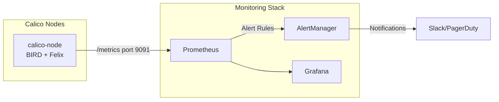

# How to Monitor BGP Peering in Calico

Author: [nawazdhandala](https://github.com/nawazdhandala)

Tags: Calico, Kubernetes, BGP, Monitoring, Networking

Description: Set up comprehensive BGP peering monitoring in Calico using Prometheus metrics, alerting rules, and Grafana dashboards to detect session failures and route anomalies.

---

## Introduction

BGP peering failures in Calico can cause silent networking outages — pods on affected nodes lose connectivity while the node itself appears healthy to Kubernetes. Without proactive monitoring, these failures may go undetected until application teams report connectivity issues. By the time an alert fires based on application symptoms, the root cause investigation adds significant time to the resolution.

Calico exposes BGP metrics through Felix (the per-node agent) and through the BIRD BGP daemon. These metrics cover session states, route counts, and convergence events. Feeding these metrics into Prometheus and building dashboards in Grafana gives you real-time visibility into the health of your BGP peering topology.

This guide covers how to enable Calico BGP metrics, configure Prometheus scraping, build alerting rules for BGP session failures, and create a Grafana dashboard for BGP health visualization.

## Prerequisites

- Calico v3.26+ with BGP mode
- Prometheus Operator or standalone Prometheus
- Grafana for dashboards
- `kubectl` access

## Enable Felix Metrics

Felix exposes Prometheus metrics including BGP session information:

```bash
calicoctl patch felixconfiguration default --type merge \
  --patch '{"spec":{"prometheusMetricsEnabled":true}}'
```

Verify metrics are exposed:

```bash
NODE_POD=$(kubectl get pod -n calico-system -l k8s-app=calico-node -o name | head -1)
kubectl exec -n calico-system ${NODE_POD} -- wget -qO- http://localhost:9091/metrics | grep bgp
```

## Configure Prometheus ServiceMonitor

Create a ServiceMonitor to scrape Calico node metrics:

```yaml
apiVersion: monitoring.coreos.com/v1
kind: ServiceMonitor
metadata:
  name: calico-node-metrics
  namespace: monitoring
spec:
  selector:
    matchLabels:
      k8s-app: calico-node
  endpoints:
  - port: calico-metrics-port
    interval: 15s
    scheme: http
```

## Key BGP Metrics to Track

Key Prometheus metrics for BGP peering health:

| Metric | Description |
|--------|-------------|
| `felix_bgp_num_established_v4` | Number of established IPv4 BGP sessions |
| `felix_bgp_num_established_v6` | Number of established IPv6 BGP sessions |
| `felix_bgp_num_not_established` | Sessions in non-established state |
| `felix_route_table_list_seconds_*` | Route table update latency |

## Configure BGP Alerting Rules

```yaml
apiVersion: monitoring.coreos.com/v1
kind: PrometheusRule
metadata:
  name: calico-bgp-alerts
  namespace: monitoring
spec:
  groups:
  - name: calico-bgp
    rules:
    - alert: CalicoBGPSessionDown
      expr: felix_bgp_num_not_established > 0
      for: 2m
      labels:
        severity: critical
      annotations:
        summary: "Calico BGP session down on {{ $labels.instance }}"
        description: "{{ $value }} BGP sessions are not established"
    - alert: CalicoBGPSessionFlapping
      expr: changes(felix_bgp_num_established_v4[5m]) > 3
      labels:
        severity: warning
      annotations:
        summary: "Calico BGP session flapping on {{ $labels.instance }}"
```

## BGP Monitoring Architecture



## Conclusion

Monitoring Calico BGP peering proactively prevents silent networking outages from affecting production workloads. Enable Felix metrics, configure Prometheus scraping and alerting rules for session failures, and build Grafana dashboards to visualize peering health across your cluster. Aim for BGP session failure alerts to fire within 2 minutes of a session going down.
