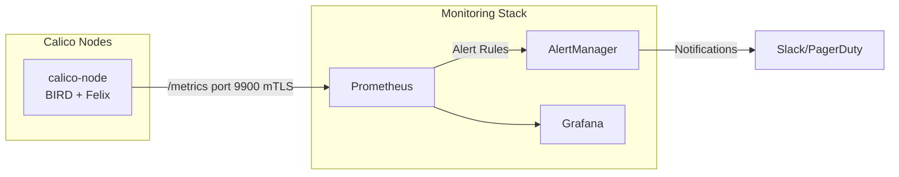

# How to Monitor BGP Peering in Calico

Author: [nawazdhandala](https://github.com/nawazdhandala)

Tags: Calico, Kubernetes, BGP, Monitoring, Networking

Description: Set up comprehensive BGP peering monitoring in Calico using Prometheus metrics, alerting rules, and Grafana dashboards to detect session failures and route anomalies.

---

## Introduction

BGP peering failures in Calico can cause silent networking outages - pods on affected nodes lose connectivity while the node itself appears healthy to Kubernetes. Without proactive monitoring, these failures may go undetected until application teams report connectivity issues. By the time an alert fires based on application symptoms, the root cause investigation adds significant time to the resolution.

Calico Enterprise exposes BGP metrics from `calico-node` using statistics pulled from the BIRD BGP daemon. These metrics cover session states, route counts, and route updates. Feeding these metrics into Prometheus and building dashboards in Grafana gives you real-time visibility into the health of your BGP peering topology.

This guide covers how to verify Calico BGP metrics, configure Prometheus scraping, build alerting rules for BGP session failures, and create a Grafana dashboard for BGP health visualization.

## Prerequisites

- Calico Enterprise with BGP mode
- Prometheus Operator or standalone Prometheus
- Grafana for dashboards
- `kubectl` access

## Verify BGP Metrics

Calico Enterprise runs BGP metrics for Prometheus by default on each compute node at port 9900, secured with mTLS. Extract the client credentials and CA bundle:

```bash
kubectl get secret -n tigera-prometheus calico-node-prometheus-client-tls \
  -o jsonpath='{.data.tls\.key}' | base64 -d > key.pem
kubectl get secret -n tigera-prometheus calico-node-prometheus-client-tls \
  -o jsonpath='{.data.tls\.crt}' | base64 -d > cert.pem
kubectl get cm -n tigera-prometheus tigera-ca-bundle \
  -o jsonpath='{.data.tigera-ca-bundle\.crt}' > bundle.pem
```

Verify metrics are exposed:

```bash
NODE_IP=$(kubectl get node -o jsonpath='{.items[0].status.addresses[?(@.type=="InternalIP")].address}')
curl --cacert bundle.pem --key key.pem --cert cert.pem \
  https://${NODE_IP}:9900/metrics | grep '^bgp_'
```

## Configure Prometheus Scraping

If you use Calico Enterprise's managed Prometheus, it scrapes configured `calico-node` targets. For a standalone Prometheus, mount the extracted Calico Enterprise mTLS credentials into Prometheus and add a scrape job that discovers Kubernetes nodes:

```yaml
- job_name: calico-bgp
  scheme: https
  metrics_path: /metrics
  scrape_interval: 15s
  tls_config:
    ca_file: /etc/prometheus/calico-bgp/bundle.pem
    cert_file: /etc/prometheus/calico-bgp/cert.pem
    key_file: /etc/prometheus/calico-bgp/key.pem
  kubernetes_sd_configs:
  - role: node
  relabel_configs:
  - source_labels: [__address__]
    regex: '([^:]+)(?::\d+)?'
    target_label: __address__
    replacement: '${1}:9900'
```

## Key BGP Metrics to Track

Key Prometheus metrics for BGP peering health:

| Metric | Description |
|--------|-------------|
| `bgp_peers{status="Established",ip_version="IPv4"}` | Number of established IPv4 BGP sessions |
| `bgp_peers{status="Established",ip_version="IPv6"}` | Number of established IPv6 BGP sessions |
| `bgp_peers{status!="Established"}` | Sessions in non-established state |
| `bgp_routes_imported` | Current number of routes successfully imported into the routing table |
| `bgp_route_updates_received` | Total number of route updates received since startup |

## Configure BGP Alerting Rules

```yaml
apiVersion: monitoring.coreos.com/v1
kind: PrometheusRule
metadata:
  name: calico-bgp-alerts
  namespace: monitoring
spec:
  groups:
  - name: calico-bgp
    rules:
    - alert: CalicoBGPSessionDown
      expr: bgp_peers{status!="Established"} > 0
      for: 2m
      labels:
        severity: critical
      annotations:
        summary: "Calico BGP session down on {{ $labels.instance }}"
        description: "{{ $value }} BGP sessions are in {{ $labels.status }} state"
    - alert: CalicoBGPSessionFlapping
      expr: changes(bgp_peers{status="Established",ip_version="IPv4"}[5m]) > 3
      labels:
        severity: warning
      annotations:
        summary: "Calico BGP session flapping on {{ $labels.instance }}"
```

## BGP Monitoring Architecture


```mermaid
graph LR
    subgraph Calico Nodes
        CN[calico-node\nBIRD + Felix]
    end
    subgraph Monitoring Stack
        PROM[Prometheus]
        ALERT[AlertManager]
        GRAF[Grafana]
    end
    CN -->|/metrics port 9900 mTLS| PROM
    PROM -->|Alert Rules| ALERT
    ALERT -->|Notifications| SLACK[Slack/PagerDuty]
    PROM --> GRAF
```

## Conclusion

Monitoring Calico BGP peering proactively prevents silent networking outages from affecting production workloads. Verify BGP metrics, configure Prometheus scraping and alerting rules for session failures, and build Grafana dashboards to visualize peering health across your cluster. Aim for BGP session failure alerts to fire within 2 minutes of a session going down.
