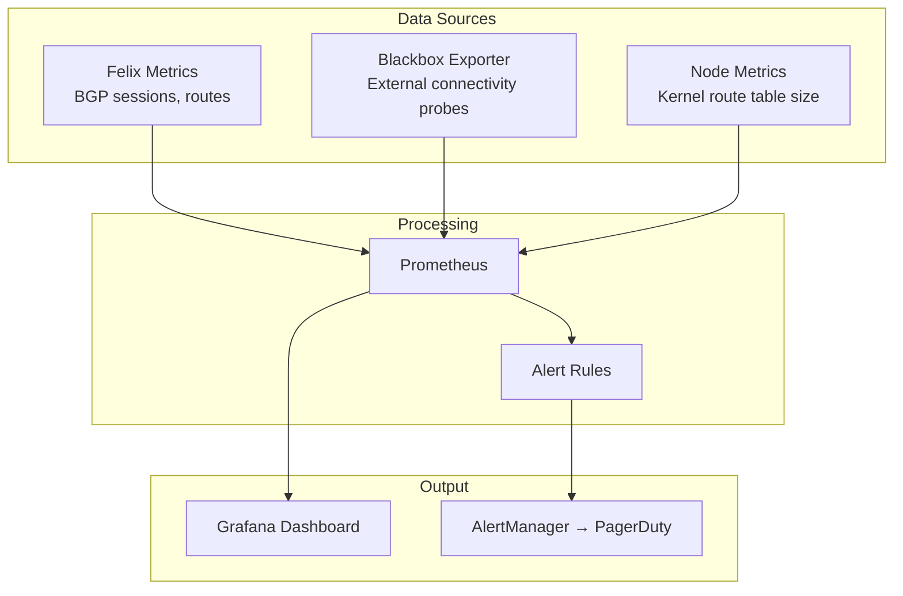

# How to Monitor BGP to Workload Connectivity in Calico

Author: [nawazdhandala](https://github.com/nawazdhandala)

Tags: Calico, Kubernetes, BGP, Monitoring, Networking

Description: Monitor BGP-to-workload connectivity health in Calico using Prometheus metrics, blackbox probing, and route change alerting to detect external access failures early.

---

## Introduction

Monitoring BGP-to-workload connectivity requires observing both the BGP control plane and the data plane. BGP sessions and route advertisements can be healthy while data plane issues — such as iptables misconfigurations, RPF drops, or MTU blackholes — silently affect traffic. A comprehensive monitoring strategy covers both layers.

Blackbox probing from external hosts provides end-to-end connectivity verification that BGP-level metrics alone cannot capture. Combining Prometheus metrics from Calico's Felix agent with synthetic monitoring from outside the cluster gives you a complete picture of whether your workloads are actually reachable.

## Prerequisites

- Prometheus and Grafana deployed
- Calico Felix metrics enabled
- Blackbox exporter for synthetic monitoring
- Access to external network for end-to-end probing

## Configure Blackbox Probing for Pod Connectivity

Deploy Prometheus blackbox exporter to probe pod IPs from external vantage points:

```yaml
apiVersion: monitoring.coreos.com/v1
kind: Probe
metadata:
  name: bgp-pod-probes
  namespace: monitoring
spec:
  jobName: bgp-workload-connectivity
  prober:
    url: blackbox-exporter:9115
  module: http_2xx
  targets:
    staticConfig:
      static:
      - http://10.48.1.5:80
      - http://10.48.2.10:80
```

## Monitor Route Count Changes

Track BGP route count changes using Felix metrics and alert on unexpected drops:

```yaml
apiVersion: monitoring.coreos.com/v1
kind: PrometheusRule
metadata:
  name: bgp-route-monitoring
  namespace: monitoring
spec:
  groups:
  - name: bgp-workload-routes
    rules:
    - alert: BGPWorkloadRoutesDrop
      expr: |
        delta(felix_bgp_num_established_v4[5m]) < -1
      for: 1m
      labels:
        severity: warning
      annotations:
        summary: "BGP workload routes decreased on {{ $labels.instance }}"
    - alert: ExternalPodUnreachable
      expr: probe_success{job="bgp-workload-connectivity"} == 0
      for: 2m
      labels:
        severity: critical
      annotations:
        summary: "Pod IP {{ $labels.instance }} unreachable from external probe"
```

## Track Connection Latency

Monitor end-to-end latency for direct pod connections:

```bash
# Using curl with timing metrics for continuous latency measurement
while true; do
  latency=$(curl -s -o /dev/null -w "%{time_connect}" http://${POD_IP}/)
  echo "latency_ms{pod_ip=\"${POD_IP}\"} $(echo "$latency * 1000" | bc)"
  sleep 10
done | nc -q 1 prometheus-pushgateway 9091
```

## Monitor BGP Route Table Size

Track route table growth to detect scaling issues:

```bash
# Custom metric for route table size
kubectl exec -n calico-system ${NODE_POD} -- ip route | wc -l
```

## Monitoring Stack Architecture



## Conclusion

Monitoring BGP-to-workload connectivity requires a dual approach: Calico Felix metrics for BGP control plane health and blackbox probing from external vantage points for data plane verification. Set up alerts for BGP session count drops and external probe failures to catch connectivity issues before they impact application users.
