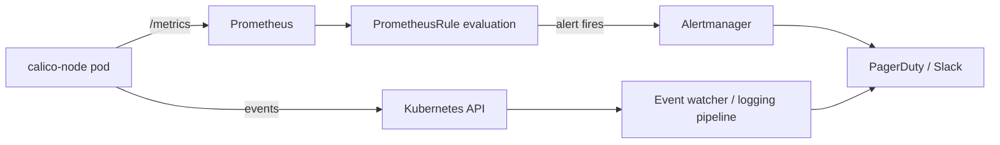

# How to Monitor for BIRD Not Ready Errors in Calico

Author: [nawazdhandala](https://github.com/nawazdhandala)

Tags: Calico, Kubernetes, Networking, Troubleshooting

Description: Set up monitoring and alerting for BIRD not ready errors in Calico using Prometheus metrics, Kubernetes events, and BGP peer state checks.

---

## Introduction

Monitoring BIRD health in Calico is essential for detecting BGP routing failures before they impact application traffic. The calico-node pod exposes Prometheus metrics, emits Kubernetes events, and writes structured logs - all of which can be used to build comprehensive observability for BIRD state.

Without dedicated monitoring, BIRD failures often go unnoticed until users report intermittent connectivity issues. By the time the issue is escalated, the failure may have been occurring for hours. Proactive monitoring surfaces these problems within seconds and enables automated alerting to the on-call team.

This guide covers three monitoring layers: Prometheus metrics and alerts, Kubernetes event watching, and log-based alerting. Implementing all three provides defense-in-depth for BGP health visibility.

## Symptoms

- No alerts triggered during a BIRD not-ready incident that lasted hours
- BGP peer state changes are invisible in existing dashboards
- calico-node pod restarts go unnoticed until application teams report issues

## Root Causes

- Calico metrics endpoint not scraped by Prometheus
- No PrometheusRule defined for BIRD or BGP peer state
- calico-node pod restarts not correlated with network incidents

## Diagnosis Steps

```bash
# Verify calico-node metrics endpoint is accessible
NODE_POD=$(kubectl get pods -n kube-system -l k8s-app=calico-node -o name | head -1)
kubectl exec $NODE_POD -n kube-system -- wget -qO- http://localhost:9091/metrics | grep -i "bird\|bgp" | head -20

# Check if Prometheus is scraping calico-node
kubectl get servicemonitor,podmonitor -n kube-system | grep calico
```

## Solution

**Step 1: Enable Calico metrics**

```bash
kubectl patch felixconfiguration default \
  --type merge \
  --patch '{"spec":{"prometheusMetricsEnabled":true}}'
```

**Step 2: Create a PodMonitor for calico-node**

```yaml
apiVersion: monitoring.coreos.com/v1
kind: PodMonitor
metadata:
  name: calico-node-monitor
  namespace: kube-system
spec:
  selector:
    matchLabels:
      k8s-app: calico-node
  podMetricsEndpoints:
  - port: http-metrics
    interval: 15s
    path: /metrics
```

**Step 3: Create PrometheusRules for BIRD alerts**

```yaml
apiVersion: monitoring.coreos.com/v1
kind: PrometheusRule
metadata:
  name: calico-bird-alerts
  namespace: kube-system
spec:
  groups:
  - name: calico.bird
    rules:
    - alert: CalicoNodeBIRDNotReady
      expr: up{job="calico-node"} == 0
      for: 2m
      labels:
        severity: critical
      annotations:
        summary: "Calico BIRD not ready on {{ $labels.pod }}"
        description: "calico-node pod {{ $labels.pod }} has been unreachable for 2 minutes"
    - alert: CalicoNodePodRestarting
      expr: increase(kube_pod_container_status_restarts_total{namespace="kube-system",container="calico-node"}[15m]) > 2
      for: 5m
      labels:
        severity: warning
      annotations:
        summary: "calico-node pod restarting frequently on {{ $labels.pod }}"
```

**Step 4: Watch Kubernetes events for BIRD issues**

```bash
# Continuous watch for calico-node events
kubectl get events -n kube-system --watch \
  --field-selector involvedObject.name=calico-node 2>/dev/null

# Or use a script in a CronJob
kubectl get events -n kube-system \
  --sort-by='.lastTimestamp' \
  --field-selector reason=BackOff | grep calico
```



## Prevention

- Include calico monitoring setup in your cluster provisioning checklist
- Test alert rules in a staging cluster to confirm they fire correctly
- Set up a synthetic BGP connectivity check using a periodic `calicoctl node status` CronJob

## Conclusion

Effective monitoring for BIRD not-ready errors requires enabling Prometheus metrics on calico-node, creating targeted alert rules, and watching Kubernetes events. With these in place, BGP failures surface within minutes, enabling rapid response before users are impacted.
