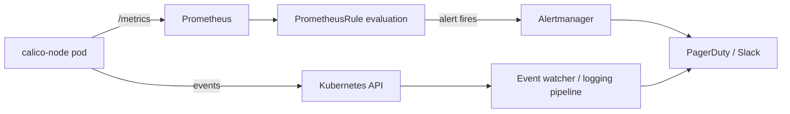

# How to Monitor for BIRD Not Ready Errors in Calico

Author: [nawazdhandala](https://github.com/nawazdhandala)

Tags: Calico, Kubernetes, Networking, Troubleshooting

Description: Set up monitoring and alerting for BIRD not ready errors in Calico using Prometheus metrics, Kubernetes events, and BGP peer state checks.

---

## Introduction

Monitoring BIRD health in Calico is essential for detecting BGP routing failures before they impact application traffic. The calico-node pod exposes Felix Prometheus metrics, emits Kubernetes events, and writes structured logs - all of which can be used to build comprehensive observability around BIRD readiness.

Without dedicated monitoring, BIRD failures often go unnoticed until users report intermittent connectivity issues. By the time the issue is escalated, the failure may have been occurring for hours. Proactive monitoring surfaces these problems within seconds and enables automated alerting to the on-call team.

This guide covers three monitoring layers: Prometheus metrics and alerts, Kubernetes event watching, and log-based alerting. Implementing all three provides defense-in-depth for BGP health visibility.

## Symptoms

- No alerts triggered during a BIRD not-ready incident that lasted hours
- BGP peer state changes are invisible in existing dashboards
- calico-node pod restarts go unnoticed until application teams report issues

## Root Causes

- Calico metrics endpoint not scraped by Prometheus
- No PrometheusRule defined for BIRD or BGP peer state
- calico-node pod restarts not correlated with network incidents

## Diagnosis Steps

```bash
# Verify calico-node metrics endpoint is accessible

NODE_POD=$(kubectl get pods -n kube-system -l k8s-app=calico-node -o jsonpath='{.items[0].metadata.name}')
kubectl exec -n kube-system "$NODE_POD" -- wget -qO- http://localhost:9091/metrics | head -20

# Check BGP peer status on the node where calico-node is running
sudo calicoctl node status

# Check if Prometheus is scraping calico-node
kubectl get servicemonitor -n kube-system | grep calico
```

## Solution

**Step 1: Enable Calico Felix metrics**

```bash
kubectl patch felixconfiguration default \
  --type merge \
  --patch '{"spec":{"prometheusMetricsEnabled":true}}'
```

**Step 2: Create a ServiceMonitor for calico-node**

```yaml
apiVersion: v1
kind: Service
metadata:
  name: felix-metrics-svc
  namespace: kube-system
  labels:
    k8s-app: calico-node
spec:
  clusterIP: None
  selector:
    k8s-app: calico-node
  ports:
  - name: metrics
    port: 9091
    targetPort: 9091
---
apiVersion: monitoring.coreos.com/v1
kind: ServiceMonitor
metadata:
  name: calico-node-monitor
  namespace: kube-system
spec:
  selector:
    matchLabels:
      k8s-app: calico-node
  endpoints:
  - port: metrics
    interval: 15s
    path: /metrics
```

**Step 3: Create PrometheusRules for BIRD alerts**

```yaml
apiVersion: monitoring.coreos.com/v1
kind: PrometheusRule
metadata:
  name: calico-bird-alerts
  namespace: kube-system
spec:
  groups:
  - name: calico.bird
    rules:
    - alert: CalicoNodeBIRDNotReady
      expr: kube_pod_container_status_ready{namespace="kube-system",container="calico-node",pod=~"calico-node-.*"} == 0
      for: 2m
      labels:
        severity: critical
      annotations:
        summary: "Calico BIRD not ready on {{ $labels.pod }}"
        description: "calico-node container {{ $labels.pod }} has failed its readiness check for 2 minutes"
    - alert: CalicoNodeMetricsDown
      expr: up{namespace="kube-system",service="felix-metrics-svc"} == 0
      for: 2m
      labels:
        severity: warning
      annotations:
        summary: "Calico metrics scrape is failing on {{ $labels.pod }}"
        description: "Prometheus has been unable to scrape Felix metrics for 2 minutes"
    - alert: CalicoNodePodRestarting
      expr: increase(kube_pod_container_status_restarts_total{namespace="kube-system",container="calico-node"}[15m]) > 2
      for: 5m
      labels:
        severity: warning
      annotations:
        summary: "calico-node pod restarting frequently on {{ $labels.pod }}"
```

**Step 4: Watch Kubernetes events for BIRD issues**

```bash
# Continuous watch for calico-node events
NODE_POD=$(kubectl get pods -n kube-system -l k8s-app=calico-node -o jsonpath='{.items[0].metadata.name}')
kubectl events -n kube-system --for pod/"$NODE_POD" --watch

# Or use a script in a CronJob
kubectl get events -n kube-system \
  --sort-by='.lastTimestamp' \
  --field-selector reason=BackOff | grep calico
```


```mermaid
flowchart LR
    A[calico-node pod] -- /metrics --> B[Prometheus]
    B --> C[PrometheusRule evaluation]
    C -- alert fires --> D[Alertmanager]
    D --> E[PagerDuty / Slack]
    A -- events --> F[Kubernetes API]
    F --> G[Event watcher / logging pipeline]
    G --> E
```

## Prevention

- Include calico monitoring setup in your cluster provisioning checklist
- Test alert rules in a staging cluster to confirm they fire correctly
- Set up a synthetic BGP connectivity check using `CalicoNodeStatus` resources or a host-level `calicoctl node status` check

## Conclusion

Effective monitoring for BIRD not-ready errors requires enabling Prometheus metrics on calico-node, creating targeted alert rules, and watching Kubernetes events. With these in place, BGP failures surface within minutes, enabling rapid response before users are impacted.
