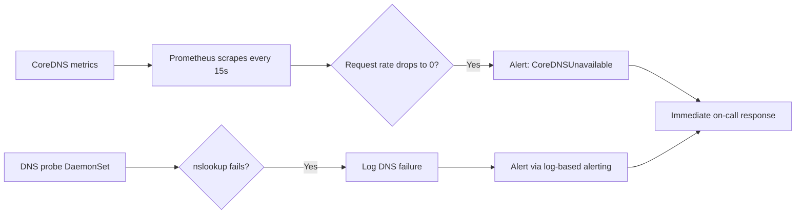

# How to Monitor Calico Blocking kube-dns

Author: [nawazdhandala](https://github.com/nawazdhandala)

Tags: Calico, Kubernetes, Networking, Troubleshooting

Description: Monitor for Calico policies blocking kube-dns using CoreDNS metrics, synthetic DNS probes from multiple namespaces, and cluster-wide DNS availability SLI.

---

## Introduction

Monitoring for Calico blocking kube-dns requires cluster-wide DNS availability as a primary service level indicator. When kube-dns is blocked, DNS fails for every namespace simultaneously - this pattern is detectable by monitoring DNS success rates from multiple test points.

## Symptoms

- Cluster-wide DNS failure detected seconds after policy is applied
- No alert fires for DNS outage lasting multiple minutes

## Root Causes

- No cluster-wide DNS SLI defined
- DNS probes only in specific namespaces, missing cluster-wide detection

## Diagnosis Steps

```bash
# Check CoreDNS error rate
kubectl exec -n kube-system \
  $(kubectl get pods -n kube-system -l k8s-app=kube-dns -o name | head -1) \
  -- wget -qO- http://localhost:9153/metrics | grep -E "responses_total|requests_total"
```

## Solution

**Multi-namespace DNS probe DaemonSet**

```yaml
apiVersion: apps/v1
kind: DaemonSet
metadata:
  name: dns-probe-all-ns
  namespace: kube-system
spec:
  selector:
    matchLabels:
      app: dns-probe
  template:
    metadata:
      labels:
        app: dns-probe
    spec:
      containers:
      - name: probe
        image: busybox
        command:
        - /bin/sh
        - -c
        - |
          while true; do
            nslookup kubernetes.default.svc.cluster.local > /dev/null 2>&1 || \
              echo "$(date): DNS FAILURE"
            sleep 10
          done
```

**Prometheus alert for CoreDNS availability**

```yaml
apiVersion: monitoring.coreos.com/v1
kind: PrometheusRule
metadata:
  name: coredns-availability-alert
  namespace: monitoring
spec:
  groups:
  - name: coredns
    rules:
    - alert: CoreDNSUnavailable
      expr: |
        absent(up{job="coredns"})
        OR
        rate(coredns_dns_requests_total[5m]) == 0
      for: 2m
      labels:
        severity: critical
      annotations:
        summary: "CoreDNS appears unavailable or not processing queries"
```



## Prevention

- Set up CoreDNS availability monitoring before enabling any kube-system policies
- Define cluster-wide DNS availability as an SLI with alerting
- Monitor DNS request rate as a proxy for DNS health

## Conclusion

Monitoring kube-dns availability requires tracking CoreDNS request rate (drops to zero when blocked), SERVFAIL rates, and DNS probe results. The combination detects kube-dns blocking within 2 minutes of onset and enables rapid response to cluster-wide DNS outages.
