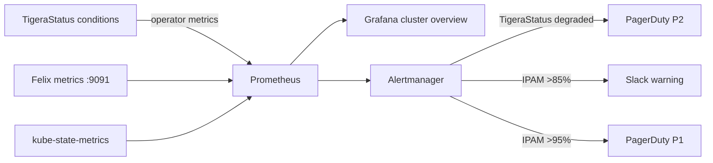

# How to Monitor Calico Cluster Diagnostics

Author: [nawazdhandala](https://github.com/nawazdhandala)

Tags: Calico, Kubernetes, Networking, Diagnostics, Monitoring

Description: Monitor Calico cluster health using Prometheus alerts on TigeraStatus conditions, IPAM utilization thresholds, and kube-controllers sync lag to detect cluster-wide issues before they impact applications.

---

## Introduction

Monitoring cluster-wide Calico health requires tracking TigeraStatus conditions in Prometheus, alerting on IPAM utilization before exhaustion, and detecting kube-controllers sync failures that cause policy drift. These cluster-level signals complement per-node Felix metrics to provide complete Calico observability.

## Prometheus Rules for Cluster Health

```yaml
apiVersion: monitoring.coreos.com/v1
kind: PrometheusRule
metadata:
  name: calico-cluster-health-alerts
  namespace: calico-system
spec:
  groups:
    - name: calico.cluster
      rules:
        # TigeraStatus degradation
        - alert: CalicoTigeraStatusDegraded
          expr: |
            tigera_component_available == 0
          for: 5m
          annotations:
            summary: "Calico component {{ $labels.component }} is not Available"

        # IPAM utilization high
        - alert: CalicoIPAMHighUtilization
          expr: |
            (felix_ipam_blocks_used / felix_ipam_blocks_total) > 0.85
          for: 10m
          annotations:
            summary: "Calico IPAM utilization above 85%"

        # kube-controllers not syncing
        - alert: CalicoKubeControllersNotSyncing
          expr: |
            time() - kube_controllers_last_sync_timestamp > 300
          for: 5m
          annotations:
            summary: "calico-kube-controllers has not synced in 5 minutes"

        # calico-typha replicas below desired
        - alert: CalicoTyphaBelowDesired
          expr: |
            kube_deployment_status_replicas_available{deployment="calico-typha"}
            < kube_deployment_spec_replicas{deployment="calico-typha"}
          for: 5m
          annotations:
            summary: "calico-typha is below desired replica count"
```

## IPAM Utilization Tracking

```bash
# Export IPAM utilization as a simple metric for Prometheus
#!/bin/bash
# Track IPAM utilization over time
while true; do
  USED=$(calicoctl ipam show 2>/dev/null | grep "IPs in use" | awk '{print $NF}' | tr -d '%')
  echo "calico_ipam_utilization_percent ${USED}"
  sleep 60
done
```

## Monitoring Architecture



## Grafana Cluster Overview Dashboard

```json
{
  "title": "Calico Cluster Health Overview",
  "panels": [
    {
      "title": "TigeraStatus Available",
      "type": "stat",
      "targets": [{"expr": "sum(tigera_component_available)"}]
    },
    {
      "title": "IPAM Utilization",
      "type": "gauge",
      "targets": [{"expr": "felix_ipam_blocks_used / felix_ipam_blocks_total * 100"}],
      "thresholds": [{"color": "green", "value": 0}, {"color": "yellow", "value": 75}, {"color": "red", "value": 90}]
    }
  ]
}
```

## Conclusion

Cluster-level Calico monitoring requires three critical alerts: TigeraStatus degradation (immediate P2), IPAM utilization above 85% (warning) and 95% (P1), and kube-controllers sync lag (prevents policy drift from going undetected). The IPAM utilization alert is the most operationally valuable because IPAM exhaustion silently prevents new pods from scheduling, and by the time engineers notice, the cluster may be at 100%.
