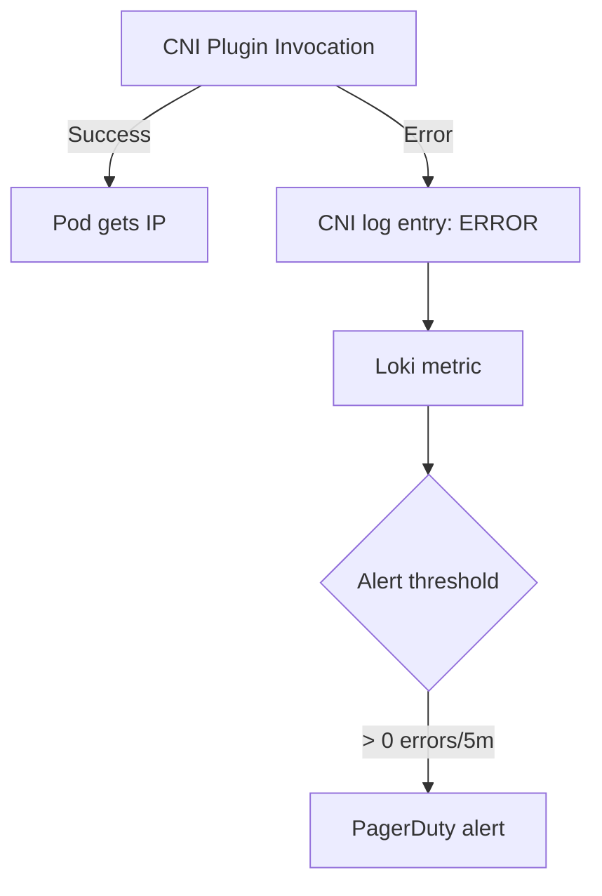

# Monitor Calico CNI Plugin

Author: [nawazdhandala](https://github.com/nawazdhandala)

Tags: Calico, Kubernetes, Networking, CNI, Plugin, Monitoring, Observability

Description: Set up monitoring for the Calico CNI plugin to track pod IP allocation rates, CNI invocation errors, IPAM pool utilization, and WorkloadEndpoint creation health.

---

## Introduction

Monitoring the Calico CNI plugin provides visibility into pod networking infrastructure health that is often overlooked until it fails. CNI invocation latency affects pod startup time; IPAM pool exhaustion prevents new pods from starting; and WorkloadEndpoint creation failures mean pods start without network policy enforcement. By tracking these metrics proactively, you can address capacity and health issues before they cause visible failures.

## Prerequisites

- Calico installed with Felix metrics enabled
- Prometheus and Grafana deployed
- Log aggregation for CNI logs (Loki or similar)

## Step 1: Monitor IPAM Pool Utilization

IPAM pool exhaustion is the most common CNI-related capacity issue:

```bash
# Create a script to expose IPAM utilization as metrics
kubectl create configmap ipam-metrics-script -n monitoring \
  --from-literal=check.sh='#!/bin/sh
calicoctl ipam show --output=json | python3 -c "
import json, sys
data = json.load(sys.stdin)
blocks = data.get(\"blocks\", [])
total = sum(b[\"allocations\"] + b[\"unallocations\"] for b in blocks)
used = sum(b[\"allocations\"] for b in blocks)
print(f\"calico_ipam_total_ips {total}\")
print(f\"calico_ipam_used_ips {used}\")
print(f\"calico_ipam_free_ips {total - used}\")
"'
```

Alert on pool utilization:

```yaml
- alert: CalicoIPAMPoolNearFull
  expr: (calico_ipam_used_ips / calico_ipam_total_ips) > 0.8
  for: 5m
  labels:
    severity: warning
  annotations:
    summary: "Calico IPAM pool is {{ $value | humanizePercentage }} full"

- alert: CalicoIPAMPoolCritical
  expr: (calico_ipam_used_ips / calico_ipam_total_ips) > 0.95
  for: 1m
  labels:
    severity: critical
  annotations:
    summary: "Calico IPAM pool nearly exhausted - new pods will fail to start"
```

## Step 2: Monitor CNI Error Rates via Log Metrics



Loki alerting rule:

```yaml
groups:
  - name: calico-cni
    rules:
      - alert: CalicoCNIErrors
        expr: |
          sum(rate({job="calico-cni"} |= "level=error" [5m])) > 0
        for: 1m
        labels:
          severity: warning
        annotations:
          summary: "Calico CNI plugin errors detected"
```

## Step 3: Monitor WorkloadEndpoint Count

Track the number of WorkloadEndpoints to detect creation failures:

```bash
# Expose WEP count as a metric
calicoctl get wep --all-namespaces -o json | \
  python3 -c "import json,sys; print(len(json.load(sys.stdin)['items']))"

# Should match running pod count
kubectl get pods -A --field-selector=status.phase=Running | wc -l
```

Alert on divergence:

```yaml
- alert: CalicoCNIWEPMismatch
  expr: |
    (kube_pod_status_phase{phase="Running"} - calico_wep_count) > 5
  for: 3m
  labels:
    severity: warning
  annotations:
    summary: "Calico WEP count diverging from running pod count"
```

## Step 4: Track Pod Start Time (CNI Latency Indicator)

```bash
# High pod start times often indicate slow CNI execution
kubectl get events --sort-by='.lastTimestamp' | grep "Created container"
```

## Step 5: Monitor IPAM Handle Leaks

```bash
# Schedule a daily check for leaked IPAM handles
kubectl create cronjob ipam-check --schedule="0 3 * * *" \
  --image=calico/ctl:v3.27.0 \
  -- sh -c "calicoctl ipam check && echo 'IPAM healthy' || echo 'IPAM issues found'"
```

## Conclusion

Monitoring the Calico CNI plugin focuses on IPAM pool utilization (to prevent exhaustion), CNI error rate tracking via log aggregation, and WorkloadEndpoint count alignment with running pods. IPAM pool utilization is the most actionable metric — at 80% capacity, you have time to add IP pools before pod creation failures occur. CNI error log monitoring catches transient failures that don't create visible Kubernetes events.
