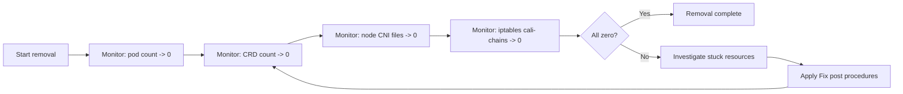

# How to Monitor Calico CNI Removal Progress and Problems

Author: [nawazdhandala](https://github.com/nawazdhandala)

Tags: Calico, Kubernetes, Networking, Troubleshooting

Description: Monitor Calico CNI removal progress by tracking resource deletion, identifying stuck objects with finalizers, and verifying node-level cleanup completion.

---

## Introduction

Monitoring Calico CNI removal is less about continuous alerting and more about tracking progress through a defined removal procedure. Each step of the removal process has observable outputs that confirm successful completion. Monitoring these checkpoints prevents the common mistake of assuming removal is complete when it is not.

The key monitoring points are: Calico pod count reaching zero, CRD resource count reaching zero, CNI config files absent from nodes, and iptables cali-* chains absent from the FORWARD table.

## Symptoms

- Removal procedure appears complete but new CNI fails to initialize
- Removal hangs at a specific step with no progress indication
- Resources stuck in Terminating state with no error message

## Root Causes

- No monitoring of removal progress leads to incomplete cleanup being missed
- Finalizers blocking deletion not noticed until new CNI is attempted

## Diagnosis Steps

```bash
# Overall Calico presence check
kubectl get all -n kube-system | grep calico | wc -l
kubectl get crd | grep calico | wc -l
```

## Solution

**Step 1: Monitor Calico pod count during removal**

```bash
# Watch Calico pod count decrease
watch -n5 kubectl get pods -n kube-system -l k8s-app=calico-node
```

**Step 2: Monitor CRD deletion**

```bash
# Watch CRD count
watch -n5 "kubectl get crd | grep calico"
# Expected: count decreases to 0
```

**Step 3: Check for stuck Terminating resources**

```bash
# Check all namespaces for Terminating Calico resources
kubectl get all --all-namespaces | grep -i "terminating\|calico"

# Check for stuck CRD objects
kubectl api-resources --verbs=list | grep calico | awk '{print $1}' | while read RES; do
  COUNT=$(kubectl get $RES --all-namespaces 2>/dev/null | tail -n +2 | wc -l)
  if [ "$COUNT" -gt 0 ]; then
    echo "Remaining $RES: $COUNT"
  fi
done
```

**Step 4: Verify node-level cleanup per node**

```bash
for NODE in $(kubectl get nodes -o jsonpath='{.items[*].metadata.name}'); do
  CNI_FILES=$(ssh $NODE "ls /etc/cni/net.d/ | grep calico | wc -l" 2>/dev/null)
  CALI_CHAINS=$(ssh $NODE "sudo iptables -L | grep -c cali-" 2>/dev/null || echo "0")
  echo "$NODE - CNI files: $CNI_FILES, cali- chains: $CALI_CHAINS"
done
```

**Step 5: Post-removal verification checklist**

```bash
echo "=== Post-removal verification ==="
echo -n "Calico pods: "
kubectl get pods -n kube-system -l k8s-app=calico-node --no-headers 2>/dev/null | wc -l
echo -n "Calico CRDs: "
kubectl get crd 2>/dev/null | grep calico | wc -l
echo -n "calico-config ConfigMap: "
kubectl get configmap calico-config -n kube-system 2>/dev/null | wc -l
echo "=== Expected: all zeros ==="
```



## Prevention

- Create a removal monitoring script and run it after each removal step
- Check node-level state before declaring removal complete
- Document completion criteria for each step of the removal procedure

## Conclusion

Monitoring Calico CNI removal requires tracking resource counts at each layer: pods, CRDs, CNI config files, and iptables chains. A simple verification script run after each step confirms progress and catches stuck resources before they block the next step or the new CNI installation.
