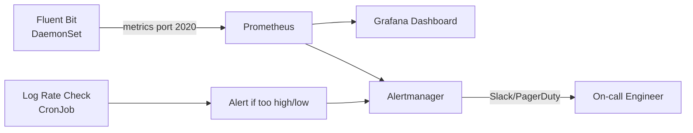

# How to Monitor Calico Component Log Collection

Author: [nawazdhandala](https://github.com/nawazdhandala)

Tags: Calico, Kubernetes, Networking, Logging, Monitoring

Description: Monitor the health of Calico log collection pipelines by tracking log ingestion rates, detecting gaps in log coverage, and alerting on log shipper failures or Calico component log silences.

---

## Introduction

Monitoring log collection infrastructure is often neglected until an incident reveals that logs were missing. For Calico, two failure modes are most common: a calico-node pod restart that causes a temporary log gap, and a log shipper failure that silently stops forwarding logs while kubectl logs still works. Monitoring both the collection pipeline and the log volume per component catches these failures before they affect incident response.

## Monitor Log Ingestion Rate with Prometheus

```yaml
# Alert on Fluent Bit output errors
apiVersion: monitoring.coreos.com/v1
kind: PrometheusRule
metadata:
  name: calico-log-collection-alerts
  namespace: logging
spec:
  groups:
    - name: calico.logging
      rules:
        - alert: FluentBitOutputErrors
          expr: |
            increase(fluentbit_output_errors_total{name=~".*elasticsearch.*"}[5m]) > 5
          for: 5m
          annotations:
            summary: "Fluent Bit is failing to forward Calico logs"
            description: "{{ $value }} output errors in the last 5 minutes"

        - alert: CalicoLogSilence
          expr: |
            absent(fluentbit_output_records_total{name=~".*calico.*"})
          for: 15m
          annotations:
            summary: "No Calico logs have been forwarded in 15 minutes"
```

## Grafana Dashboard for Log Ingestion

```json
{
  "title": "Calico Log Collection Health",
  "panels": [
    {
      "title": "Log Records per Component",
      "type": "graph",
      "targets": [
        {
          "expr": "rate(fluentbit_output_records_total{tag=~\"kube.calico-system.*\"}[5m])",
          "legendFormat": "{{tag}}"
        }
      ]
    },
    {
      "title": "Output Errors",
      "type": "stat",
      "targets": [
        {
          "expr": "increase(fluentbit_output_errors_total[1h])",
          "legendFormat": "Errors (1h)"
        }
      ]
    }
  ]
}
```

## Log Volume Baseline Monitoring

```bash
#!/bin/bash
# Check log rates per calico-node pod (useful for detecting Debug logging)
for pod in $(kubectl get pods -n calico-system -l k8s-app=calico-node \
  -o jsonpath='{.items[*].metadata.name}'); do
  LINES=$(kubectl logs -n calico-system "${pod}" -c calico-node \
    --since=1m --timestamps=false 2>/dev/null | wc -l)
  echo "${pod}: ${LINES} log lines/minute"
  # Alert if > 500 lines/minute (indicates Debug logging)
  if [ "${LINES}" -gt 500 ]; then
    echo "  WARNING: High log rate detected, check log level"
  fi
done
```

## Monitoring Architecture



## Log Gap Detection with Loki

```bash
# Query Loki for last log timestamp per calico-node pod
# Using logcli (Loki CLI tool)

logcli query \
  '{namespace="calico-system", container="calico-node"}' \
  --limit=1 \
  --since=1h \
  --output=jsonl | \
  jq -r '.labels.pod + ": " + .timestamp'

# If any pod's last timestamp is > 10 minutes ago: log gap detected
```

## Conclusion

Monitoring Calico log collection requires tracking two signals: Fluent Bit output error rates (which detect forwarding failures) and log ingestion volume per component (which detects both silences and unexpectedly high volumes from Debug logging). The log silence alert is the most operationally critical — a 15-minute gap in calico-node logs during an incident can make root cause analysis impossible. Set up the Prometheus alerts and Grafana dashboard as part of your initial log collection deployment, not after your first incident.
