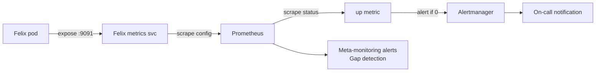

# How to Monitor Calico Component Metrics Monitoring Health

Author: [nawazdhandala](https://github.com/nawazdhandala)

Tags: Calico, Kubernetes, Networking, Metrics, Prometheus, Monitoring

Description: Monitor the health of your Calico metrics collection pipeline itself, detecting gaps in coverage, scrape failures, and stale data that could leave you blind to real Calico issues.

---

## Introduction

Meta-monitoring — monitoring the monitoring system — is essential for Calico observability. If your Prometheus scrapes for Felix metrics start failing, you lose visibility into network health without any warning. By monitoring the metrics pipeline itself, you detect observability gaps before they leave you blind during an incident.

## Prerequisites

- Calico metrics flowing into Prometheus
- PrometheusOperator with alerting rules capability

## Meta-Monitoring Alert Rules

```yaml
# prometheus-rules-meta-monitoring.yaml
apiVersion: monitoring.coreos.com/v1
kind: PrometheusRule
metadata:
  name: calico-metrics-pipeline-health
  namespace: monitoring
spec:
  groups:
    - name: calico.metrics.pipeline
      rules:
        # Alert if Felix metrics are not being scraped
        - alert: CalicoFelixMetricsScrapeFailing
          expr: up{job="calico-felix-metrics"} == 0
          for: 10m
          labels:
            severity: warning
          annotations:
            summary: "Felix metrics not being scraped on {{ $labels.instance }}"

        # Alert if fewer nodes are being scraped than expected
        - alert: CalicoFelixMetricsCoverage
          expr: |
            count(up{job="calico-felix-metrics"} == 1) <
            count(kube_node_info) * 0.9
          for: 15m
          labels:
            severity: warning
          annotations:
            summary: "Less than 90% of nodes have Felix metrics"

        # Alert if metrics are stale (data not updating)
        - alert: CalicoFelixMetricsStale
          expr: |
            (time() - max(timestamp(felix_active_local_policies)) by (node)) > 300
          for: 5m
          labels:
            severity: warning
          annotations:
            summary: "Felix metrics are stale on {{ $labels.node }} (>5 minutes old)"

        # Alert if Typha metrics completely missing
        - alert: CalicoTyphaMissing
          expr: absent(typha_connections_total)
          for: 15m
          labels:
            severity: info
          annotations:
            summary: "No Typha metrics found (expected if Typha is disabled)"
```

## Coverage Dashboard

```promql
# Panel: Metrics Coverage Rate
count(up{job=~"calico-.*"} == 1) / count(up{job=~"calico-.*"})

# Panel: Last successful scrape per target
time() - max(last_over_time(up{job=~"calico-.*"}[10m])) by (instance, job)

# Panel: Scrape duration histogram
histogram_quantile(0.99, rate(prometheus_target_interval_length_seconds_bucket{job=~"calico-.*"}[5m]))
```

## Monitoring Pipeline Architecture



## Conclusion

Meta-monitoring your Calico metrics pipeline ensures you're never operating blind. The key signals to watch are `up{job="calico-felix-metrics"}` (scrape success), the ratio of scraped nodes vs total nodes (coverage), and metric staleness via timestamp comparison. By alerting on these signals, you detect observability gaps within minutes of them occurring, giving you time to restore metrics collection before an actual Calico incident leaves you without the diagnostic data you need.
