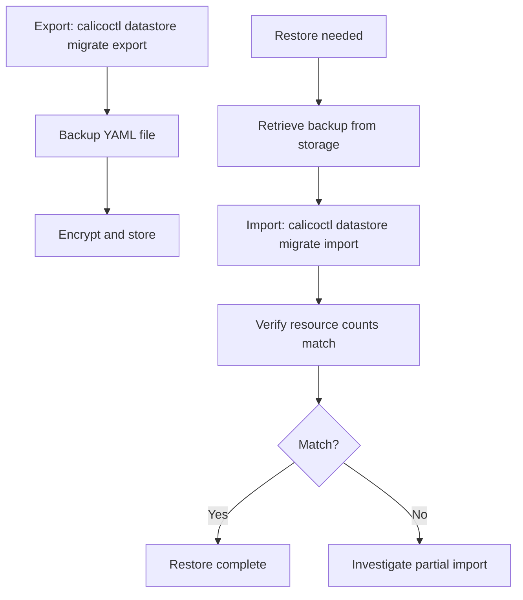

# How to Monitor Calico Datastore Export and Import Operations

Author: [nawazdhandala](https://github.com/nawazdhandala)

Tags: Calico, Kubernetes, Networking, Operations

Description: Monitor Calico datastore backup health by alerting on failed export CronJobs, tracking backup file size trends, and verifying backup recency meets recovery time objectives.

---

## Introduction

Monitoring datastore export operations ensures backups are being created on schedule and that they contain the expected amount of data. A backup that completes but produces a much smaller file than usual indicates a partial export failure that would fail during restore.

## Key Commands

```bash
# Export Calico datastore (backup or migration)
calicoctl datastore migrate export > calico-backup-$(date +%Y%m%d).yaml

# Verify export content
echo "Resources in backup: $(grep -c '^kind:' calico-backup.yaml)"
grep "^kind:" calico-backup.yaml | sort | uniq -c

# Lock source datastore (migration only, not backup)
calicoctl datastore migrate lock

# Import to destination datastore
calicoctl datastore migrate import -f calico-backup.yaml

# Verify import
calicoctl get felixconfiguration
calicoctl get globalnetworkpolicy | wc -l
```

## Operation Flow



## Operational Checklist

```markdown
Before export:
[ ] Confirm source datastore connectivity
[ ] Confirm source kubeconfig or etcd credentials
[ ] Verify sufficient disk space for export file
[ ] Note current resource counts for post-export verification

After import:
[ ] Compare resource counts: source vs destination
[ ] Verify Calico components are operational
[ ] Test pod connectivity (cross-namespace, cross-node)
[ ] Verify network policies are being enforced
```

## Conclusion

Calico datastore export and import operations require careful verification at both ends: confirm resource counts before and after, verify connectivity and policy enforcement after import, and store exports encrypted in access-controlled storage. Regular automated exports with monthly restore testing ensure that disaster recovery is not just theoretically possible but practically verified.
