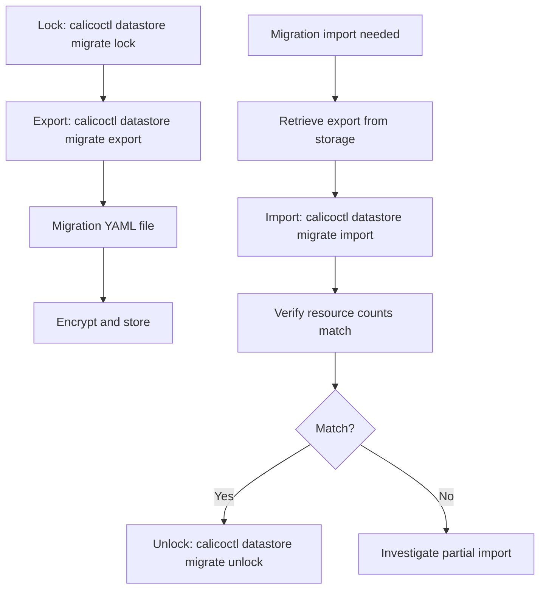

# How to Monitor Calico Datastore Export and Import Operations

Author: [nawazdhandala](https://github.com/nawazdhandala)

Tags: Calico, Kubernetes, Networking, Operation

Description: Monitor Calico datastore backup health by alerting on failed export CronJobs, tracking backup file size trends, and verifying backup recency meets recovery time objectives.

---

## Introduction

Monitoring datastore export operations ensures migration exports are being created on schedule and that they contain the expected amount of data. An export that completes but produces a much smaller file than usual can indicate missing resources or a partial export problem that should be investigated before relying on it for import.

## Key Commands

```bash
# Export Calico etcdv3 datastore for migration

# Lock source datastore for migration
calicoctl datastore migrate lock

export_file="calico-export-$(date +%Y%m%d).yaml"
calicoctl datastore migrate export > "$export_file"

# Verify export content
echo "Resources in export: $(grep -c '^kind:' "$export_file")"
grep "^kind:" "$export_file" | sort | uniq -c

# Import to Kubernetes datastore after configuring calicoctl for it
calicoctl datastore migrate import -f "$export_file"

# Verify import
calicoctl get felixconfiguration
calicoctl get globalnetworkpolicy | wc -l

# Unlock after migration verification and Calico rollout
calicoctl datastore migrate unlock
```

## Operation Flow


```mermaid
flowchart TD
    A[Lock: calicoctl datastore migrate lock] --> B[Export: calicoctl datastore migrate export]
    B --> C[Migration YAML file]
    C --> D[Encrypt and store]
    E[Migration import needed] --> F[Retrieve export from storage]
    F --> G[Import: calicoctl datastore migrate import]
    G --> H[Verify resource counts match]
    H --> I{Match?}
    I -->|Yes| J[Unlock: calicoctl datastore migrate unlock]
    I -->|No| K[Investigate partial import]
```

## Operational Checklist

```markdown
Before export:
[ ] Confirm source datastore connectivity
[ ] Confirm source kubeconfig or etcd credentials
[ ] Verify sufficient disk space for export file
[ ] Note current resource counts for post-export verification

After import:
[ ] Compare resource counts: source vs destination
[ ] Verify Calico components are operational
[ ] Test pod connectivity (cross-namespace, cross-node)
[ ] Verify network policies are being enforced
```

## Conclusion

Calico datastore export and import operations require careful verification at both ends: confirm resource counts before and after, verify connectivity and policy enforcement after import, and store exports encrypted in access-controlled storage. Regular automated exports with monthly import testing ensure that disaster recovery is not just theoretically possible but practically verified.
