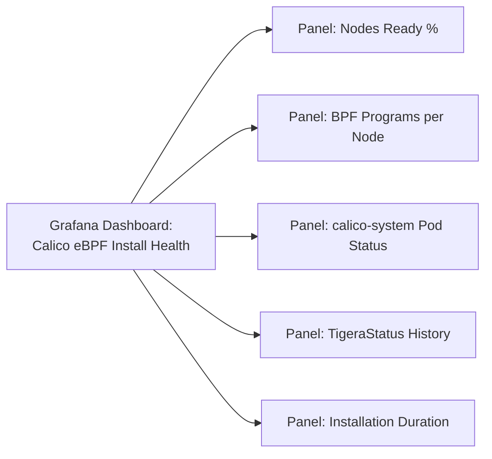

# How to Monitor Calico eBPF Installation

Author: [nawazdhandala](https://github.com/nawazdhandala)

Tags: Calico, Kubernetes, Networking, eBPF, Installation, Monitoring

Description: Set up monitoring during and immediately after Calico eBPF installation to detect installation failures, track node readiness progress, and establish performance baselines.

---

## Introduction

Monitoring the Calico eBPF installation process in real time helps you detect installation failures immediately and understand why nodes are taking longer than expected to become ready. For an automated installation pipeline, having structured monitoring output allows you to distinguish between an installation in progress and one that is stuck.

Post-installation, establishing a baseline monitoring setup captures the initial BPF performance characteristics for comparison after future upgrades or configuration changes.

## Prerequisites

- Calico eBPF installation in progress or recently completed
- `kubectl` access
- Prometheus (for post-installation monitoring)

## Real-Time Installation Monitor

```bash
#!/bin/bash
# monitor-ebpf-install.sh
echo "Monitoring Calico eBPF installation..."

while true; do
  clear
  echo "=== Calico eBPF Installation Monitor $(date) ==="
  echo ""

  # Operator status
  echo "--- Tigera Operator ---"
  kubectl get pods -n tigera-operator --no-headers 2>/dev/null || echo "Not installed yet"

  echo ""
  echo "--- TigeraStatus ---"
  kubectl get tigerastatus 2>/dev/null || echo "Not available yet"

  echo ""
  echo "--- calico-system pods ---"
  kubectl get pods -n calico-system --no-headers 2>/dev/null || echo "Namespace not created yet"

  echo ""
  echo "--- Node Readiness ---"
  kubectl get nodes --no-headers 2>/dev/null | \
    awk '{print $1, $2}' || echo "Cannot reach cluster"

  echo ""
  echo "--- BPF Programs (first calico-node pod) ---"
  POD=$(kubectl get pod -n calico-system -l k8s-app=calico-node \
    -o jsonpath='{.items[0].metadata.name}' 2>/dev/null)
  if [[ -n "${POD}" ]]; then
    kubectl exec -n calico-system "${POD}" -c calico-node -- \
      bpftool prog list 2>/dev/null | grep -c "calico" | \
      xargs -I{} echo "{} Calico BPF programs loaded"
  fi

  sleep 10
done
```

## Installation Progress Metrics

```bash
# Track installation progress via events
kubectl get events -n calico-system --sort-by='.lastTimestamp' -w &

# Track node readiness over time
kubectl get nodes -w &
```

## Post-Installation Baseline Setup

```yaml
# prometheus-recording-rules-baseline.yaml
apiVersion: monitoring.coreos.com/v1
kind: PrometheusRule
metadata:
  name: calico-ebpf-baseline
  namespace: monitoring
spec:
  groups:
    - name: calico.ebpf.baseline
      interval: 60s
      rules:
        - record: calico:ebpf_nodes_active
          expr: count(felix_bpf_enabled == 1)

        - record: calico:ebpf_bpf_programs_total
          expr: sum(felix_bpf_prog_total)

        - record: calico:network_latency_baseline_p50
          expr: histogram_quantile(0.50, rate(felix_int_dataplane_apply_time_seconds_bucket[5m]))

        - record: calico:network_latency_baseline_p99
          expr: histogram_quantile(0.99, rate(felix_int_dataplane_apply_time_seconds_bucket[5m]))
```

## Grafana Installation Health Dashboard



## Post-Installation Acceptance Metrics

```promql
# All nodes should have eBPF active
count(felix_bpf_enabled == 1) == count(kube_node_info)

# BPF program count should be > 10 per node
min(felix_bpf_prog_total) > 10

# No pod should be in error state in calico-system
kube_pod_container_status_running{namespace="calico-system"} == 1
```

## Conclusion

Monitoring a Calico eBPF installation in real time provides immediate feedback on progress and failures. The real-time monitor script shows the key indicators in a dashboard format during installation. Post-installation, recording rules establish baseline performance metrics that serve as reference points for future comparisons. Set up the baseline monitoring immediately after installation success so you have historical data from the first day the cluster is running — this data becomes invaluable during future troubleshooting or performance analysis.
