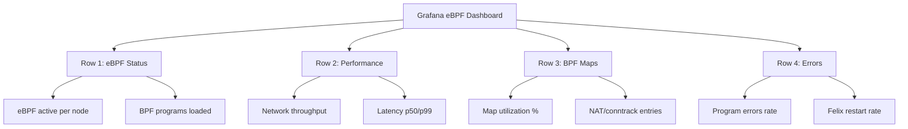

# How to Monitor Calico eBPF Mode

Author: [nawazdhandala](https://github.com/nawazdhandala)

Tags: Calico, Kubernetes, Networking, EBPF, Monitoring, Performance

Description: Set up comprehensive monitoring for Calico eBPF mode, tracking BPF program health, network performance metrics, and detecting eBPF-specific failures.

---

## Introduction

Monitoring Calico eBPF mode requires new observability strategies compared to iptables-based monitoring. The key metrics to track are: BPF program loading status (did all programs load successfully on all nodes?), BPF map utilization (are maps approaching their size limits?), network performance metrics (is the expected latency reduction materializing?), and eBPF-mode-specific error counters (BPF program execution failures).

Felix exposes Prometheus metrics that include eBPF-specific counters when running in eBPF mode. These metrics provide insight into the BPF data plane's health that is not available through standard Kubernetes monitoring.

## Prerequisites

- Calico with eBPF mode active
- Prometheus and Grafana
- Felix metrics enabled

## Step 1: Enable Felix Prometheus Metrics

```yaml
# felixconfiguration-metrics.yaml
apiVersion: projectcalico.org/v3
kind: FelixConfiguration
metadata:
  name: default
spec:
  prometheusMetricsEnabled: true
  prometheusMetricsPort: 9091
  prometheusProcessMetricsEnabled: true
  prometheusGoMetricsEnabled: true
```

```yaml
# Prometheus ServiceMonitor for Felix
apiVersion: monitoring.coreos.com/v1
kind: ServiceMonitor
metadata:
  name: calico-felix-metrics
  namespace: monitoring
spec:
  selector:
    matchLabels:
      k8s-app: calico-node
  namespaceSelector:
    matchNames: [calico-system]
  endpoints:
    - port: metrics
      interval: 15s
```

## Key eBPF Prometheus Metrics

```promql
# Felix BPF data plane active (1 = eBPF, 0 = iptables)
felix_bpf_enabled

# BPF map utilization (warn at 80%)
felix_bpf_map_size_used / felix_bpf_map_size_capacity

# BPF program execution errors
rate(felix_bpf_prog_execution_failures_total[5m])

# NAT entries in BPF (service entries)
felix_bpf_nat_entries

# Conntrack entries
felix_bpf_conntrack_entries
```

## Alert Rules for eBPF Monitoring

```yaml
# prometheus-rules-ebpf.yaml
apiVersion: monitoring.coreos.com/v1
kind: PrometheusRule
metadata:
  name: calico-ebpf-alerts
  namespace: monitoring
spec:
  groups:
    - name: calico.ebpf
      rules:
        - alert: CalicoEBPFNotActive
          expr: felix_bpf_enabled == 0
          for: 5m
          labels:
            severity: warning
          annotations:
            summary: "Calico eBPF mode not active on node {{ $labels.instance }}"
            description: "Felix is running in iptables mode despite eBPF being configured"

        - alert: CalicoEBPFMapNearCapacity
          expr: |
            (felix_bpf_map_size_used / felix_bpf_map_size_capacity) > 0.8
          for: 10m
          labels:
            severity: warning
          annotations:
            summary: "Calico BPF map {{ $labels.map }} is at {{ $value | humanizePercentage }} capacity"
            description: "BPF map approaching limit. Consider increasing map size or reducing connections."

        - alert: CalicoEBPFProgErrors
          expr: rate(felix_bpf_prog_execution_failures_total[5m]) > 0
          for: 2m
          labels:
            severity: critical
          annotations:
            summary: "Calico BPF program execution failures detected"
            description: "BPF programs failing to execute - network policy may be partially enforced"
```

## Grafana Dashboard Layout



## Performance Baseline Monitoring

```bash
# Establish latency baseline after eBPF enablement
cat <<'EOF' > monitor-ebpf-latency.sh
#!/bin/bash
# Continuous latency monitoring
SERVER_IP="${1:?Provide server pod IP}"

while true; do
  START=$(date +%s%N)
  kubectl exec -n default test-client -- \
    wget -qO/dev/null --timeout=1 "http://${SERVER_IP}" 2>/dev/null
  END=$(date +%s%N)
  LATENCY_MS=$(( (END - START) / 1000000 ))
  echo "$(date): ${LATENCY_MS}ms"
  sleep 1
done
EOF
chmod +x monitor-ebpf-latency.sh
```

## Conclusion

Monitoring Calico eBPF mode requires tracking both the operational status of BPF programs (are they loaded and running on every node?) and the health metrics exposed via Felix Prometheus metrics (map utilization, execution errors, NAT table sizes). The `felix_bpf_enabled` metric is your primary health indicator - if it drops to 0 on any node, Felix has fallen back to iptables mode and you've lost the performance benefits of eBPF. Set up alerts for BPF mode transitions and BPF map capacity to detect issues before they impact production workloads.
