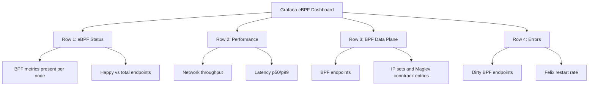

# How to Monitor Calico eBPF Mode

Author: [nawazdhandala](https://github.com/nawazdhandala)

Tags: Calico, Kubernetes, Networking, eBPF, Monitoring, Performance

Description: Set up comprehensive monitoring for Calico eBPF mode, tracking BPF program health, network performance metrics, and detecting eBPF-specific failures.

---

## Introduction

Monitoring Calico eBPF mode requires new observability strategies compared to iptables-based monitoring. The key metrics to track are: BPF endpoint programming status (are endpoints successfully programmed on all nodes?), BPF data plane activity (are BPF-specific metrics present from Felix?), network performance metrics (is the expected latency reduction materializing?), and eBPF-mode-specific troubleshooting signals such as dirty BPF endpoints.

Felix exposes Prometheus metrics that include BPF data plane metrics when running in eBPF mode. These metrics provide insight into the BPF data plane's health that is not available through standard Kubernetes monitoring.

## Prerequisites

- Calico with eBPF mode active
- Prometheus and Grafana
- Felix metrics enabled

## Step 1: Enable Felix Prometheus Metrics

```yaml
# felixconfiguration-metrics.yaml

apiVersion: projectcalico.org/v3
kind: FelixConfiguration
metadata:
  name: default
spec:
  prometheusMetricsEnabled: true
  prometheusMetricsPort: 9091
  prometheusProcessMetricsEnabled: true
  prometheusGoMetricsEnabled: true
```

```yaml
apiVersion: v1
kind: Service
metadata:
  name: felix-metrics-svc
  namespace: calico-system
  labels:
    app: calico-felix-metrics
spec:
  clusterIP: None
  selector:
    k8s-app: calico-node
  ports:
    - name: metrics
      port: 9091
      targetPort: 9091
---
apiVersion: monitoring.coreos.com/v1
kind: ServiceMonitor
metadata:
  name: calico-felix-metrics
  namespace: monitoring
spec:
  selector:
    matchLabels:
      app: calico-felix-metrics
  namespaceSelector:
    matchNames: [calico-system]
  endpoints:
    - port: metrics
      interval: 15s
```

## Key eBPF Prometheus Metrics

```promql
# BPF endpoints managed by Felix
felix_bpf_dataplane_endpoints

# BPF endpoints successfully programmed
felix_bpf_happy_dataplane_endpoints

# BPF endpoints left dirty after a programming failure
felix_bpf_dirty_dataplane_endpoints

# BPF IP sets managed by Felix
felix_bpf_num_ip_sets

# Maglev entries in the BPF conntrack table
felix_bpf_conntrack_maglev_entries_total
```

## Alert Rules for eBPF Monitoring

```yaml
# prometheus-rules-ebpf.yaml
apiVersion: monitoring.coreos.com/v1
kind: PrometheusRule
metadata:
  name: calico-ebpf-alerts
  namespace: monitoring
spec:
  groups:
    - name: calico.ebpf
      rules:
        - alert: CalicoEBPFNotActive
          expr: absent_over_time(felix_bpf_dataplane_endpoints[5m])
          for: 5m
          labels:
            severity: warning
          annotations:
            summary: "Calico BPF data plane metrics are missing"
            description: "Felix is not exporting BPF data plane metrics. Verify that eBPF mode is enabled and Felix metrics are being scraped."

        - alert: CalicoEBPFEndpointsNotProgrammed
          expr: |
            felix_bpf_dataplane_endpoints > felix_bpf_happy_dataplane_endpoints
          for: 10m
          labels:
            severity: warning
          annotations:
            summary: "Calico BPF endpoints are not fully programmed on {{ $labels.instance }}"
            description: "Felix reports fewer happy BPF endpoints than total BPF endpoints."

        - alert: CalicoEBPFDirtyEndpoints
          expr: felix_bpf_dirty_dataplane_endpoints > 0
          for: 2m
          labels:
            severity: critical
          annotations:
            summary: "Calico BPF dirty endpoints detected on {{ $labels.instance }}"
            description: "Felix reports BPF endpoints left dirty after a programming failure. Check calico-node logs and BPF counters."
```

## Grafana Dashboard Layout


```mermaid
flowchart TD
    A[Grafana eBPF Dashboard] --> B[Row 1: eBPF Status]
    A --> C[Row 2: Performance]
    A --> D[Row 3: BPF Data Plane]
    A --> E[Row 4: Errors]
    B --> B1[BPF metrics present per node]
    B --> B2[Happy vs total endpoints]
    C --> C1[Network throughput]
    C --> C2[Latency p50/p99]
    D --> D1[BPF endpoints]
    D --> D2[IP sets and Maglev conntrack entries]
    E --> E1[Dirty BPF endpoints]
    E --> E2[Felix restart rate]
```

## Performance Baseline Monitoring

```bash
# Establish latency baseline after eBPF enablement
cat <<'EOF' > monitor-ebpf-latency.sh
#!/bin/bash
# Continuous latency monitoring
SERVER_IP="${1:?Provide server pod IP}"

while true; do
  START=$(date +%s%N)
  kubectl exec -n default test-client -- \
    wget -qO/dev/null --timeout=1 "http://${SERVER_IP}" 2>/dev/null
  END=$(date +%s%N)
  LATENCY_MS=$(( (END - START) / 1000000 ))
  echo "$(date): ${LATENCY_MS}ms"
  sleep 1
done
EOF
chmod +x monitor-ebpf-latency.sh
```

## Conclusion

Monitoring Calico eBPF mode requires tracking both the operational status of the BPF data plane (are BPF metrics present from every node?) and the health metrics exposed via Felix Prometheus metrics (endpoint programming status, dirty endpoints, IP sets, and Maglev conntrack entries). The `felix_bpf_happy_dataplane_endpoints` and `felix_bpf_dirty_dataplane_endpoints` metrics are key health indicators: if endpoints are not happy or are left dirty, Felix could not fully program the BPF data plane. Set up alerts for missing BPF metrics and endpoint programming failures to detect issues before they impact production workloads.
