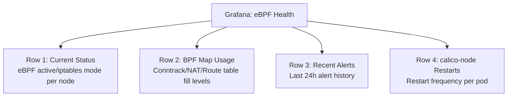

# How to Monitor Calico eBPF Troubleshooting

Author: [nawazdhandala](https://github.com/nawazdhandala)

Tags: Calico, Kubernetes, Networking, EBPF, Monitoring, Troubleshooting

Description: Set up proactive monitoring to automatically detect Calico eBPF issues before they require manual troubleshooting, reducing incident response time.

---

## Introduction

The goal of monitoring Calico eBPF in the context of troubleshooting is to detect issues before they become incidents requiring manual diagnosis. When your monitoring can automatically identify the type of eBPF failure - BPF map exhaustion, program loading failure, or mode regression - your on-call engineer starts with context instead of having to collect it.

## Prerequisites

- Prometheus and Alertmanager
- Calico eBPF active with Felix metrics enabled

## Automated Detection Alerts

```yaml
# prometheus-rules-ebpf-troubleshooting.yaml
apiVersion: monitoring.coreos.com/v1
kind: PrometheusRule
metadata:
  name: calico-ebpf-troubleshooting-alerts
  namespace: monitoring
spec:
  groups:
    - name: calico.ebpf.troubleshooting
      rules:
        # Detect eBPF mode regression
        - alert: CalicoEBPFModeRegression
          expr: felix_bpf_enabled == 0
          for: 2m
          labels:
            severity: critical
            runbook: "https://wiki.example.com/runbooks/calico-ebpf-mode-regression"
          annotations:
            summary: "Calico eBPF mode disabled on {{ $labels.instance }}"
            description: |
              Felix is running in iptables mode on node {{ $labels.instance }}.
              Possible causes:
              - Kernel too old for eBPF
              - BPF filesystem not mounted
              - Installation changed to non-BPF mode
              First step: kubectl logs -n calico-system ds/calico-node -c calico-node | grep -i bpf

        # Detect BPF map near exhaustion
        - alert: CalicoEBPFMapExhaustion
          expr: |
            (felix_bpf_conntrack_entries / felix_bpf_conntrack_max_entries) > 0.9
          for: 5m
          labels:
            severity: warning
            runbook: "https://wiki.example.com/runbooks/calico-bpf-map-exhaustion"
          annotations:
            summary: "Calico BPF conntrack map at {{ $value | humanizePercentage }} capacity"
            description: "BPF conntrack map approaching limit. New connections may fail."

        # Detect calico-node frequent restarts (usually indicates BPF init failure)
        - alert: CalicoNodeFrequentRestarts
          expr: |
            increase(kube_pod_container_status_restarts_total{
              namespace="calico-system",
              container="calico-node"
            }[1h]) > 3
          labels:
            severity: warning
          annotations:
            summary: "calico-node restarting frequently on {{ $labels.pod }}"
            description: "calico-node has restarted {{ $value }} times in the last hour. Check for BPF init failures."
```

## Alert-Driven Diagnostic Context

When an alert fires, the alert should include pre-computed diagnostic information:

```yaml
# Alertmanager webhook receiver that pre-collects context
receivers:
  - name: calico-ebpf-pagerduty
    webhook_configs:
      - url: "https://automation.internal/webhooks/calico-ebpf-incident"
        send_resolved: true
```

```bash
#!/bin/bash
# webhook-pre-collect-context.sh
# Called by Alertmanager webhook when alert fires

ALERT_NAME="${1}"
NODE="${2}"

# Pre-collect diagnostic bundle before notifying on-call
./collect-calico-ebpf-diagnostics.sh 2>/dev/null

# Upload to incident storage
BUNDLE=$(ls -t calico-ebpf-diag-*.tar.gz | head -1)
aws s3 cp "${BUNDLE}" "s3://incident-artifacts/$(date +%Y%m%d)/${BUNDLE}"

# Notify with context URL
curl -X POST "${PAGERDUTY_WEBHOOK}" \
  -d "{\"alert\":\"${ALERT_NAME}\",\"node\":\"${NODE}\",\"diagnostics\":\"s3://incident-artifacts/$(date +%Y%m%d)/${BUNDLE}\"}"
```

## Monitoring Dashboard for Active Troubleshooting



## Conclusion

Proactive monitoring for eBPF issues transforms troubleshooting from reactive (detect via user complaints) to proactive (detect via metrics before impact). The key alert types - eBPF mode regression, BPF map exhaustion, and frequent calico-node restarts - cover the most common eBPF failure categories. By including runbook URLs in alerts and pre-collecting diagnostic context automatically, you significantly reduce the time from alert to resolution. A well-configured monitoring setup means your on-call engineer receives an alert with the diagnostic bundle already attached, ready to start root cause analysis immediately.
