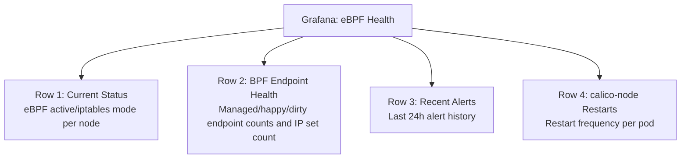

# How to Monitor Calico eBPF Troubleshooting

Author: [nawazdhandala](https://github.com/nawazdhandala)

Tags: Calico, Kubernetes, Networking, eBPF, Monitoring, Troubleshooting

Description: Set up proactive monitoring to automatically detect Calico eBPF issues before they require manual troubleshooting, reducing incident response time.

---

## Introduction

The goal of monitoring Calico eBPF in the context of troubleshooting is to detect issues before they become incidents requiring manual diagnosis. When your monitoring can automatically identify the type of eBPF failure - missing BPF dataplane activity, endpoint programming failure, or restart loops - your on-call engineer starts with context instead of having to collect it.

## Prerequisites

- Prometheus and Alertmanager
- Calico eBPF active with Felix metrics enabled

## Automated Detection Alerts

```yaml
# prometheus-rules-ebpf-troubleshooting.yaml

apiVersion: monitoring.coreos.com/v1
kind: PrometheusRule
metadata:
  name: calico-ebpf-troubleshooting-alerts
  namespace: monitoring
spec:
  groups:
    - name: calico.ebpf.troubleshooting
      rules:
        # Detect nodes with local endpoints but no successfully programmed BPF endpoints
        - alert: CalicoEBPFDataplaneInactive
          expr: |
            (felix_active_local_endpoints > 0)
            and on(instance) (felix_bpf_happy_dataplane_endpoints == 0)
          for: 2m
          labels:
            severity: critical
            runbook: "https://wiki.example.com/runbooks/calico-ebpf-mode-regression"
          annotations:
            summary: "Calico eBPF dataplane not programming endpoints on {{ $labels.instance }}"
            description: |
              Felix has local endpoints but no successfully programmed BPF endpoints on node {{ $labels.instance }}.
              Possible causes:
              - Kernel too old for eBPF
              - BPF filesystem not mounted
              - Installation changed to non-BPF mode
              First step: kubectl logs -n calico-system ds/calico-node -c calico-node | grep -i bpf

        # Detect BPF endpoint programming failures
        - alert: CalicoEBPFDirtyEndpoints
          expr: felix_bpf_dirty_dataplane_endpoints > 0
          for: 5m
          labels:
            severity: warning
            runbook: "https://wiki.example.com/runbooks/calico-bpf-endpoint-programming"
          annotations:
            summary: "Calico BPF has {{ $value }} dirty dataplane endpoints"
            description: "Felix reports BPF endpoints left dirty after a dataplane programming failure."

        # Detect calico-node frequent restarts (usually indicates BPF init failure)
        - alert: CalicoNodeFrequentRestarts
          expr: |
            increase(kube_pod_container_status_restarts_total{
              namespace="calico-system",
              container="calico-node"
            }[1h]) > 3
          labels:
            severity: warning
          annotations:
            summary: "calico-node restarting frequently on {{ $labels.pod }}"
            description: "calico-node has restarted {{ $value }} times in the last hour. Check for BPF init failures."
```

## Alert-Driven Diagnostic Context

When an alert fires, the alert should include pre-computed diagnostic information:

```yaml
# Alertmanager webhook receiver that pre-collects context
receivers:
  - name: calico-ebpf-pagerduty
    webhook_configs:
      - url: "https://automation.internal/webhooks/calico-ebpf-incident"
        send_resolved: true
```

```bash
#!/bin/bash
# webhook-pre-collect-context.sh
# Example handler logic run by the service that receives the Alertmanager webhook

ALERT_NAME="${1}"
NODE="${2}"

# Pre-collect diagnostic bundle before notifying on-call
./collect-calico-ebpf-diagnostics.sh 2>/dev/null

# Upload to incident storage
BUNDLE=$(ls -t calico-ebpf-diag-*.tar.gz | head -1)
aws s3 cp "${BUNDLE}" "s3://incident-artifacts/$(date +%Y%m%d)/${BUNDLE}"

# Notify with context URL
curl -X POST "${PAGERDUTY_WEBHOOK}" \
  -d "{\"alert\":\"${ALERT_NAME}\",\"node\":\"${NODE}\",\"diagnostics\":\"s3://incident-artifacts/$(date +%Y%m%d)/${BUNDLE}\"}"
```

## Monitoring Dashboard for Active Troubleshooting


```mermaid
flowchart TD
    A[Grafana: eBPF Health] --> B[Row 1: Current Status\neBPF active/iptables mode per node]
    A --> C[Row 2: BPF Endpoint Health\nManaged/happy/dirty endpoint counts and IP set count]
    A --> D[Row 3: Recent Alerts\nLast 24h alert history]
    A --> E[Row 4: calico-node Restarts\nRestart frequency per pod]
```

## Conclusion

Proactive monitoring for eBPF issues transforms troubleshooting from reactive (detect via user complaints) to proactive (detect via metrics before impact). The key alert types - missing BPF dataplane activity, dirty BPF dataplane endpoints, and frequent calico-node restarts - cover the most common eBPF failure categories exposed by Felix metrics. By including runbook URLs in alerts and pre-collecting diagnostic context automatically, you significantly reduce the time from alert to resolution. A well-configured monitoring setup means your on-call engineer receives an alert with the diagnostic bundle already attached, ready to start root cause analysis immediately.
