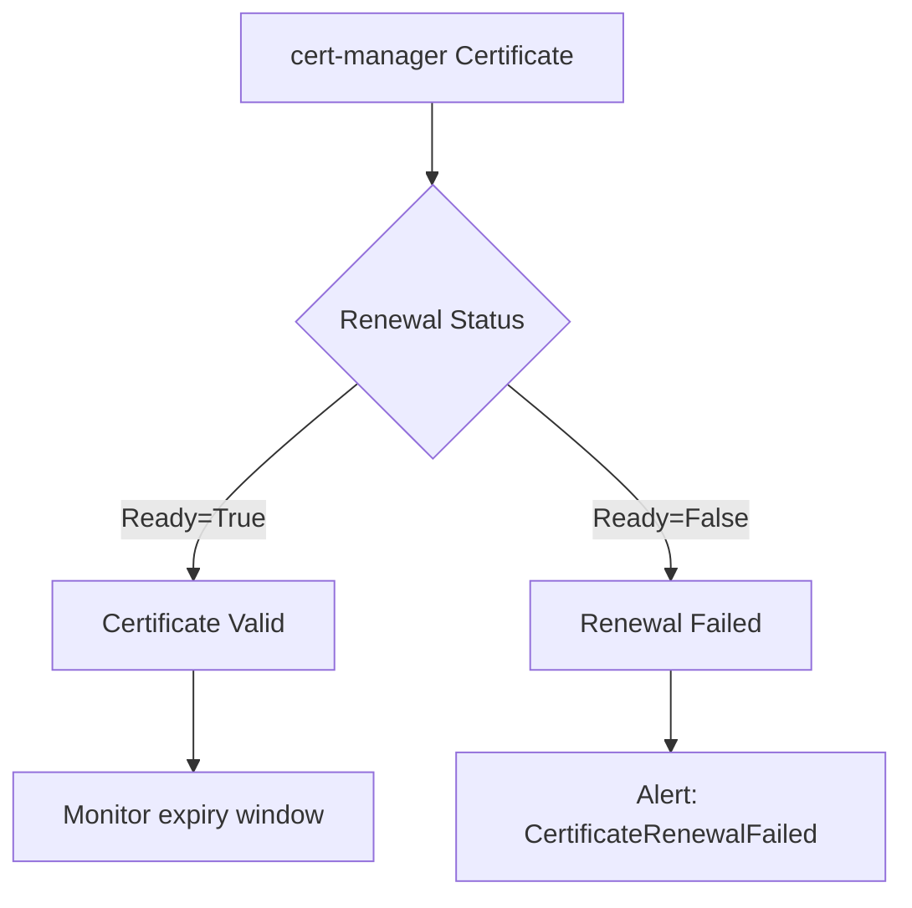

# Monitor Calico etcd Certificate Generation

Author: [nawazdhandala](https://github.com/nawazdhandala)

Tags: Calico, Kubernetes, Networking, etcd, TLS, Certificates, Monitoring

Description: Set up monitoring and alerting for Calico etcd TLS certificate expiry and renewal health to prevent certificate-related outages in your Kubernetes cluster.

---

## Introduction

Certificate expiry is one of the most avoidable yet most common causes of Calico etcd outages. When certificates are generated manually and stored in Kubernetes secrets, there is no built-in mechanism to alert operators before they expire. By the time the expiry is noticed, Calico may already be failing to connect to etcd, resulting in stale policies and broken pod networking.

Monitoring certificate health means tracking expiry dates across all Calico etcd certificates, alerting well in advance of expiry, and verifying that automated renewal processes (such as cert-manager) are completing successfully.

## Prerequisites

- Calico etcd TLS certificates deployed
- Prometheus and Grafana for metrics
- cert-manager (optional but recommended) for automated renewal
- `kubectl` access with cluster admin privileges

## Step 1: Export Certificate Expiry as Metrics

Use the `x509-certificate-exporter` to expose certificate expiry as Prometheus metrics:

```bash
helm repo add enix https://charts.enix.io
helm install x509-certificate-exporter enix/x509-certificate-exporter \
  --namespace monitoring \
  --set secretsExporter.enabled=true \
  --set secretsExporter.secrets[0].namespace=kube-system \
  --set secretsExporter.secrets[0].name=calico-etcd-certs
```

This exposes metrics like:

```
x509_cert_not_after{secret_name="calico-etcd-certs",namespace="kube-system"} 1.760313e+09
```

## Step 2: Create Expiry Alerts

```yaml
groups:
  - name: calico-etcd-certs
    rules:
      - alert: CalicoEtcdCertExpiringSoon
        expr: |
          (x509_cert_not_after{secret_name=~"calico-etcd.*"} - time()) / 86400 < 30
        for: 1h
        labels:
          severity: warning
        annotations:
          summary: "Calico etcd cert expiring in {{ $value }} days"
          description: "Certificate in {{ $labels.secret_name }} expires soon"

      - alert: CalicoEtcdCertCritical
        expr: |
          (x509_cert_not_after{secret_name=~"calico-etcd.*"} - time()) / 86400 < 7
        for: 1h
        labels:
          severity: critical
        annotations:
          summary: "Calico etcd certificate expires in less than 7 days!"
```

## Step 3: Monitor cert-manager Renewal Health



```yaml
- alert: CertManagerCertificateNotReady
  expr: |
    certmanager_certificate_ready_status{
      name=~"calico.*",
      condition="True"
    } == 0
  for: 10m
  labels:
    severity: critical
  annotations:
    summary: "cert-manager certificate {{ $labels.name }} is not ready"
```

## Step 4: Grafana Dashboard for Certificate Health

Create a Grafana panel showing days until expiry for each Calico etcd certificate:

```
# Prometheus query for dashboard
(x509_cert_not_after{secret_name=~"calico-etcd.*"} - time()) / 86400
```

Display as a stat panel with thresholds:
- Green: > 30 days
- Yellow: 7-30 days
- Red: < 7 days

## Step 5: Manual Certificate Check Script

For clusters without Prometheus, use a CronJob:

```yaml
apiVersion: batch/v1
kind: CronJob
metadata:
  name: calico-cert-check
  namespace: kube-system
spec:
  schedule: "0 8 * * *"
  jobTemplate:
    spec:
      template:
        spec:
          containers:
            - name: checker
              image: alpine/openssl
              command:
                - /bin/sh
                - -c
                - |
                  kubectl get secret calico-etcd-certs -n kube-system \
                    -o jsonpath='{.data.etcd-cert}' | base64 -d | \
                    openssl x509 -noout -enddate -checkend 2592000
                  if [ $? -ne 0 ]; then
                    echo "ALERT: Calico etcd cert expires within 30 days!"
                    exit 1
                  fi
          restartPolicy: OnFailure
```

## Conclusion

Monitoring Calico etcd certificate health requires exposing certificate expiry as Prometheus metrics, setting multi-threshold alerts (30 days and 7 days), tracking cert-manager renewal status, and using Grafana dashboards for at-a-glance visibility. With proper monitoring in place, certificate expiry becomes a planned maintenance event rather than an unexpected outage trigger.
