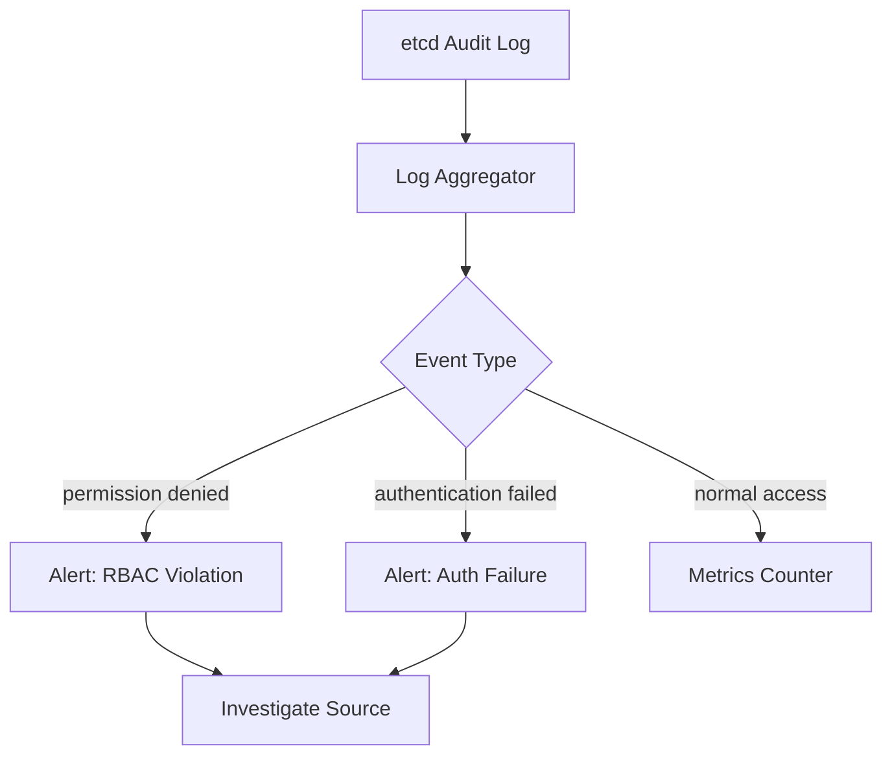

# Monitor Calico etcd RBAC

Author: [nawazdhandala](https://github.com/nawazdhandala)

Tags: Calico, Kubernetes, Networking, etcd, RBAC, Monitoring, Observability

Description: Set up monitoring and alerting for Calico etcd RBAC to detect permission errors, unauthorized access attempts, and authentication failures across Calico components.

---

## Introduction

Monitoring Calico etcd RBAC health is essential for maintaining both security and reliability. Permission errors that affect Felix or the CNI plugin can cause subtle degradation — policies stop updating silently, or IP allocation slows without obvious errors in the Kubernetes event stream. On the security side, unexpected permission denied events may indicate a compromised component attempting to access unauthorized paths.

A good monitoring strategy combines etcd audit logs for security events, Calico component log scraping for permission error rates, and Prometheus metrics for overall etcd connectivity health.

## Prerequisites

- etcd with audit logging enabled
- Prometheus and Grafana deployed
- Calico component logs accessible (Loki or similar log aggregation recommended)
- `kubectl` with cluster admin access

## Step 1: Enable etcd Audit Logging

Configure etcd to log all access attempts:

```yaml
# etcd configuration
--audit-log-path=/var/log/etcd/audit.log
--audit-log-maxsize=100
--audit-log-maxbackups=5
```

Or via systemd drop-in:

```bash
sudo tee /etc/systemd/system/etcd.service.d/audit.conf <<EOF
[Service]
ExecStart=
ExecStart=/usr/bin/etcd \
  --audit-log-path=/var/log/etcd/audit.log \
  --audit-log-maxsize=100
EOF
sudo systemctl daemon-reload && sudo systemctl restart etcd
```

## Step 2: Monitor Permission Denied Events



Parse audit logs for permission violations:

```bash
# Count permission denied events per user in last hour
grep "permission denied" /var/log/etcd/audit.log | \
  jq -r '.user' | sort | uniq -c | sort -rn
```

## Step 3: Prometheus Alerting on Component Errors

Scrape Calico component logs with Promtail/Loki and create metric rules:

```yaml
# Loki rule for Felix permission errors
groups:
  - name: calico-etcd-rbac
    rules:
      - alert: CalicoFelixEtcdPermissionDenied
        expr: |
          sum(rate({app="calico-node"} |= "permission denied" [5m])) > 0
        for: 1m
        labels:
          severity: critical
        annotations:
          summary: "Felix etcd permission denied errors detected"
```

## Step 4: Track etcd Health Metrics

```bash
# Check etcd cluster health via Prometheus
# etcd exposes metrics on port 2381 by default

curl http://etcd:2381/metrics | grep -E "etcd_server_proposals|etcd_mvcc_db"
```

Key metrics to monitor:

| Metric | Alert Threshold | Meaning |
|--------|----------------|---------|
| `etcd_server_leader_changes_seen_total` | > 3 in 5m | Unstable etcd leadership |
| `etcd_disk_wal_fsync_duration_seconds` | p99 > 10ms | etcd disk latency |
| `etcd_network_peer_sent_failures_total` | Rising | etcd peer connectivity |

## Step 5: Component Connectivity Dashboard

Create a Grafana dashboard panel tracking Calico-to-etcd connectivity:

```yaml
# Prometheus query for Felix etcd reconnect rate
rate(felix_etcd_reconnects_total[5m])
```

Alert on frequent reconnects:

```yaml
- alert: CalicoFelixEtcdReconnecting
  expr: rate(felix_etcd_reconnects_total[5m]) > 0.1
  for: 5m
  labels:
    severity: warning
  annotations:
    summary: "Felix is frequently reconnecting to etcd on {{ $labels.node }}"
```

## Conclusion

Monitoring Calico etcd RBAC combines etcd audit logs for security events, log aggregation for permission error rates, and Prometheus metrics for connectivity health. By alerting on permission denied events, authentication failures, and frequent reconnects, you can detect both security violations and reliability issues before they impact cluster operations. Regular review of audit logs also confirms that RBAC restrictions are working as intended.
