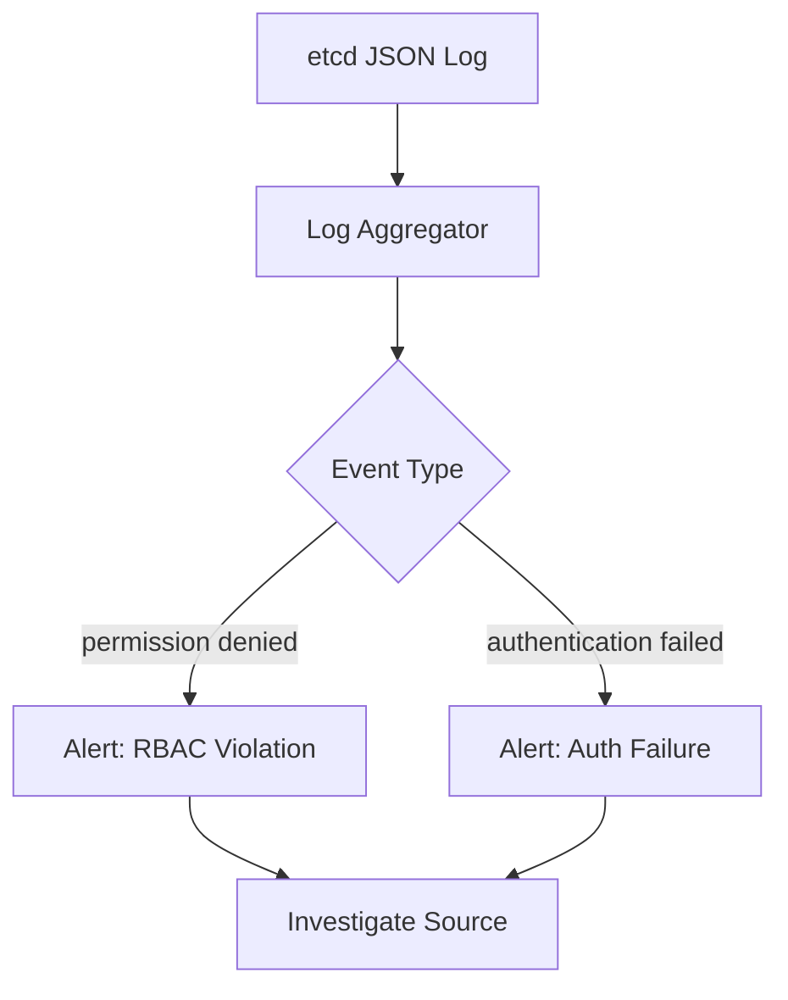

# Monitor Calico etcd RBAC

Author: [nawazdhandala](https://github.com/nawazdhandala)

Tags: Calico, Kubernetes, Networking, etcd, RBAC, Monitoring, Observability

Description: Set up monitoring and alerting for Calico etcd RBAC to detect permission errors, unauthorized access attempts, and authentication failures across Calico components.

---

## Introduction

Monitoring Calico etcd RBAC health is essential for maintaining both security and reliability. Permission errors that affect Felix or the CNI plugin can cause subtle degradation - policies stop updating silently, or IP allocation slows without obvious errors in the Kubernetes event stream. On the security side, unexpected permission denied events may indicate a compromised component attempting to access unauthorized paths.

A good monitoring strategy combines etcd structured logs for security-related errors, Calico component log scraping for permission error rates, and Prometheus metrics for overall etcd connectivity health.

## Prerequisites

- etcd with structured JSON logging enabled
- Prometheus and Grafana deployed
- Calico component logs accessible (Loki or similar log aggregation recommended)
- `kubectl` with cluster admin access

## Step 1: Enable etcd Structured Logging

etcd does not provide Kubernetes-style `--audit-log-*` flags. Configure etcd to write structured JSON logs that your log collector can scrape:

```bash
# etcd command-line flags

--log-format=json
--log-outputs=/var/log/etcd/etcd.log
--enable-log-rotation=true
--log-rotation-config-json='{"maxsize":100,"maxbackups":5}'
```

Or via systemd drop-in:

```bash
sudo mkdir -p /etc/systemd/system/etcd.service.d /var/log/etcd
sudo tee /etc/systemd/system/etcd.service.d/logging.conf <<EOF
[Service]
Environment=ETCD_LOG_FORMAT=json
Environment=ETCD_LOG_OUTPUTS=/var/log/etcd/etcd.log
Environment=ETCD_ENABLE_LOG_ROTATION=true
Environment=ETCD_LOG_ROTATION_CONFIG_JSON={\"maxsize\":100,\"maxbackups\":5}
EOF
sudo systemctl daemon-reload && sudo systemctl restart etcd
```

## Step 2: Monitor Permission Denied Events


```mermaid
graph TD
    A[etcd JSON Log] --> B[Log Aggregator]
    B --> C{Event Type}
    C -->|permission denied| D[Alert: RBAC Violation]
    C -->|authentication failed| E[Alert: Auth Failure]
    D --> G[Investigate Source]
    E --> G
```

Parse structured logs for permission violations:

```bash
# Count permission denied messages
jq -r 'select((.msg? // "") | test("permission denied"; "i")) | .msg' /var/log/etcd/etcd.log | \
  sort | uniq -c | sort -rn
```

## Step 3: Prometheus Alerting on Component Errors

Scrape Calico component logs with Promtail/Loki and create metric rules:

```yaml
# Loki rule for Felix permission errors
groups:
  - name: calico-etcd-rbac
    rules:
      - alert: CalicoFelixEtcdPermissionDenied
        expr: |
          sum(rate({app="calico-node"} |= "permission denied" [5m])) > 0
        for: 1m
        labels:
          severity: critical
        annotations:
          summary: "Felix etcd permission denied errors detected"
```

## Step 4: Track etcd Health Metrics

```bash
# Check etcd cluster health via Prometheus
# etcd exposes metrics on the client port by default, and on any URL
# configured with --listen-metrics-urls.

curl http://etcd:2379/metrics | grep -E "etcd_server_proposals|etcd_disk_|etcd_network_"
```

Key metrics to monitor:

| Metric | Alert Threshold | Meaning |
|--------|----------------|---------|
| `etcd_server_leader_changes_seen_total` | > 3 in 5m | Unstable etcd leadership |
| `etcd_disk_wal_fsync_duration_seconds` | p99 > 10ms | etcd disk latency |
| `etcd_network_peer_sent_failures_total` | Rising | etcd peer connectivity |

## Step 5: Component Connectivity Dashboard

Create a Grafana dashboard panel tracking Calico-to-etcd connectivity:

```promql
rate(felix_resyncs_started[5m])
```

Alert on frequent resyncs:

```yaml
- alert: CalicoFelixFrequentDatastoreResyncs
  expr: rate(felix_resyncs_started[5m]) > 0.1
  for: 5m
  labels:
    severity: warning
  annotations:
    summary: "Felix is frequently resyncing with the datastore on {{ $labels.instance }}"
```

## Conclusion

Monitoring Calico etcd RBAC combines etcd structured logs for security-related errors, log aggregation for permission error rates, and Prometheus metrics for connectivity health. By alerting on permission denied events, authentication failures, and frequent datastore resyncs, you can detect both security violations and reliability issues before they impact cluster operations. Regular review of logs also confirms that RBAC restrictions are working as intended.
