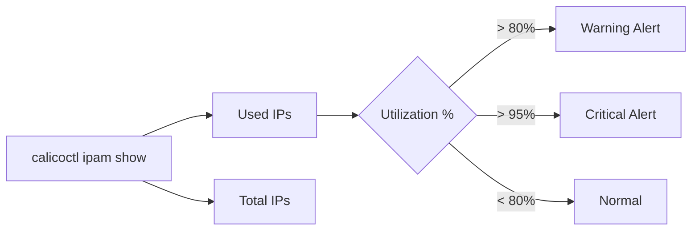

# Monitor Calico etcdv3 Paths

Author: [nawazdhandala](https://github.com/nawazdhandala)

Tags: Calico, Kubernetes, Networking, etcd, etcdv3, Monitoring, Observability

Description: Set up monitoring for Calico etcdv3 path health to detect data inconsistencies, IPAM exhaustion, and etcd storage growth before they impact cluster networking.

---

## Introduction

Monitoring Calico's etcdv3 paths provides early warning for several categories of operational issues: IP address pool exhaustion, runaway growth in etcd storage due to leaked IPAM allocations, data inconsistencies caused by interrupted Calico operations, and etcd performance degradation under high write load from busy clusters.

Without monitoring, these problems are typically discovered only when they cause visible failures - pods failing to start, policies not updating, or nodes becoming unhealthy. Proactive monitoring allows you to address issues during business hours rather than during incidents.

## Prerequisites

- Calico using etcd datastore
- Prometheus and Grafana deployed
- etcd Prometheus metrics enabled
- etcdctl access for inspection

## Step 1: Monitor etcd Storage Size

etcd has a configurable storage quota (default 8GB). Monitor usage:

```bash
# Check etcd database size
etcdctl endpoint status --write-out=table

# Via Prometheus
curl http://etcd:2381/metrics | grep etcd_mvcc_db_total_size_in_bytes
```

```yaml
- alert: CalicoEtcdStorageHigh
  expr: etcd_mvcc_db_total_size_in_bytes / 1e9 > 5
  for: 10m
  labels:
    severity: warning
  annotations:
    summary: "etcd storage is {{ $value }}GB - approaching quota"
```

## Step 2: Monitor IPAM Pool Utilization



Create a CronJob to expose IPAM metrics:

```yaml
apiVersion: batch/v1
kind: CronJob
metadata:
  name: calico-ipam-metrics
  namespace: calico-system
spec:
  schedule: "*/5 * * * *"
  jobTemplate:
    spec:
      template:
        spec:
          containers:
            - name: ipam-reporter
              image: calico/ctl:v3.27.0
              command:
                - /bin/sh
                - -c
                - |
                  calicoctl ipam show --show-blocks --output=json > /tmp/ipam.json
                  # Parse and push to monitoring system
          restartPolicy: OnFailure
```

## Step 3: Monitor Policy Count

Unexpected changes in policy count can indicate policy manipulation:

```bash
# Record policy count periodically
etcdctl get /calico/v1/policy/ --prefix --keys-only | wc -l
```

```yaml
- alert: CalicoPolicyCountChanged
  expr: |
    abs(calico_policy_count - calico_policy_count offset 10m) > 5
  for: 2m
  labels:
    severity: warning
  annotations:
    summary: "Calico policy count changed by {{ $value }} in 10 minutes"
```

## Step 4: Monitor etcd Key Count Growth

Unusual growth in Calico etcd key count indicates leaks:

```bash
# Track key count over time
etcdctl get /calico/v1/ipam/ --prefix --keys-only | wc -l
etcdctl get /calico/v1/host/ --prefix --keys-only | wc -l
```

Alert on rapid growth:

```yaml
- alert: CalicoEtcdIPAMKeyGrowth
  expr: rate(calico_etcd_ipam_key_count[1h]) > 50
  for: 30m
  labels:
    severity: warning
  annotations:
    summary: "IPAM etcd keys growing rapidly - possible leak"
```

## Step 5: etcd Compaction Health

Calico data in etcd requires regular compaction to reclaim space from deleted keys:

```bash
# Check compaction revision
etcdctl endpoint status --write-out=json | \
  python3 -c "import json,sys; d=json.load(sys.stdin); print('Revision:', d[0]['Status']['header']['revision'])"
```

Configure automatic compaction:

```bash
etcd --auto-compaction-mode=periodic --auto-compaction-retention=1h
```

## Conclusion

Monitoring Calico etcdv3 paths requires tracking etcd storage utilization, IPAM pool exhaustion, policy count changes, and key growth rates. By exposing these metrics to Prometheus and building targeted alerts, you can detect datastore health issues - from IPAM leaks to approaching storage quotas - well before they impact cluster operations.
