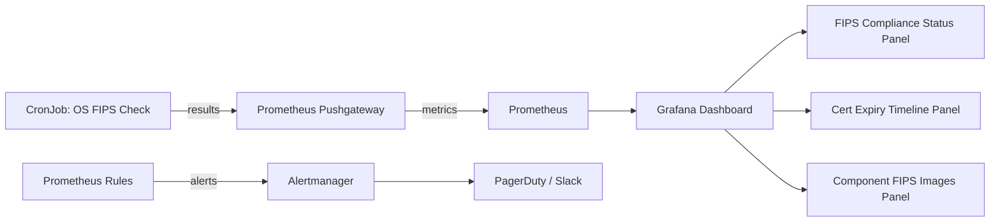

# How to Monitor Calico FIPS Mode

Author: [nawazdhandala](https://github.com/nawazdhandala)

Tags: Calico, Kubernetes, Networking, FIPS, Monitoring, Compliance

Description: Set up continuous monitoring for Calico FIPS mode compliance, detecting algorithm violations, certificate expiry, and configuration drift in real time.

---

## Introduction

Monitoring Calico FIPS mode is about maintaining continuous compliance rather than one-time validation. FIPS configuration can drift in several ways: OS FIPS can be disabled by a kernel update, certificates can expire or be replaced with non-FIPS variants, new Calico versions might introduce non-FIPS images, or cluster administrators might inadvertently change the Installation `fipsMode` setting.

The monitoring strategy for Calico FIPS must be proactive: alert before a certificate expires (not after), detect configuration changes immediately, and provide a continuous compliance posture dashboard for audit teams. This requires combining Kubernetes-native monitoring (Prometheus, events) with custom scripts and scheduled compliance checks.

## Prerequisites

- Calico with `fipsMode: Enabled`
- Prometheus and Alertmanager
- Kubernetes Event Exporter or Falco
- Grafana for dashboards

## Monitor 1: Certificate Expiry Alerts

```yaml
# prometheus-rules-fips-certs.yaml
apiVersion: monitoring.coreos.com/v1
kind: PrometheusRule
metadata:
  name: calico-fips-cert-alerts
  namespace: monitoring
spec:
  groups:
    - name: calico.fips.certificates
      rules:
        - alert: CalicoCertExpiringSoon
          expr: |
            (kube_secret_created{namespace="calico-system", secret=~"calico.*tls.*"} +
             (365 * 24 * 3600)) - time() < (30 * 24 * 3600)
          for: 1h
          labels:
            severity: warning
          annotations:
            summary: "Calico TLS certificate expiring within 30 days"
            description: "Secret {{ $labels.secret }} in calico-system expires soon. FIPS compliance may be at risk."

        - alert: CalicoCertExpired
          expr: |
            (kube_secret_created{namespace="calico-system", secret=~"calico.*tls.*"} +
             (365 * 24 * 3600)) - time() < 0
          labels:
            severity: critical
          annotations:
            summary: "Calico TLS certificate has expired"
            description: "FIPS compliance VIOLATED: certificate {{ $labels.secret }} has expired."
```

## Monitor 2: FIPS Mode Configuration Drift

```bash
#!/bin/bash
# monitor-fips-drift.sh - Run as CronJob every 15 minutes
set -euo pipefail

ALERTMANAGER_URL="${ALERTMANAGER_URL:-http://alertmanager.monitoring.svc:9093}"

check_fips_mode() {
  fips_mode=$(kubectl get installation default \
    -o jsonpath='{.spec.fipsMode}' 2>/dev/null)

  if [[ "${fips_mode}" != "Enabled" ]]; then
    echo "FIPS DRIFT: Installation fipsMode is '${fips_mode}', expected 'Enabled'"

    # Send alert
    curl -s -X POST "${ALERTMANAGER_URL}/api/v1/alerts" \
      -H "Content-Type: application/json" \
      -d '[{
        "labels": {
          "alertname": "CalicoFIPSModeDrift",
          "severity": "critical",
          "current_value": "'"${fips_mode}"'"
        },
        "annotations": {
          "summary": "Calico FIPS mode has been disabled",
          "description": "Installation fipsMode changed from Enabled to '"${fips_mode}"'"
        }
      }]'
    return 1
  fi

  echo "OK: FIPS mode is Enabled"
  return 0
}

check_fips_mode
```

## Monitor 3: OS-Level FIPS Compliance Check

```yaml
# calico-fips-node-monitor-cronjob.yaml
apiVersion: batch/v1
kind: CronJob
metadata:
  name: calico-fips-os-monitor
  namespace: calico-system
spec:
  schedule: "*/30 * * * *"
  jobTemplate:
    spec:
      template:
        spec:
          hostPID: true
          tolerations:
            - operator: Exists
          nodeSelector: {}
          containers:
            - name: fips-checker
              image: registry.internal.example.com/tools/ubi8:latest
              command:
                - /bin/bash
                - -c
                - |
                  fips_val=$(cat /proc/sys/crypto/fips_enabled)
                  if [[ "${fips_val}" != "1" ]]; then
                    echo "ALERT: Node $(hostname) has FIPS disabled!"
                    exit 1
                  fi
                  echo "OK: Node $(hostname) FIPS enabled"
              volumeMounts:
                - name: proc
                  mountPath: /proc
                  readOnly: true
          volumes:
            - name: proc
              hostPath:
                path: /proc
          restartPolicy: OnFailure
```

## Monitor 4: Grafana FIPS Compliance Dashboard



Key Grafana panels for FIPS compliance:

```promql
# Panel 1: FIPS mode enabled across all nodes
count(calico_fips_node_enabled == 1) / count(calico_fips_node_enabled)

# Panel 2: Days until certificate expiry
(calico_cert_expiry_timestamp - time()) / 86400

# Panel 3: FIPS mode in Installation
calico_installation_fips_mode_enabled
```

## Audit Log Monitoring

```bash
# Monitor Kubernetes audit logs for Installation changes
# (requires audit policy to log operator.tigera.io resources)
kubectl get events -A --field-selector reason=Updated | \
  grep installation

# Watch for any change to Installation spec.fipsMode
kubectl get installation default -w -o jsonpath='{.spec.fipsMode}'
```

## Conclusion

Continuous monitoring of Calico FIPS mode protects against the gradual drift that can erode compliance over time. Certificate expiry alerts with 30-day lead time prevent last-minute scrambles, OS FIPS drift detection catches kernel upgrade side effects, and configuration drift monitoring ensures no one accidentally disables FIPS mode in production. Combine these monitors with a Grafana dashboard to give compliance teams a real-time view of your FIPS posture without requiring them to query Kubernetes directly.
