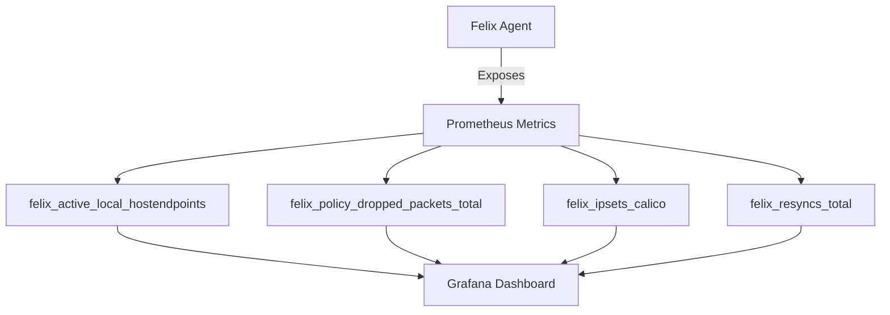

# Monitor Calico Host Endpoint Security

Author: [nawazdhandala](https://github.com/nawazdhandala)

Tags: Calico, Kubernetes, Networking, Security, Host Endpoint, Monitoring, Observability

Description: Learn how to monitor Calico host endpoint security using Felix metrics, Prometheus, and policy flow logs to gain continuous visibility into node-level network enforcement.

---

## Introduction

Monitoring Calico host endpoint security gives you ongoing visibility into which traffic is being allowed or denied at your Kubernetes node boundaries. Without monitoring, you may not notice policy drift, unexpected traffic patterns, or policy programming failures until a security incident or connectivity outage occurs.

Calico exposes rich telemetry through Felix metrics, flow logs, and policy audit logs. By integrating these signals with Prometheus and Grafana, you can build dashboards that surface anomalies in node-level traffic enforcement and alert on suspicious access patterns - such as unexpected SSH attempts or port scans against node interfaces.

This guide walks through setting up monitoring for Calico host endpoint security using open-source tooling.

## Prerequisites

- Calico installed with Felix metrics enabled
- Prometheus and Grafana deployed in the cluster
- Host endpoints configured on cluster nodes
- `kubectl` access with cluster admin privileges

## Step 1: Enable Felix Prometheus Metrics

Configure Felix to expose metrics on port 9091:

```bash
kubectl patch felixconfiguration default \
  --type=merge \
  --patch='{"spec":{"prometheusMetricsEnabled":true,"prometheusMetricsPort":9091}}'
```

Verify metrics are exposed:

```bash
kubectl exec -n calico-system ds/calico-node -- curl -s localhost:9091/metrics | grep felix_host
```

## Step 2: Key Metrics for Host Endpoint Security



Key metrics to track:

| Metric | Description |
|--------|-------------|
| `felix_active_local_hostendpoints` | Number of active host endpoints on the node |
| `felix_policy_dropped_packets_total` | Packets dropped by Calico policy |
| `felix_policy_passed_packets_total` | Packets allowed by Calico policy |
| `felix_ipsets_calico` | Number of IP sets managed by Calico |

## Step 3: Configure Prometheus ServiceMonitor

```yaml
apiVersion: monitoring.coreos.com/v1
kind: ServiceMonitor
metadata:
  name: calico-felix
  namespace: monitoring
spec:
  selector:
    matchLabels:
      k8s-app: calico-node
  namespaceSelector:
    matchNames:
      - calico-system
  endpoints:
    - port: felix-metrics
      interval: 30s
      path: /metrics
```

## Step 4: Create Grafana Alerts

Configure an alert for unexpected host endpoint drops:

```yaml
# Grafana alert rule
- alert: CalicoHostEndpointHighDropRate
  expr: rate(felix_policy_dropped_packets_total[5m]) > 100
  for: 2m
  labels:
    severity: warning
  annotations:
    summary: "High drop rate on host endpoint {{ $labels.node }}"
    description: "Felix is dropping more than 100 packets/s on {{ $labels.node }}"
```

## Step 5: Enable Flow Logs

For Calico Enterprise or Calico Cloud, enable flow logs:

```bash
kubectl patch felixconfiguration default \
  --type=merge \
  --patch='{"spec":{"flowLogsEnabled":true,"flowLogsFlushInterval":"15s"}}'
```

For open-source Calico, review denied traffic using node-level audit:

```bash
# On the node, check iptables drop counters
sudo iptables -L cali-from-hep-forward -n -v --line-numbers
```

## Conclusion

Effective monitoring of Calico host endpoint security requires tracking Felix metrics for active endpoints, dropped packets, and policy synchronization health. By integrating with Prometheus and Grafana, you can build real-time dashboards and alerts that surface anomalies before they become incidents. Combine metrics with periodic policy audits to maintain a strong, continuously-verified security posture.
