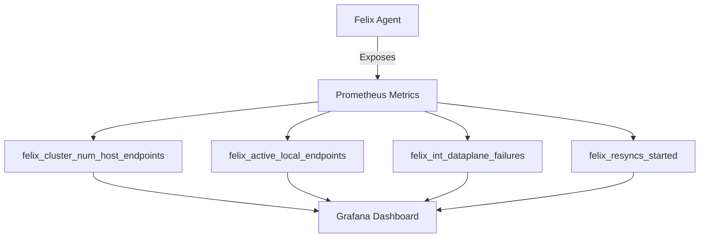

# Monitor Calico Host Endpoint Security

Author: [nawazdhandala](https://github.com/nawazdhandala)

Tags: Calico, Kubernetes, Networking, Security, Host Endpoint, Monitoring, Observability

Description: Learn how to monitor Calico host endpoint security using Felix metrics, Prometheus, and policy flow logs to gain continuous visibility into node-level network enforcement.

---

## Introduction

Monitoring Calico host endpoint security gives you ongoing visibility into which traffic is being allowed or denied at your Kubernetes node boundaries. Without monitoring, you may not notice policy drift, unexpected traffic patterns, or policy programming failures until a security incident or connectivity outage occurs.

Calico Open Source exposes Felix metrics, while Calico Enterprise and Calico Cloud add flow logs and policy metrics. By integrating these signals with Prometheus and Grafana, you can build dashboards that surface anomalies in node-level traffic enforcement and alert on suspicious access patterns - such as unexpected SSH attempts or port scans against node interfaces.

This guide walks through setting up monitoring for Calico host endpoint security using open-source tooling, with optional Calico Enterprise and Calico Cloud signals where noted.

## Prerequisites

- Calico installed with access to update FelixConfiguration
- Prometheus and Grafana deployed in the cluster
- Host endpoints configured on cluster nodes
- `kubectl` access with cluster admin privileges

## Step 1: Enable Felix Prometheus Metrics

Configure Felix to expose metrics on port 9091:

```bash
kubectl patch felixconfiguration default \
  --type=merge \
  --patch='{"spec":{"prometheusMetricsEnabled":true,"prometheusMetricsPort":9091}}'
```

Verify metrics are exposed:

```bash
kubectl exec -n calico-system ds/calico-node -- curl -s localhost:9091/metrics | grep felix_active_local_endpoints
```

## Step 2: Key Metrics for Host Endpoint Security


```mermaid
graph TD
    A[Felix Agent] -->|Exposes| B[Prometheus Metrics]
    B --> C[felix_cluster_num_host_endpoints]
    B --> D[felix_active_local_endpoints]
    B --> E[felix_int_dataplane_failures]
    B --> F[felix_resyncs_started]
    C --> G[Grafana Dashboard]
    D --> G
    E --> G
    F --> G
```

Key metrics to track:

| Metric | Description |
|--------|-------------|
| `felix_cluster_num_host_endpoints` | Total number of host endpoints cluster-wide |
| `felix_active_local_endpoints` | Number of active workload and host endpoints on the node |
| `felix_int_dataplane_failures` | Number of Felix data plane update failures that will be retried |
| `felix_resyncs_started` | Number of times Felix has started resyncing with the datastore |

## Step 3: Configure Prometheus ServiceMonitor

```yaml
apiVersion: v1
kind: Service
metadata:
  name: felix-metrics-svc
  namespace: calico-system
  labels:
    k8s-app: calico-node
spec:
  clusterIP: None
  selector:
    k8s-app: calico-node
  ports:
    - name: felix-metrics
      port: 9091
      targetPort: 9091
---
apiVersion: monitoring.coreos.com/v1
kind: ServiceMonitor
metadata:
  name: calico-felix
  namespace: monitoring
spec:
  selector:
    matchLabels:
      k8s-app: calico-node
  namespaceSelector:
    matchNames:
      - calico-system
  endpoints:
    - port: felix-metrics
      interval: 30s
      path: /metrics
```

## Step 4: Create Grafana Alerts

Configure an alert for Felix data plane programming failures:

```yaml
# Grafana alert rule

- alert: CalicoFelixDataplaneFailures
  expr: increase(felix_int_dataplane_failures[5m]) > 0
  for: 2m
  labels:
    severity: warning
  annotations:
    summary: "Felix data plane failures on {{ $labels.instance }}"
    description: "Felix has failed to apply one or more data plane updates in the last 5 minutes."
```

For Calico Enterprise or Calico Cloud policy metrics, you can also alert on denied packets:

```yaml
- alert: CalicoPolicyDeniedPackets
  expr: rate(calico_denied_packets[5m]) > 100
  for: 2m
  labels:
    severity: warning
  annotations:
    summary: "High policy deny rate on {{ $labels.instance }}"
    description: "Calico policy metrics report more than 100 denied packets/s."
```

## Step 5: Configure Flow Logs

For Calico Enterprise or Calico Cloud, tune the flow log export interval:

```bash
kubectl patch felixconfiguration default \
  --type=merge \
  --patch='{"spec":{"flowLogsFlushInterval":"15s"}}'
```

For open-source Calico, review denied traffic using node-level audit:

```bash
# On the node, check iptables drop counters
sudo iptables -L cali-from-hep-forward -n -v --line-numbers
```

## Conclusion

Effective monitoring of Calico host endpoint security requires tracking Felix metrics for host endpoint count, active endpoints, data plane failures, and policy synchronization health. By integrating with Prometheus and Grafana, you can build real-time dashboards and alerts that surface anomalies before they become incidents. Combine metrics with periodic policy audits and, where available, policy deny metrics or flow logs to maintain a strong, continuously-verified security posture.
