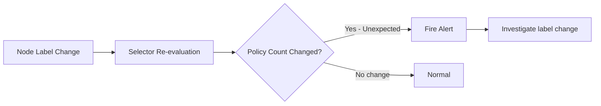

# Monitor Calico Host Endpoint Selectors

Author: [nawazdhandala](https://github.com/nawazdhandala)

Tags: Calico, Kubernetes, Networking, Host Endpoint, Selectors, Monitoring

Description: Set up monitoring for Calico host endpoint selector drift to detect when label changes cause policies to be incorrectly applied or stop being enforced on cluster nodes.

---

## Introduction

Calico host endpoint selectors are dynamic — they re-evaluate whenever node or HostEndpoint labels change. This dynamism is powerful, but it also means that label changes made for unrelated reasons (such as a deployment pipeline adding a new label) can inadvertently change which policies apply to which nodes. Monitoring for selector drift is essential for maintaining a stable and expected security posture.

Selector drift can manifest as sudden security policy changes without anyone intentionally modifying policy. For example, if a node label used in a selector is removed during an upgrade operation, the associated policy stops being enforced on that node — potentially opening a security gap that isn't immediately obvious.

This guide covers how to monitor for selector-related changes and alert on unexpected policy-to-endpoint mapping changes.

## Prerequisites

- Calico deployed with Prometheus metrics enabled
- Alertmanager and Grafana for alerting and visualization
- `kubectl` and `calicoctl` access
- A defined set of expected policy-to-endpoint mappings

## Step 1: Track Active Policy Count per Node

Felix exposes metrics that indicate how many active local policies are programmed:

```bash
# Query active policy count
kubectl exec -n calico-system ds/calico-node -- \
  curl -s localhost:9091/metrics | grep felix_active_local_policies
```

Create a Prometheus recording rule to track this over time:

```yaml
groups:
  - name: calico-selectors
    rules:
      - record: calico:active_policies_per_node
        expr: felix_active_local_policies
```

## Step 2: Alert on Policy Count Changes



```yaml
- alert: CalicoSelectorDriftDetected
  expr: |
    abs(
      felix_active_local_policies -
      felix_active_local_policies offset 5m
    ) > 2
  for: 1m
  labels:
    severity: warning
  annotations:
    summary: "Calico selector drift on {{ $labels.node }}"
    description: "Policy count changed by {{ $value }} on {{ $labels.node }}"
```

## Step 3: Audit Label Changes with Kubernetes Events

Use a Kubernetes audit policy to track label modifications on nodes:

```yaml
# audit-policy.yaml
apiVersion: audit.k8s.io/v1
kind: Policy
rules:
  - level: Metadata
    resources:
      - group: ""
        resources: ["nodes"]
    verbs: ["update", "patch"]
```

## Step 4: Periodic Selector Reconciliation

Run a CronJob that verifies expected endpoint-to-policy mappings:

```yaml
apiVersion: batch/v1
kind: CronJob
metadata:
  name: calico-selector-audit
  namespace: calico-system
spec:
  schedule: "*/30 * * * *"
  jobTemplate:
    spec:
      template:
        spec:
          serviceAccountName: calico-auditor
          containers:
            - name: auditor
              image: calico/ctl:v3.27.0
              command:
                - /bin/sh
                - -c
                - |
                  WORKER_COUNT=$(calicoctl get hep \
                    --selector="node-role == 'worker'" -o json \
                    | python3 -c "import json,sys; print(len(json.load(sys.stdin)['items']))")
                  echo "Worker HEP count: $WORKER_COUNT"
                  # Compare to expected count and alert if mismatch
          restartPolicy: OnFailure
```

## Step 5: Label Change Webhook

Use a validating admission webhook to prevent unauthorized label changes on nodes:

```yaml
apiVersion: admissionregistration.k8s.io/v1
kind: ValidatingWebhookConfiguration
metadata:
  name: node-label-protection
webhooks:
  - name: node-label-validator.security.example.com
    rules:
      - apiGroups: [""]
        apiVersions: ["v1"]
        resources: ["nodes"]
        operations: ["UPDATE"]
    failurePolicy: Warn
    clientConfig:
      service:
        name: label-validator
        namespace: security
        path: /validate-node-labels
```

## Conclusion

Monitoring Calico host endpoint selectors requires tracking Felix's active policy count per node, alerting on unexpected changes, and auditing label modifications that could trigger selector re-evaluation. By combining Prometheus metrics, Kubernetes audit logs, and periodic reconciliation jobs, you can detect and respond to selector drift before it creates security gaps in your cluster.
