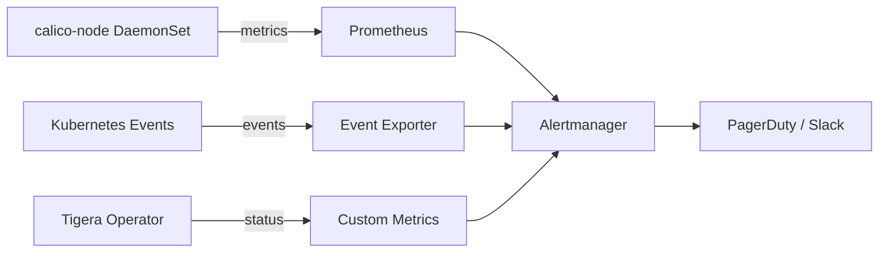

# How to Monitor Calico ImageSet Management

Author: [nawazdhandala](https://github.com/nawazdhandala)

Tags: Calico, Kubernetes, Networking, ImageSet, Monitoring, Observability

Description: Set up monitoring for Calico ImageSet management to detect configuration drift, image pull failures, and operator reconciliation issues in real time.

---

## Introduction

Monitoring Calico ImageSet management means watching for deviations from your intended image configuration before they cause outages. The scenarios you need to detect include: pods pulling from unexpected registries (registry bypass), image pull failures that prevent node upgrades, operator reconciliation failures that leave ImageSet changes unapplied, and version drift between what's in the ImageSet and what's running.

Unlike stateless workload monitoring, Calico component failures can silently degrade network policy enforcement across the entire cluster. A `calico-node` pod that fails to restart due to an ImagePullBackOff can leave nodes with stale policy tables for hours before anyone notices traffic anomalies.

This guide covers how to set up alerts in Prometheus/Alertmanager and implement custom monitoring for ImageSet-specific scenarios.

## Prerequisites

- Prometheus and Alertmanager installed in cluster
- Calico with ImageSet configured
- Kubernetes Event Exporter or similar event monitoring
- Access to create PrometheusRule resources

## Monitoring Architecture



## Alert 1: Image Pull Failures

```yaml
# prometheus-rules-imageset.yaml
apiVersion: monitoring.coreos.com/v1
kind: PrometheusRule
metadata:
  name: calico-imageset-alerts
  namespace: monitoring
spec:
  groups:
    - name: calico.imageset
      rules:
        - alert: CalicoImagePullFailure
          expr: |
            kube_pod_container_status_waiting_reason{
              namespace="calico-system",
              reason=~"ImagePullBackOff|ErrImagePull|InvalidImageName"
            } > 0
          for: 5m
          labels:
            severity: critical
          annotations:
            summary: "Calico component failing to pull image"
            description: "Pod {{ $labels.pod }} in calico-system cannot pull image. Check ImageSet and registry connectivity."
```

## Alert 2: Calico Node DaemonSet Not Fully Available

```yaml
        - alert: CalicoNodeDaemonSetDegraded
          expr: |
            (kube_daemonset_status_number_available{
              namespace="calico-system",
              daemonset="calico-node"
            } / kube_daemonset_status_desired_number_scheduled{
              namespace="calico-system",
              daemonset="calico-node"
            }) < 0.9
          for: 10m
          labels:
            severity: warning
          annotations:
            summary: "calico-node DaemonSet below 90% availability"
            description: "{{ $value | humanizePercentage }} of calico-node pods are available. Possible ImageSet or upgrade issue."
```

## Alert 3: Registry Bypass Detection

```bash
#!/bin/bash
# check-registry-bypass.sh - Run as a CronJob
EXPECTED_REGISTRY="${EXPECTED_REGISTRY:-registry.internal.example.com/calico}"
NAMESPACE="calico-system"

VIOLATIONS=$(kubectl get pods -n "${NAMESPACE}" \
  -o jsonpath='{range .items[*]}{.metadata.name}{"\t"}{range .spec.containers[*]}{.image}{"\n"}{end}{end}' | \
  grep -v "^$" | \
  awk -v reg="${EXPECTED_REGISTRY}" '$2 !~ reg {print $0}')

if [[ -n "${VIOLATIONS}" ]]; then
  echo "REGISTRY BYPASS DETECTED:"
  echo "${VIOLATIONS}"
  # Send alert to monitoring system
  curl -X POST "${ALERTMANAGER_URL}/api/v1/alerts" \
    -H "Content-Type: application/json" \
    -d "[{\"labels\":{\"alertname\":\"CalicoRegistryBypass\",\"severity\":\"critical\"}}]"
fi
```

Deploy as a CronJob:

```yaml
apiVersion: batch/v1
kind: CronJob
metadata:
  name: calico-registry-monitor
  namespace: calico-system
spec:
  schedule: "*/15 * * * *"
  jobTemplate:
    spec:
      template:
        spec:
          serviceAccountName: calico-monitor-sa
          containers:
            - name: monitor
              image: registry.internal.example.com/tools/kubectl:latest
              command: ["/scripts/check-registry-bypass.sh"]
              env:
                - name: EXPECTED_REGISTRY
                  value: "registry.internal.example.com/calico"
          restartPolicy: OnFailure
```

## Alert 4: TigeraStatus Degraded

```yaml
        - alert: TigeraStatusDegraded
          expr: |
            tigera_component_status{condition="Degraded"} == 1
          for: 5m
          labels:
            severity: critical
          annotations:
            summary: "Calico component {{ $labels.name }} is degraded"
            description: "TigeraStatus shows {{ $labels.name }} is degraded. ImageSet or operator issue."
```

## Grafana Dashboard

```bash
# Import the Calico ImageSet monitoring dashboard
# Key panels to include:
# 1. Pod readiness ratio by component (calico-node, typha, kube-controllers)
# 2. Image pull error rate over time
# 3. Registry pull source (from pod annotations)
# 4. Time since last successful ImageSet reconciliation

# Check current ImageSet status via kubectl for dashboard data
kubectl get imageset -o json | jq '.items[] | {name: .metadata.name, creationTime: .metadata.creationTimestamp}'
```

## Conclusion

Monitoring Calico ImageSet management requires alerting on both immediate failures (ImagePullBackOff) and subtle drift (registry bypass, reconciliation delays). By combining Prometheus rules for DaemonSet availability, custom scripts for registry validation, and TigeraStatus monitoring, you can detect ImageSet-related issues before they affect cluster networking. Run the registry bypass check frequently - it is your safety net against accidental or intentional image substitution.
