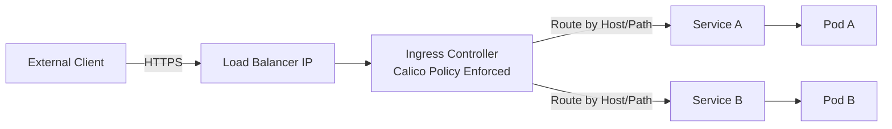

# How to Monitor the Calico Ingress Gateway

Author: [nawazdhandala](https://github.com/nawazdhandala)

Tags: Calico, Kubernetes, Ingress, Gateway, Networking

Description: Monitor Calico ingress gateway health, request rates, latency, and error rates using Prometheus and Grafana.

---

## Introduction

Calico's ingress gateway capabilities provide a controlled entry point for external traffic into the cluster. The ingress gateway sits at the boundary between external networks and the Kubernetes pod network, performing routing decisions, TLS termination, and traffic policy enforcement.

In current open-source Calico, Calico Ingress Gateway is based on Envoy Gateway and the Kubernetes Gateway API. Calico can also provide network policy enforcement for standard Kubernetes Ingress controllers such as NGINX.

## Prerequisites

- Calico installed
- An ingress controller such as NGINX for the Ingress example below, or Calico Ingress Gateway for Gateway API deployments
- kubectl access
- DNS for external access

## Configure Ingress Resource

```yaml
apiVersion: networking.k8s.io/v1
kind: Ingress
metadata:
  name: app-ingress
  namespace: production
  annotations:
    nginx.ingress.kubernetes.io/rewrite-target: /
spec:
  ingressClassName: nginx
  rules:
  - host: app.example.com
    http:
      paths:
      - path: /
        pathType: Prefix
        backend:
          service:
            name: my-app
            port:
              number: 80
```

## Apply Calico Network Policy for Ingress

```yaml
apiVersion: projectcalico.org/v3
kind: NetworkPolicy
metadata:
  name: allow-ingress-to-app
  namespace: production
spec:
  selector: app == 'my-app'
  types:
  - Ingress
  ingress:
  - action: Allow
    source:
      namespaceSelector: projectcalico.org/name == 'ingress-nginx'
      selector: app.kubernetes.io/name == 'ingress-nginx' && app.kubernetes.io/component == 'controller'
    destination:
      ports:
      - 8080
```

## Verify Gateway Functionality

```bash
# Check ingress controller pods

kubectl get pods -n ingress-nginx

# Test ingress routing
curl -H "Host: app.example.com" http://$(kubectl get svc -n ingress-nginx ingress-nginx-controller -o jsonpath='{.status.loadBalancer.ingress[0].ip}{.status.loadBalancer.ingress[0].hostname}')/

# Check ingress status
kubectl describe ingress -n production app-ingress
```

## Ingress Architecture



## Conclusion

The Calico ingress gateway combines Kubernetes ingress routing with Calico's network policy enforcement to provide secure, controlled external access to cluster services. Configure ingress resources for routing rules, create Calico network policies to restrict which pods the ingress controller can reach, and monitor ingress metrics to ensure reliable external access.
