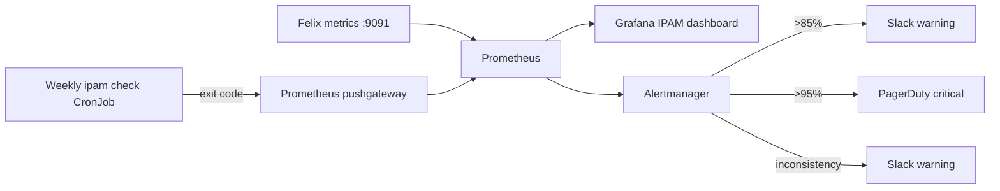

# How to Monitor Calico IPAM Health

Author: [nawazdhandala](https://github.com/nawazdhandala)

Tags: Calico, Kubernetes, Networking, IPAM, Monitoring

Description: Monitor Calico IPAM health with Prometheus alerts on IP utilization thresholds, block allocation trends, and consistency check failures to prevent IP exhaustion and detect leaks early.

---

## Introduction

Calico IPAM monitoring focuses on two signals: utilization (are we running out of IPs?) and consistency (are there leaked allocations?). Both signals are invisible to standard Kubernetes monitoring — TigeraStatus does not report IPAM utilization, and kubelet events only show exhaustion after it occurs. Dedicated IPAM monitoring catches these issues before pod scheduling fails.

## Felix IPAM Prometheus Metrics

```bash
# Felix exposes IPAM-related metrics on port 9091
kubectl exec -n calico-system -l k8s-app=calico-node -c calico-node -- \
  wget -qO- http://localhost:9091/metrics | grep -i ipam

# Key metrics:
# _owned          - Blocks assigned to this node
# felix_ipam_allocations_per_second - IP allocation rate
```

## Prometheus Alerts for IPAM

```yaml
apiVersion: monitoring.coreos.com/v1
kind: PrometheusRule
metadata:
  name: calico-ipam-alerts
  namespace: calico-system
spec:
  groups:
    - name: calico.ipam
      rules:
        - alert: CalicoIPAMUtilizationHigh
          expr: |
            calico_ipam_utilization_percent > 85
          for: 10m
          labels:
            severity: warning
          annotations:
            summary: "Calico IPAM utilization at {{ $value }}%"
            description: "Consider adding a new IPPool. Current usage above 85%."

        - alert: CalicoIPAMUtilizationCritical
          expr: |
            calico_ipam_utilization_percent > 95
          for: 5m
          labels:
            severity: critical
          annotations:
            summary: "Calico IPAM at critical utilization {{ $value }}%"
            description: "New pods may fail to schedule. Add IPPool immediately."

        - alert: CalicoIPAMCheckFailed
          expr: |
            calico_ipam_check_inconsistencies > 0
          for: 60m
          labels:
            severity: warning
          annotations:
            summary: "Calico IPAM has {{ $value }} inconsistencies"
            description: "Run calicoctl ipam check for details."
```

## IPAM Monitoring Dashboard

```json
{
  "title": "Calico IPAM Health",
  "panels": [
    {
      "title": "IPAM Utilization %",
      "type": "gauge",
      "targets": [{"expr": "calico_ipam_utilization_percent"}],
      "thresholds": [
        {"color": "green", "value": 0},
        {"color": "yellow", "value": 75},
        {"color": "red", "value": 90}
      ]
    },
    {
      "title": "IP Allocation Rate",
      "type": "graph",
      "targets": [{"expr": "rate(felix_ipam_allocations_per_second[5m])"}]
    }
  ]
}
```

## IPAM Monitoring Architecture



## Conclusion

IPAM monitoring requires tracking both utilization (from Felix metrics or a custom exporter) and consistency (from weekly ipam check CronJobs). The 85% utilization warning gives adequate time to add a new IPPool before exhaustion. The consistency alert fires after inconsistencies persist for an hour, catching scenarios where ipam check finds issues but they resolve on the next run versus genuine leaks that accumulate over days.
