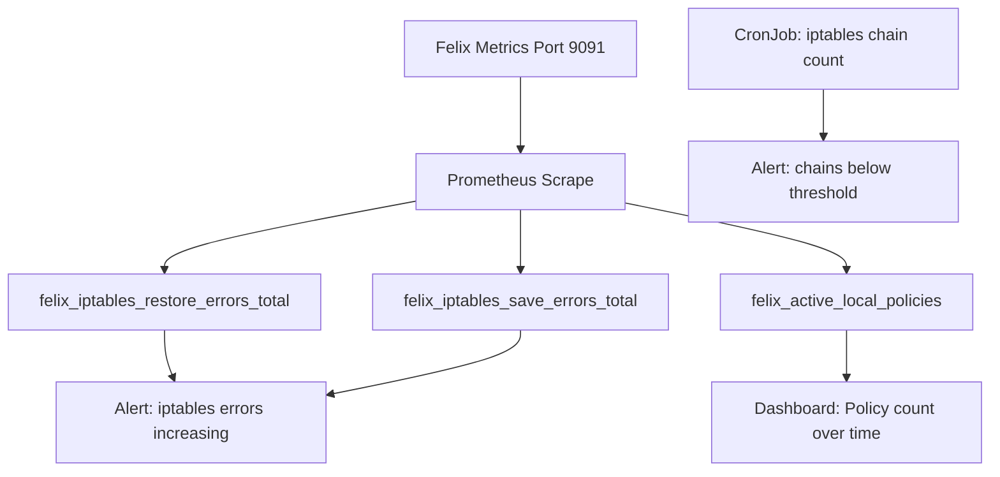

# How to Monitor for Calico iptables Rules Not Applied

Author: [nawazdhandala](https://github.com/nawazdhandala)

Tags: Calico, Kubernetes, Networking, Monitoring, iptables, Felix, Prometheus

Description: Set up monitoring to detect when Calico iptables rules are not being applied using Felix metrics, Prometheus alerts, and periodic validation checks.

---

## Introduction

Calico iptables rule application failures are particularly dangerous because they are silent - traffic continues to flow but network policies stop being enforced, creating security gaps. Monitoring for this condition requires tracking Felix's iptables programming metrics and validating that Calico chains exist on nodes.

The Felix Prometheus metrics endpoint exposes counters specifically for iptables failures, making it the primary monitoring target for this scenario.

## Prerequisites

- Calico cluster with Prometheus deployed
- Felix metrics enabled in FelixConfiguration
- Access to create PrometheusRule resources

## Step 1: Enable Felix Metrics

Ensure Felix is exporting Prometheus metrics that include iptables error counters.

```bash
# Check if Felix metrics are enabled
calicoctl get felixconfiguration default -o yaml | grep -E "prometheus|metrics"

# Enable Felix metrics if not already enabled
calicoctl patch felixconfiguration default \
  --patch '{"spec": {"prometheusMetricsEnabled": true, "prometheusMetricsPort": 9091}}'

# Verify metrics endpoint is accessible from the calico-node pod
kubectl exec -n calico-system \
  $(kubectl get pods -n calico-system -l k8s-app=calico-node -o name | head -1) -- \
  wget -qO- http://localhost:9091/metrics | grep "iptables" | head -10
```

## Step 2: Create Prometheus Alerts for iptables Errors

Set up alerts for iptables restore failures and missing Calico chains.

```yaml
# calico-iptables-alerts.yaml
# Prometheus rules to detect Calico iptables programming failures
apiVersion: monitoring.coreos.com/v1
kind: PrometheusRule
metadata:
  name: calico-iptables-monitoring
  namespace: monitoring
spec:
  groups:
    - name: calico.iptables
      rules:
        # Alert when iptables restore errors are increasing
        - alert: CalicoIptablesRestoreErrors
          expr: |
            increase(felix_iptables_restore_errors_total[5m]) > 0
          for: 2m
          labels:
            severity: critical
          annotations:
            summary: "Calico iptables restore errors on {{ $labels.instance }}"
            description: "Felix is failing to apply iptables rules. Network policy enforcement may be broken."

        # Alert when iptables save errors occur
        - alert: CalicoIptablesSaveErrors
          expr: |
            increase(felix_iptables_save_errors_total[5m]) > 0
          for: 2m
          labels:
            severity: warning
          annotations:
            summary: "Calico iptables save errors on {{ $labels.instance }}"
```

```bash
# Apply the alert rules
kubectl apply -f calico-iptables-alerts.yaml
```

## Step 3: Create a Periodic Validation CronJob

Schedule a periodic check that verifies Calico iptables chains exist on all nodes.

```yaml
# calico-iptables-validation-cronjob.yaml
# Periodically validates that Calico iptables chains exist on all nodes
apiVersion: batch/v1
kind: CronJob
metadata:
  name: calico-iptables-validator
  namespace: calico-system
spec:
  schedule: "*/15 * * * *"  # Every 15 minutes
  jobTemplate:
    spec:
      template:
        spec:
          hostNetwork: true
          hostPID: true
          serviceAccountName: calico-node
          containers:
            - name: validator
              image: calico/node:v3.27.0
              securityContext:
                privileged: true
              command:
                - /bin/bash
                - -c
                - |
                  # Count Calico iptables chains
                  CHAIN_COUNT=$(iptables -L -n 2>/dev/null | grep -c "^Chain cali-")
                  if [ "${CHAIN_COUNT}" -lt 5 ]; then
                    echo "ALERT: Only ${CHAIN_COUNT} Calico iptables chains found (expected 20+)"
                    exit 1
                  fi
                  echo "OK: ${CHAIN_COUNT} Calico iptables chains present"
          restartPolicy: Never
          tolerations:
            - operator: Exists
```

```bash
# Apply the CronJob
kubectl apply -f calico-iptables-validation-cronjob.yaml
```

## Step 4: Monitor Key Felix iptables Metrics

Track these specific Felix metrics in your Grafana dashboard.

```bash
# Key metrics to include in Grafana dashboard

# iptables restore error rate (should be 0)
# rate(felix_iptables_restore_errors_total[5m])

# iptables programming latency
# felix_iptables_restore_latency_seconds

# Number of active Calico iptables chains (should be stable)
# felix_ipsets_in_dataplane

# Felix policy sync status
# felix_active_local_policies

# Check current values
kubectl exec -n calico-system \
  $(kubectl get pods -n calico-system -l k8s-app=calico-node -o name | head -1) -- \
  wget -qO- http://localhost:9091/metrics 2>/dev/null | \
  grep -E "felix_iptables|felix_ipsets|felix_active"
```

## Step 5: Set Up Dashboard for iptables Health



## Best Practices

- Alert on any increase in `felix_iptables_restore_errors_total` - zero errors is the only acceptable state
- Include iptables chain count validation in your periodic cluster health checks
- Monitor Felix policy sync metrics (`felix_active_local_policies`) to detect stale policy programming
- Use OneUptime to run synthetic network policy enforcement tests as an end-to-end check

## Conclusion

Monitoring for Calico iptables rule application failures requires Felix Prometheus metrics (especially `felix_iptables_restore_errors_total`), periodic iptables chain count validation, and end-to-end network policy enforcement tests. Zero iptables errors is the target state - any increase in error counters should trigger immediate investigation.
